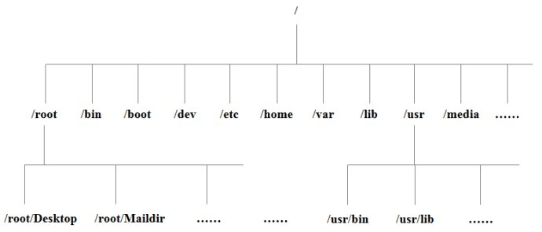

# 京东二面


## 1. Linux 的启动过程

https://www.runoob.com/linux/linux-system-boot.html


## 2. Linux 的 etc 目录存放的是什么文件？

参考：https://www.runoob.com/linux/linux-system-contents.html



以下是对这些目录的解释：

* /bin:

  bin 是 Binary 的缩写，这个目录存放着最经常使用的命令。

* /boot:

  这里存放的是启动 Linux 时使用的一些核心文件，包括一些连接文件以及镜像文件。

* /dev:

  dev 是 Device 的缩写，该目录下存放的是 Linux 的外部设备，在 Linux 中访问设备的方式和访问文件的方式是相同的。

* **/etc:**

  **这个目录用来存放所有系统管理所需要的配置文件和子目录。**

* /home:

  用户的主目录，在 Linux 中，每个用户都有一个自己的目录，一般该目录名是以用户的账号命名的。

* /lib:

  这个目录里存放着系统最基本的动态连接共享库，其作用类似于 Windows 里的 DLL 文件。几乎所有的应用程序都需要用到这些共享库。

* /lost + found:

  这个目录一般情况下是空的，当系统非法关机后，这里就存放了一些文件。

* /media:

  linux 系统会自动识别一些设备，例如 U盘、光驱等等，当识别后，linux 会把识别的设备挂载到这个目录下。

* /mnt:

  系统提供该目录是为了让用户临时挂载别的文件系统的，我们可以将光驱挂载在 /mnt/ 上，然后进入该目录就可以查看光驱里的内容了。

* /opt:

  这是给主机额外安装软件所存放的目录。比如你安装一个 ORACLE 数据库则可以放到这个目录下。默认是空的。

* /proc:

  这个目录是一个虚拟的目录，它是系统内存的映射，我们可以通过直接访问这个目录来获取系统信息。

  这个目录的内容不在硬盘上而是在内存里，我们也可以直接修改里面的某些文件。比如可以通过下面的命令来屏蔽主机的 ping 命令，使别人无法 ping 你的机器：

  ```bash
  echo 1 > /proc/sys/net/ipv4/icmp_echo_ignore_all
  ```

* /root:

  该目录为系统管理员，也称作超级权限者的用户主目录。

* /sbin:

  s 就是 Super User 的意思，这里存放的是系统管理员使用的系统管理程序。

* /selinux:

  这个目录的 Redhat/CentOS 所特有的目录，Selinux 是一个安全机制，类似于 windows 的防火墙。

* /tmp:

  这个目录是用来存放一些临时文件的。

* /usr:

  用户的很多应用程序和文件都放在这个目录下，类似于 windows 下的 program files 目录。

* /usr/bin:

  系统用户使用的应用程序。

* /usr/sbin:

  超级用户使用的比较高级的管理程序和系统守护程序。

* /usr/src:

  内核源代码默认的放置目录。

* /var:

  这个目录中存放着在不断扩充着的东西，我们习惯将那些经常被修改的目录放在这个目录下。包括各种日志文件。

## 3. 用于压测的 jmeter 有什么参数？

步骤：

1）添加线程组；

2）添加 http 请求；

3）在 http 请求中写入接入 url、请求方式和参数；

4）添加查看结果树；

5）调用接口、查看返回值；

## 4. Java 的线程和内核的线程有什么关系？

参考：深入理解Java虚拟机

实现线程主要有三种方式：使用内核线程实现（1：1实现），使用用户线程实现（1：N实现），使用用户线程加劲量级进程混合实现（N：M实现）。

Java 线程如何实现并不受 Java 虚拟机规范的约束，这是一个与具体虚拟机相关的话题。Java 线程在早期的 Classic 虚拟机上（JDK 1.2 以前），是基于一种被称为“绿色线程”（Green Threads）的用户线程实现的，但从 JDK 1.3 起，“主流”平台上的“主流”商用 Java 虚拟机的线程模型普遍都被替换为基于操作系统原生模型来实现，即采用 1:1 的线程模型。

以 HotSpot 为例，它的每个 Java 线程都是直接映射到一个操作系统原生线程来实现的，而且中间没有额外的间接结构，所以 HotSpot 自己是不会去干涉线程调度的（可以设置线程优先级给操作系统提供调度建议），全权交给底下的操作系统去处理，所以何时冻结或唤醒线程、该给线程分配多少处理器执行时间、该把线程安排给哪个处理器核心去执行等，都是由操作系统完成的，也都是由操作系统全权决定的。

## 5. 为什么内核线程调度切换起来成本要更高？

内核线程的调度成本主要来自于用户态与核心态之间的状态转换，而这两种状态转换的开销主要来自于响应中断、保护和恢复执行现场的成本。

```
线程A -> 系统中断 -> 线程B
```

处理器要去执行线程 A 的程序代码时，并不是仅有代码程序就能跑得起来，程序是数据与代码的组合体，代码执行时还必须要有上下文数据的支撑。而这里说的“上下文”，以程序员的角度来看，是方法调用过程中的各种局部的变量与资源；以线程的角度来看，是方法的调用栈中存储和各类信息；而以操作系统和硬件的角度来看，则是存储在内存、缓存和寄存器中的一个个具体数值。物理硬件的各种存储设备和寄存器是被操作系统内所有线程共享的资源，当中断发生，从线程 A 切换到线程 B 去执行之前，操作系统首先要把线程 A 的上下文数据妥善保管好，然后把寄存器、内存分页等恢复到线程 B 挂起的状态，这样线程 B 被重新激活后才能仿佛从来没有被挂起过。这种保护和恢复现场的工作，免不了涉及一系列数据在各种寄存器、缓存中的来回拷贝，当然不可能是一种轻量级的操作。

## 6. 为什么要用 epoll 模型？