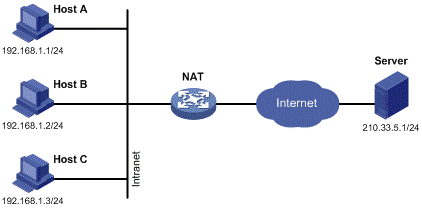
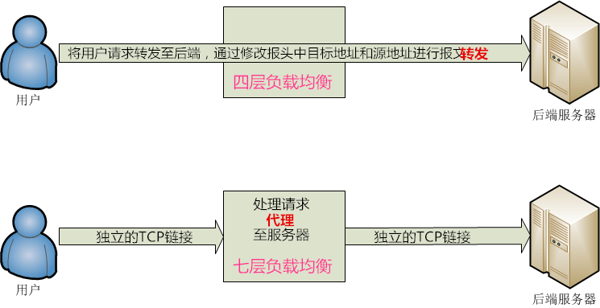
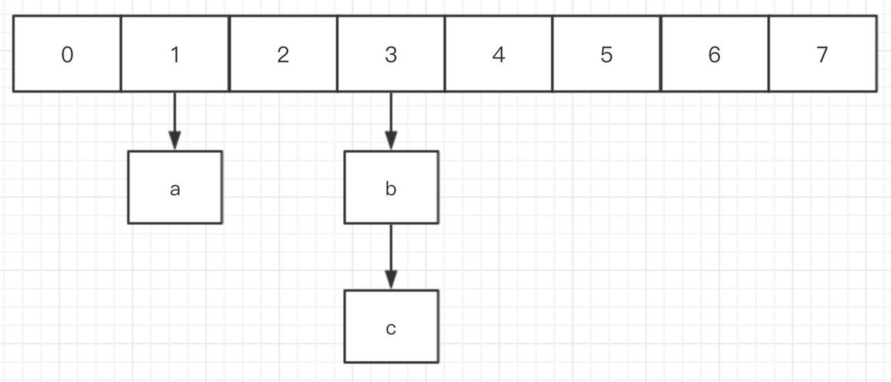
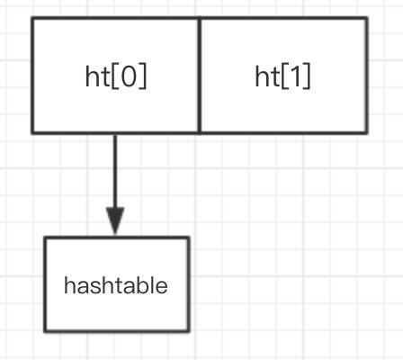
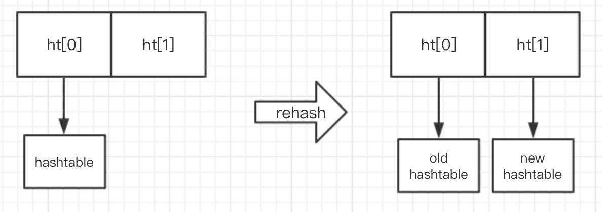

# 其他人面经

## 一、NAT 技术原理说一下？



NAT 技术让少数公有 IP 地址被使用私有地址的大量主机所共享。这一机制允许远多于 IP 地址空间所支持的主机共享网络。同时，由于 NAT 屏蔽了内部网络，也为局域网内的机器提供了安全保障。

NAT 的基本实施过程包括使用一个预留给本地 IP 网络的私有地址成立组织的内部网络，同时分配给组织一个或多个公网 IP 地址，并在本地网络与公网产、之间安装一个或多个具有 NAT 功能的路由器。NAT 路由器实现的功能包括将数据报中私网地址换成公网地址，反向亦然。当有报文通过时，网络地址转换不仅检查报文信息，还将报文头中的 IP 地址和端口信息修改，以使处于 NAT 之后的机器共享少数公网 IP 地址。

### 何时使用 NAT ？

NAT 能够减少在网络环境中所需要的公共 IP 地址需求。

以下是应用 NAT 的场景：

* 用户需要访问 Internet 但主机没有全球唯一的 IP 地址；
* 用户更改 ISP 需要对网络重新编号；
* 用户需要合并地址重复的内网；

通常 NAT 应用于边界路由器。

NAT 的优势与不足：

|           优势           |            不足            |
| :----------------------: | :------------------------: |
|     节约合法注册地址     |    转换导致交换路径延时    |
|     解决地址重叠问题     | 导致端到端 IP 地址无法追溯 |
| 提高访问 Internet 灵活性 |     某些应用程序无使用     |
| 网络变动无需地址重新编号 |                            |

### 网络地址转换类型：

**静态 NAT：**此类 NAT 在本地和全局地址之间做到一到一的永久映射。须注意静态 NAT 要求用户对每一台主机都有一个真实的 Internet IP 地址。

**动态 NAT：**允许用户将一个未登记的 IP 地址映射到一个登记的 IP 地址池中的一个。采用动态分配的方法将外部合法地址映射到内部网络，无需要像静态 NAT 那样，通过对路由器进行静态配置来将内部地址映射到外部地址，但是必须有足够的真正的 IP 地址来进行收发包。

端口 NAT：最为流行的 NAT 配置类型。通过多个源端口，将多个未登记的 IP 地址映射到一个合法 IP 地址（多合一）。使用 PAT 能够使上千个用户仅使用一个全局 IP 地址连接到 Internet。

### NAT 实现细节：

路由器将源 IP 地址识别为内部本地 IP 地址，在报文中转换源 IP 地址，并在 NAT 表中记录此次转换。

配有新转换地址的报文发送到外部接口。外部主机将报文发送给目的主机并且 NAT 路由器通过 NAT 表将内部全局 IP 地址转换回内部本地 IP 地址。

PAT 方式中，所有内部主机地都转换为一个 IP 地址。除了内部本地 IP 地址和内部全局 IP 地址以外，还多了一个端口号。端口号帮助路由器识别哪一台主机应当收到返回数据。路由器使用来自各主机的源端口好来区别他们各自发出的数据。注意当报文离开路由器时有一个目标端口号 80， 而 HTTP 服务器将报文发回时目的端口号为 1026。从而允许 NAT 转换路由器区别 NAT 表中的主机然后将目的 IP 地址转换回内部本地地址。

PAT 允许我们在传输层识别主机，理论上一个公网 IP 地址可被 65535 台主机共享。

## 二、 nginx 工作在哪一层？

参考： https://www.cnblogs.com/jmcui/p/12388287.html

### 四层负载均衡和七层负载均衡



四层负载均衡工作在 OSI 模型中的四层，即传输层。四层负载均衡只能根据报文中目标地址和源地址对请求进行转发，而无法修改或判断所请求资源的具体类型，然后经过负载均衡内部的调度算法转发至要处理请求的服务器。四层负载均衡单纯地提供了端到端的可靠连接，并将请求转发至后端，连接始终都是同一个。LVS 就是很典型的四层负载均衡。

七层负载均衡工作在 OSI 模型的第七层，即应用层，所以七层负载均衡可以基于请求的应用层信息进行负载均衡，例如根据请求的资源类型分配到后端服务器，而不再是根据 IP 和端口选择。七层负载均衡的功能更丰富更灵活，也能使整个网络更智能。在七层负载均衡两端（面向用户端和面向服务器端）的连接都是独立的。

简言之，四层负载均衡就是基于 IP + 端口实现的，七层负载均衡就是通过应用层资源实现的。

### 常用负载均衡软件对比

### LVS (Linux Virtual Server)

1、抗负载能力强、性能高，能达到 F5 硬件的 60%；对内存和 cpu 资源消耗比较低
 2、工作在网络4层，通过 vrrp 协议转发（仅作分发之用），具体的流量由 linux 内核处理，因此没有流量的产生。
 2、稳定性、可靠性好，自身有完美的热备方案；（如：LVS + Keepalived）
 3、应用范围比较广，工作在四层，所以不用考虑要处理的具体应用，可以对所有应用做负载均衡；
 4、不支持正则处理，不能做动静分离。
 5、支持负载均衡算法：rr（轮循）、wrr（带权轮循）、lc（最小连接）、wlc（权重最小连接）
 6、配置复杂，对网络依赖比较大，稳定性很高。

### Ngnix

1、工作在网络的7层之上，可以针对 http 应用做一些分流的策略，比如针对域名、目录结构；
 2、Nginx 对网络的依赖比较小，理论上能 ping 通就就能进行负载功能；
 3、Nginx 安装和配置比较简单，测试起来比较方便；
 4、也可以承担高的负载压力且稳定，一般能支撑超过1万次的并发；
 5、对后端服务器的健康检查，只支持通过端口来检测，不支持通过url来检测；
 6、Nginx 对请求的异步处理可以帮助节点服务器减轻负载；
 7、Nginx 仅能支持http、https 和 Email 协议，这样就在适用范围较小；
 8、不支持 Session 的直接保持，但能通过 ip_hash 来解决；
 9、支持负载均衡算法：Round-robin（轮循）、Weight-round-robin（带权轮循）、Ip-hash（Ip哈希）；
 10、Nginx 还能做 Web 服务器即Cache功能；

### HAProxy

1、支持两种代理模式：TCP（四层）和 HTTP（七层），支持虚拟主机；
 2、能够补充 Nginx 的一些缺点比如 Session 的保持，Cookie 的引导等工作；
 3、支持 url 检测后端的服务器出问题的检测会有很好的帮助；
 4、更多的负载均衡策略比如：动态加权轮循(Dynamic Round Robin)，加权源地址哈希(Weighted Source Hash)，加权URL哈希和加权参数哈希(Weighted Parameter Hash)已经实现；
 5、单纯从效率上来讲 HAProxy 更会比 Nginx 有更出色的负载均衡速度；
 6、HAProxy 可以对 Mysql 进行负载均衡，对后端的 DB节点进行检测和负载均衡；
 9、支持负载均衡算法：Round-robin（轮循）、Weight-round-robin（带权轮循）、source（原地址保持）、RI（请求URL）、rdp-cookie（根据cookie）；
 10、不能做 Web 服务器即 Cache。

## 三、 f5 负载说一下？

F5 全称：F5-BIG-IP-GTM 全球流量管理器。

BIG-IP: 外部看来是一个 IP，内部可却是几十台应用服务器，表现为一个虚拟的大服务器。

## 四、BlockingQueue 实现一下

```java
class BoundedBlockingQueue {
    ReentrantLock lock = new ReentrantLock();
    Condition empty = lock.newCondition();
    Condition full = lock.newCondition();
    ArrayList<Integer> arrayList =null;
    int maxSize = 10;
    int curSize = 0;// 其实这个curSize没有用到，他就是当前的arrayList的size()
    public BoundedBlockingQueue(int capacity) {
        this.maxSize = capacity;
        arrayList =  new ArrayList<>();
    }
    
    public void enqueue(int element) throws InterruptedException {
        put(element);
    }
    public void put(int integer){
        lock.lock();
        try {
            while(arrayList.size() == maxSize) {
                full.await();// 如果队列满了,立即阻塞
            }
            arrayList.add(integer);
            empty.signalAll();// 当前队列不为空了，因为添加进去了一个
        }catch (Exception e1){
            e1.printStackTrace();
        }finally {
            lock.unlock();
        }
    }


    public int take(){
        lock.lock();
        int res = 0;
        try{
            while(arrayList.size() == 0){
                empty.await(); // 如果为空，阻塞,直接释放锁,下一次获得锁之后再从这里运行，在继续判断
            }
            res =  arrayList.get(0);
            arrayList.remove(0);
            full.signalAll();//当前队列不是满的了，通知之前因为满而不能添加进去的put函数
        }catch (Exception e1){
            e1.printStackTrace();
        }finally {
            lock.unlock();
        }
        return res;
    }
    public int dequeue() throws InterruptedException {
        return take();
    }

    public int size() {
        return arrayList.size();
    }
}
```


## 五、redis 的 hash 扩容说一下

参考：

https://blog.csdn.net/wangmaohong0717/article/details/84611426

https://juejin.im/post/6844903862961176584

渐近式 hash 

### 基本介绍

Hash 也可以用来存储用户信息，和 String 不同的是 Hash 可以对用户信息的每个字段单独存储，String 则需要序列化用户的所有字段后存储。并且 String 需要以整个字符串的形式获取用户，而 hash 可以只获取部分数据，从而节约网络流量，不过 hash 内存占用要大于 String ，这是 hash 的缺点。

```redis
> hset books java "Effective java"
(integer) 1
> hset books golang "concurrency in go"
(integer) 1
> hget books java
"Effective java"
> hset user age 17
(integer) 1
>hincrby user age 1	#单个 key 可以进行计数 和 incr 命令基本一致
(integer) 18
```

Redis 中的 Hash 和 Java 的 HashMap 更加相似，都是数组 + 链表的结构。 当发生 hash 碰撞时将会把元素追加到链表上，值得注意的是在 Redis 的 Hash 中 value 只能是字符串。

### 内部原理

hash 的内部结构，第一维是数组，第二维是链表。



部分源码：

```c
struct dictht {
    dictEntry **table;	        //entry 数组
    long size;			//数组长度
    long used			//数组中的元素个数
    ...
}
struct dictEntry{
    void *key;		        //hash 的 key
    void *val;		    	//hash 的 value
    dictEntry *next;	        //下一个dictEntry 链表结构
}
```

在 Java 中 HashMap 扩容是个很耗时的操作，需要去申请新的数组，为了追求高性能，Redis 采用了**渐近式 rehash 策略**，这也是 hash 中最重要的部分。

### 渐近式 rehash

在 hash 的内部包含了两个 hashtable，一般情况下只是用一个。



在扩容的时候， rehash 策略会保留新旧两个 hashtable 结构，查询时也会同时查询两个 hashtable。Redis 会将旧 hashtable 中的内容一点一点的迁移到新的 hashtable 中，当迁移完成时，就会用新的 hashtable 取代之前的。当 hashtable 移除了最后一个元素之后，这个数据结构将会被删除。



数据搬迁操作放在 hash 的后续指令中，也就是来自客户端对 hash 的指令操作。一旦客户端后续没有指令操作这个 hash。 Redis 就会使用定时任务对数据主动搬迁。

正常情况下，当 hashtable 中元素的个数等于数组的长度时，就会开始扩容，扩容的新数组是原数组大小的 2 倍，如果 Redis 正在做 bgsave （持久化）时，可能不会去扩容，因为要减少内存页的过多分离（Copy On Write）。但是如果 hashtable 已经非常满了，元素的个数达到了数组长度的 5 倍时，Redis 会强制扩容。

当hashtable 中元素逐渐变少时,Redis 会进行缩容来减少空间占用,并且缩容不会受 bgsave 的影响,缩容条件是元素个数少于数组长度的 10%.

## Redis 的渐近式 rehash

扩展或收缩哈希表需要将 `ht[0]` 里面的所有键值对 rehash 到 `ht[1]`里面，但是，这个 rehash 动作并不是一次性、集中式地完成的，而是分多次、渐近式地完成的。

为了避免 rehash 对服务器性能造成影响，服务器不是一次性将 ht[0] 里面的所有键值对全部 rehash 到 ht[1] ，而是分多次、渐近式地将 ht[0] 里面的键值对慢慢地 rehash 到 ht[1]。

以下是哈希表渐近式 rehash 的详细步骤：

1）为 ht[1] 分配空间，让字典同时持有 ht[0] 和 ht[1] 两个哈希表。

2）在字典中维持一个索引计数器变量 rehashidx, 并将它的值设置为 0， 表示 rehash 工作正式开始。

3）在 rehash 进行期间，每次对字典执行添加、删除、查找或者更新操作时，程序除了执行指定的操作以外，还会顺带将 ht[0] 哈希表在 rehashidx 索引上的所有键值对 rehash 到 ht[1] ，当 rehash 工作完成后，程序将 rehashidx 属性的值增一。

4）随着字典操作的不断执行，最终在某个时间点上，ht[0] 的所有键值对都会被 rehash 至 ht[1] ，这时程序将 rehashidx 属性的值设为 -1，表示 rehash 操作已经完成。

渐进式 rehash 的好处在于它采取分面治之的方式，将 rehash 键值对所需要的计算工作均摊到对字典的每个添加、删除、查找和更新操作上，从而避免了集中式 rehash 而带来的庞大计算量。

### 渐进式 rehash 执行期间的哈希表操作

因为在进行渐近式 rehash 的过程中，字典会同时使用 ht[0] 和 ht[1] 两个哈希表，所以在渐进式 rehash 进行期间，字典的删除 (delete)、查找（find）、更新（update）等操作会在两个哈希表上进行。例如，要在字典里查找一个键的话，程序会先在 ht[0] 里面进行查找，如果没找到的话，就会继续到 ht[1] 里面进行查找，诸如此类。

另外，在渐进式 rehash 执行期间，新添加到字典的键值对一律会被保存到 ht[1] 里面而 ht[0] 则不再进行任何添加操作，这一措施保证了 ht[0] 包含的键值对数量会只减不增，并随着 rehash 操作的执行而最终变成空表。