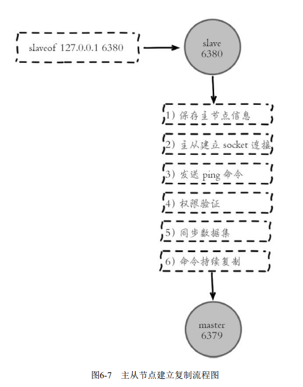
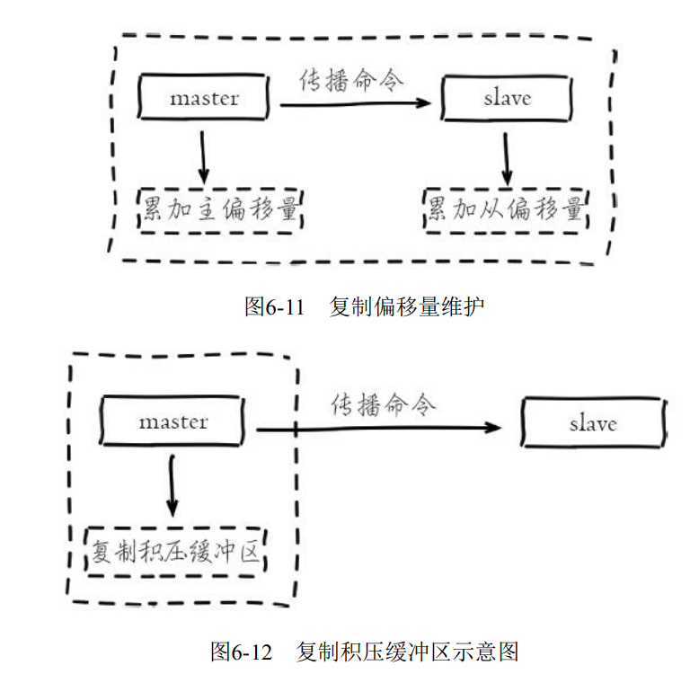
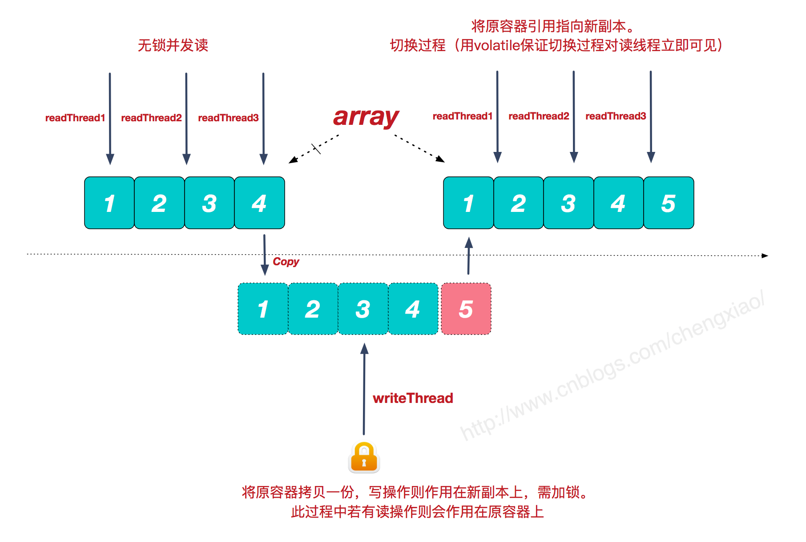

## 说一下进程，线程和协程


## Garbage First 收集器

G1 收集器开创了收集器面向局部收集的设计思路和基于 Region 的内存布局形式。

G1 开创的基于 Region 的堆内存布局是它能够实现这个目标的关键。虽然 G1 也仍是遵循分代收集理论设计的，但其堆内存的布局与其他收集器有非常明显的差异：G1 不再坚持固定大小以及固定数量的分代区域划分，而是把连续的 Java 堆划分为多个大小相等的独立区域 （Region），每一个 Region 都可以根据需要，扮演新生代的 Eden 空间、Survivor 空间，或者老年代空间。收集器能够对扮演不同角色 Region 采用不同的策略去处理，这样无论是新创建的对象还是存活了一段时间、熬过多次收集的旧对象都能获取很好的收集效果。

Region 中还有一类特殊的 Humongous 区域，专门用来存储大对象。G1 认为只要大小超过了一个 Region 容量一半的对象即可判定为大对象。

G1 为每个 Region 设计了两个名为 **TAMS** （Top at Mark Start）的指针，把 Region 中的一部分空间划分出来用于并发回收过程中新对象分配，并发回收时新分配的对象地址都必须要在这两个指针位置以上。

G1 收集器的动作过程大致可划分为以下四个步骤：

* **初始标记（Initial Marking）**:仅仅只是标记一下 GC Roots 能直接关联到的对象，并且修改 **TAMS** 指针的值，让下一阶段用户线程并发运行时，能正确地在可用的 Region 中分配新对象。这个阶段需要停顿线程，但耗时很短，而且是借用进行 Minor GC 的时候同步完成的，所以 G1 收集器在这个阶段实际并没有额外的停顿。
* **并发标记（Concurrent Marking）**:从 GC Root 开始对堆中对象进行可达性分析，递归扫描整个堆里的对象图，找出要回收的对象，这阶段耗时较长，但可与用户程序并发执行。当对象图扫描完成以后，还要重新处理 SATB 记录下的在并发时有引用变动的对象。
* **最终标记（Final Marking）：**对用户线程做另一个短暂的暂停，用于处理并发阶段结束后仍遗留下来的最后那少量的 SATB 记录。
* **筛选回收（Live Data Counting and Evacuation）**：负责更新 Region 的统计数据，**对各个 Region 的回收价值和成本进行排序**，根据用户所期望的停顿时间来制定回收计划，可以自由选择任意多个 Region 构成回收集，然后把决定回收的那一部分 Region 的存活对象复制到空的 Region 中，再清理掉整个旧 Region 的全部空间。这里的操作涉及存活对象的移动，是必须暂停用户线程，由多条收集线程并行完成的。

## 如果消息队列挂了，如何保证数据的一致性？


## 生成订单的订单详情是以 redis 为准还是以 MySQL 为准？


## 先介绍一下乐观锁与悲观锁，在MySQL 中你是如何使用的？

一、概念上区别

乐观锁（**Optimistic Lock**）：顾名思义，对加锁持有一种乐观的态度，即先进行业务操作，不到最后一步不进行加锁，"乐观"的认为加锁一定会成功的，在最后一步更新数据的时候再进行加锁。

悲观锁（**Pessimistic Lock**）：正如其名字一样，悲观锁对数据加锁持有一种悲观的态度。因此，在整个数据处理过程中，将数据处于锁定状态。悲观锁的实现，往往依靠数据库提供的锁机制（也只有数据库层提供的锁机制才能真正保证数据访问的排他性，否则，即使在本系统中实现了加锁机制，也无法保证外部系统不会修改数据）。

二、实现方式

**乐观锁：**

* **version**方式：一般是在数据表中加上一个数据版本号**version**字段，表示数据被修改的次数，当数据被修改时，**version**值会加一。当线程A要更新数据值时，在读取数据的同时也会读取**version**值，在提交更新时，若刚才读取到的**version**值为当前数据库中的**version**值相等时才更新，否则重试更新操作，直到更新成功。

  `sql` 实现代码：

	```
	update table set x=x+1, version=version+1 where id=#{id} and version=#{version}; 
	```
* `CAS` 操作方式：即 compare and swap 或者 compare and  set，涉及到三个操作数，数据所在的内存值，预期值，新值。当需要更新时，判断当前内存值与之前取到的值是否相等，若相等，则用新值更新，若失败则重试，一般情况下是一个自旋操作，即不断的重试。

**悲观锁：**

是由数据库自己实现了的，要用的时候，我们直接调用数据库的相关语句就可以了（原理：共享资源每次只给一个线程使用，其它线程阻塞，用完后再把资源转让给其它线程），如行锁、读锁和写锁等，都是在操作之前加锁，在Java中，synchronized 的思想也是悲观锁。

三、使用场景

- 乐观锁：比较适合读取操作比较频繁的场景，如果出现大量的写入操作，数据发生冲突的可能性就会增大，为了保证数据的一致性，应用层需要不断的重新获取数据，这样会增加大量的查询操作，降低了系统的吞吐量。
- 悲观锁：比较适合写入操作比较频繁的场景，如果出现大量的读取操作，每次读取的时候都会进行加锁，这样会增加大量的锁的开销，降低了系统的吞吐量。


## Http 1.0 与 Http 1.1 与 Http 1.2 的区别

**HTTP 1.0 与 HTTP 1.1 的主要区别**

1. **长连接**：HTTP 1.0 需要使用 keep-alive 参数来告知服务器端要建立一个长连接，而 HTTP1.1 默认支持长连接。

   
   
   HTTP 是基于TCP/IP协议协议的，创建一个TCP连接是需要经过三次握手的，有一定的开销，如果每次通讯都要重新建立连接的话，对性能有影响。因此最好能维持一个长连接，可以用一个长连接来发多个请求。
   
2. （**可以只发送 header 信息，达到节省带宽的目的**）HTTP 1.1 支持只发送 header 信息（不带任何 body 信息），如果服务器认为客户端有权限请求服务器，则返回 100, 否则返回 401。客户端如果接收到 100，才开始把请求 body 发送到服务器。

   这样当服务器返回 401 时，客户端就可以不用发送请求 body 了，节约了带宽。

   另外 HTTP 还支持传送内容的一部分。这样当客户端已经有一部分的资源后，只需要跟服务器请求另外的部分资源即可。这是支持文件断点续传的基础。

3. **HOST域**：现在可以用 web server （例如 tomcat），web server 上的多个虚拟站点可以共享同一个 ip 和端口。

   HTTP 1.0 是没有 host 域的，HTTP 1.1 才支持这个参数。

**HTTP1.1 与 HTTP2.0 的主要区别**

1. **多路复用**：允许同时通过单一的连接发起多重的请求-响应的消息。

   在 HTTP/1.1 协议中，浏览器客户端在同一时间针对同一域名的请求有一定的数量限制。超过限制数目的请求会被阻塞。

   HTTP 2.0 使用了多路复用技术，做到同一个连接并发处理多个请求。

   当然HTTP 1.1 也可以多建几个 TCP 连接，来支持处理更多并发的请求，但是创建 TCP 连接本身也是有开销的。

   TCP 连接有一个慢启动的过程，先检查数据是否传送成功，一旦成功，则慢慢加大传输速度。因此对就瞬时并发的连接，服务器的响应就会变慢。所以最好能使用一个建立好的连接，并且这个连接可以支持瞬时并发的请求。

   在过去，HTTP 性能优化的关键并不在于高带宽，而是低延迟。

   单连接 多资源的方式，减少服务端的连接压力，内存占用更少，连接吞吐量更大。

   由于 TCP 连接的减少而使网络拥塞状况得以改善，同时慢启动时间的减少，使拥塞和丢包恢复速度更快。

2. **二进制分帧**：在不改动 HTTP/1.x 的语义、语法、状态码等情况下，HTTP/2 是如何做到 “突破HTTP 1.1 的性能限制，改进传输性能，实现低延迟和高吞吐量”的？

   关键之一就是在应用层（HTTP/2）和传输层（TCP or UDP）之间增加一个二进制分帧层。

3. **首部压缩**：HTTP 1.1 不支持 header 数据的压缩，HTTP 2.0 使用 HPACK 算法对 header 的数据进行压缩，这样数据体积小了，在网络上传输就会更快。

4. **服务器推送**：服务端推送是一种在客户端请求之前发送数据的机制。

   在 HTTP/2 中，服务器可以对客户端的一个请求发送多个响应。

   当我们对支持 HTTP 2.0 的 web server 请求数据的时候，服务器会顺便把一些客户端需要的资源一起推送到客户端，免得客户端再次创建连接发送到服务器端获取。这种方式非常适合加载静态资源。

   服务器推送可以缓存，并且在遵循同源的情况下，不同页面之间可以共享缓存。

   因此当客户端需要的数据已缓存时，客户端直接从本地加载这些资源就可以了，不用走网络，速度自然是快很多的。


## Redis 的主从复制

**配置：**

配置复制的方式有三种：

1）在配置文件中加入 `slaveof {masterHost} {masterPort}`随 Redis 启动生效。

2）在redis-server 启动命令后加入 `--slaveof {masterHost} {masterPort}` 生效。

3) 直接使用命令：`slaveof{masterHost}{masterPort}`生效。

**断开主节点：**

`slaveof no one ` 可用于断开与主节点复制关系，从节点断开复制后并不会抛弃原有数据，只是无法再获取主节点上的数据变化。

**切主操作：**

`slaveof ` 还可以用来进行切换主节点的操作：

切主流程：1. 断开与旧主节点复制关系；2. 与新主节点建立复制关系；3. 删除从节点当前所有数据；4. 对新主节点进行复制操作。

**只读：**

默认情况下，从节点配置为只读模式。

**配置拓扑：**

一主多从结构使得应用端可以利用多个从节点实现读写分享。对于读占比较大的场景，可以把读命令发送到从节点来分担主节点压力。同时在日常开发中如果需要执行一些比较耗时的读命令，如：keys、sort等，可以在其中一台从节点上执行，防止慢查询对主节点造成阻塞从而影响线上服务的稳定性。对于写并发量较高的场景，多个从节点会导致主节点写命令的多次发送从而过度消耗网络带宽，同时也加重了主节点的负载影响服务稳定性。

### 复制过程

在从节点执行 `slaveof` 命令后，复制过程便开始运作。



复制过程大致分为 6 个过程：

1) 保存主节点信息 （`ip` 和` port`）；

2）建立 socket 连接；

3）发送 ping 命令；

​	连接建立成功后从节点发送 ping 请求进行首次通信， ping 请求主要目的如下：

	* 检测主从之间网络套接字是否可用；
	* 检测主节点当前是否可接受处理命令；

如果发送 ping 命令后，从节点没有收到主节点的 `pong` 回复或者超时，比如网络超时或者主节点正在阻塞无法响应命令，从节点会断开复制连接，下次定时任务会发起重连。

4）权限验证；

​	如果主节点设置了 `requirepass` 参数，则需要密码验证。

5）同步数据集；

​	主从复制连接正常通信后，对于首次建立复制的场景，主节点会把持有的数据全部发送给从节点，这部分操作是耗时最长的步骤。Redis 在 2.8 版本以后采用新复制命令 **`psync`** 进行数据同步，原来的 sync 命令依然支持，保证新旧版本的兼容性。新版本同步划分两种情况：全量同步和部分同步。

6）命令持续复制

​	当主节点把当前的数据同步给从节点后，便完成了复制的建立流程。接下来主节点会持续地把写命令发送给从节点，保证主从数据一致性。

### 数据同步

* 全量复制：

  用于初次复制场景，使用 `RDB` 文件。它会把主节点全部数据一次性发送给从节点，当数据量较大时，会对主从节点和网络造成很大的开销。

* 部分复制：

  用于处理在主从复制中因网络闪断等原因造成的数据丢失场景，当从节点再次连上主节点后，如果条件允许，主节点会补发丢失数据给从节点。因为补发的数据远远小于全量数据，可以有效避免全量复制的过高开销。

### psync 命令

`psync` 命令运行需要以下组件支持：

* 主从节点各自复制偏移量；
* 主节点复制积压缓冲区；
* 主节点运行 id；

#### 1. 复制偏移量

参与复制的主从节点都会维护自身复制偏移量。主节点在处理完写入命令后，会把命令的字节长度做累加记录，统计信息在 `info replication`中的 `master_repl_offset`指针中。

从节点每秒钟上报自身的复制偏移量给主节点，因此主节点也会保存从节点的复制偏移量。

从节点在接收到主节点发送的命令后，也会累加记录自身的偏移量。统计信息在 `info replication`中`slave_repl_offset`指标中。

通过对比主从节点的复制偏移量，可以判断主从节点数据是否一致。

**tip:**

可以通过主节点的统计信息， 计算出`master_repl_offset-slave_offse`t字节量， 判断主从节点复制相差的数据量， 根据这个差值判定当前复制的健康度。 如果主从之间复制偏移量相差较大， 则可能是网络延迟或命令阻塞等原因引起。

#### 2. 复制积压缓冲区

复制积压缓冲区是保存在主节点上的一个固定长度的队列， 默认大小为1MB， 当主节点有连接的从节点（slave） 时被创建， 这时主节点（master）响应写命令时， 不但会把命令发送给从节点， 还会写入复制积压缓冲区。



#### 3. 主节点运行 ID

每个 `Redis` 节点启动后都会动态分配一个 40 位的十六进制字符串作为运行 ID。运行 ID 的主要作用是用来唯一识别 `Redis` 节点，比如从节点的运行 ID 识别自己正在复制的是哪个主节点。如果只使用`ip+port`的方式识别主节点， 那么主节点重启变更了整体数据集（如替换 RDB/AOF 文件） ，从节点再基于偏移量复制数据将是不安全的， 因此当运行 ID 变化后从节点将做全量复制。   


### 复制过程

1） 全量复制

​	用于初次复制场景，使用 `RDB` 文件。它会把主节点全部数据一次性发送给从节点，当数据量较大时，会对主从节点和网络造成很大的开销。

2）部分复制

用于处理在主从复制中因网络闪断等原因造成的数据丢失场景，当从节点再次连上主节点后，如果条件允许，主节点会补发丢失数据给从节点。因为补发的数据远远小于全量数据，可以有效避免全量复制的过高开销。`psync {runId}{offset}}`，当从节点（slave） 正在复制主节点master） 时， 如果出现网络闪断或者命令丢失等异常情况时， 从节点会向主节点要求补发丢失的命令数据， 如果主节点的复制积压缓冲区内存在这部分数据则直接发送给从节点， 这样就可以保持主从节点复制的一致性。 补发的这部分数据一般远远小于全量数据， 所以开销很小。   

3）异步复制

主节点不但负责数据读写，还负责把写命令同步从节点。写命令的发送过程是异步完成，也就是说主节点自身处理完写命令后直接返回给客户端，并不等待从节点复制完成。

## ReentrantLock 可重入功能的实现原理

ReentrantLock的实现基于队列同步器（AbstractQueuedSynchronizer，后面简称AQS），关于AQS的实现原理，可以看笔者的另一篇文章： [Java队列同步器（AQS）到底是怎么一回事](https://juejin.im/post/6844903842530738184)

ReentrantLock的可重入功能基于AQS的同步状态：state。

其原理大致为：当某一线程获取锁后，将state值+1，并记录下当前持有锁的线程，再有线程来获取锁时，判断这个线程与持有锁的线程是否是同一个线程，如果是，将state值再+1，如果不是，阻塞线程。 当线程释放锁时，将state值-1，当state值减为0时，表示当前线程彻底释放了锁，然后将记录当前持有锁的线程的那个字段设置为null，并唤醒其他线程，使其重新竞争锁。

```java
// acquires的值是1
final boolean nonfairTryAcquire(int acquires) {
	// 获取当前线程
	final Thread current = Thread.currentThread();
	// 获取state的值
	int c = getState();
	// 如果state的值等于0，表示当前没有线程持有锁
	// 尝试将state的值改为1，如果修改成功，则成功获取锁，并设置当前线程为持有锁的线程，返回true
	if (c == 0) {
		if (compareAndSetState(0, acquires)) {
			setExclusiveOwnerThread(current);
			return true;
		}
	}
	// state的值不等于0，表示已经有其他线程持有锁
	// 判断当前线程是否等于持有锁的线程，如果等于，将state的值+1，并设置到state上，获取锁成功，返回true
	// 如果不是当前线程，获取锁失败，返回false
	else if (current == getExclusiveOwnerThread()) {
		int nextc = c + acquires;
		if (nextc < 0) // overflow
			throw new Error("Maximum lock count exceeded");
		setState(nextc);
		return true;
	}
	return false;
}
```

**参考：**

[深入剖析Java重入锁ReentrantLock的实现原理](https://juejin.im/post/6844903853494632462#heading-6)

## CopyOnWriteArrayList 实现原理及源码分析

**参考：**

[CopyOnWriteArrayList实现原理及源码分析](https://www.cnblogs.com/chengxiao/p/6881974.html)

`CopyOnWriteArrayList` 是 Java 并发包中提供的一个并发容器，它是个线程安全且读操作无锁的 `ArrayList`， 写操作则通过创建底层数组的新副本来实现，是一种读写分离的并发策略，我们也可以称这种容器为“写时复制器”，Java 并发包中类似的容器还有 `CopyOnWriteSet`。

### 实现原理

　我们都知道，集合框架中的ArrayList是非线程安全的，Vector虽是线程安全的，但由于简单粗暴的锁同步机制，性能较差。而CopyOnWriteArrayList则提供了另一种不同的并发处理策略（当然是针对特定的并发场景）。

很多时候，我们的系统应对的都是**读多写少**的并发场景。CopyOnWriteArrayList容器允许并发读，读操作是无锁的，性能较高。至于写操作，比如向容器中添加一个元素，**则首先将当前容器复制一份，然后在新副本上执行写操作，结束之后再将原容器的引用指向新容器。**



**优缺点分析**

　　了解了CopyOnWriteArrayList的实现原理，分析它的优缺点及使用场景就很容易了。

　　**优点：**

　　读操作性能很高，因为无需任何同步措施，比较适用于**读多写少**的并发场景。Java的list在遍历时，若中途有别的线程对list容器进行修改，则会抛出**ConcurrentModificationException**异常。而CopyOnWriteArrayList由于其"读写分离"的思想，遍历和修改操作分别作用在不同的list容器，所以在使用迭代器进行遍历时候，也就不会抛出ConcurrentModificationException异常了

　　**缺点：**

　　缺点也很明显，**一是内存占用问题**，毕竟每次执行写操作都要将原容器拷贝一份，数据量大时，对内存压力较大，可能会引起频繁GC；**二是无法保证实时性**，Vector对于读写操作均加锁同步，可以保证读和写的强一致性。而CopyOnWriteArrayList 由于其实现策略的原因，写和读分别作用在新老不同容器上，在写操作执行过程中，读不会阻塞但读取到的却是老容器的数据。

## 0.2 在 float 中可以精确存储么？

**参考：**

https://www.bilibili.com/video/BV1354y1B7o1?from=search&seid=13594080429152812421

## 说一下阻塞、非阻塞、异步、同步的概念？

同步/异步关注的是消息通知的机制，而阻塞/非阻塞关注的是程序（线程）等待消息通知时的状态。

同步是线程主动去获取消息的结果，异步是由消息通知给线程。阻塞是线程在等待消息结果时将自己挂起，非阻塞是在等待消息过程中无需将自己挂起。

## IO复用

参考：https://segmentfault.com/a/1190000003063859

**I/O 多路复用之 select 、 poll 、 epoll 详解**

select , poll ,epoll 都是 IO 多路复用的机制。 I/O 多路复用就是通过一种机制，一个进程可以监视多个描述符，一旦某个描述符就绪（一般是读就绪或写就绪），能够通知程序进行相应的读写操作。select , poll, epoll 本质上都是同步 I/O ，因为他们都需要在读写事件就绪后自己负责进行读写。

select 

```c
int select (int n, fd_set *readfds, fd_set *writefds, fd_set *exceptfds, struct timeval *timeout);
```

select 函数监视的文件描述符分 3 类， 分别是 writefds, readfds, 和 exceptfds。调用后 select 函数会阻塞，直到有描述符就绪（有数据可读、可写、或者 except），或者超时（timeout 指定等待时间，如果立即返回设为 null 即可），函数返回。当 select 函数返回后，可以通过遍历 fdset ，来找到就绪的描述符。

select 的一个缺点在于单个进程能够监视的文件描述符的数量存在最大限制，在 Linux 上一般为 1024，可以通过修改宏定义甚至重新编译内核的方式提升这一限制。

**poll**

```c
int poll (struct pollfd *fds, unsigned int nfds, int timeout);
```

不同于 select 使用三个位图来表示三个 fdset 的方式， poll 使用一个 pollfd 的指针实现。

```c
struct pollfd {
    int fd; /* file descriptor */
    short events; /* requested events to watch */
    short revents; /* returned events witnessed */
};
```

pollfd 结构包含了要监视的 event 和发生的 event，不再使用 select “参数-值” 传递的方式。同时， pollfd 并没有最大数量限制。和 select 函数一样，poll 返回后，需要轮询 pollfd 来获取就绪的描述符。

从上面看，select和poll都需要在返回后，`通过遍历文件描述符来获取已经就绪的socket`。事实上，同时连接的大量客户端在一时刻可能只有很少的处于就绪状态，因此随着监视的描述符数量的增长，其效率也会线性下降。

**epoll**

epoll是在2.6内核中提出的，是之前的select和poll的增强版本。相对于select和poll来说，epoll 更加灵活，没有描述符限制。epoll使用一个文件描述符管理多个描述符，将用户关系的文件描述符的事件存放到内核的一个事件表中，这样在用户空间和内核空间的copy只需一次。

一 epoll 操作过程

epoll 操作过程需要三个接口，分别如下：

```c
int epoll_create(int size)；// 创建一个epoll的句柄，size用来告诉内核这个监听的数目一共有多大
int epoll_ctl(int epfd, int op, int fd, struct epoll_event *event)；
int epoll_wait(int epfd, struct epoll_event * events, int maxevents, int timeout);
```

1. `int epoll_create(int size)`

   创建一个epoll的句柄，size用来告诉内核这个监听的数目一共有多大，这个参数不同于select()中的第一个参数，给出最大监听的fd+1的值，`参数size并不是限制了epoll所能监听的描述符最大个数，只是对内核初始分配内部数据结构的一个建议`。

   当创建好epoll句柄后，它就会占用一个fd值，在linux下如果查看/proc/进程id/fd/，是能够看到这个fd的，所以在使用完epoll后，必须调用close()关闭，否则可能导致fd被耗尽。

2. `int epoll_ctl(int epfd, int op, int fd, struct epoll_event *event)`

   函数是对指定描述符fd执行op操作。
    \- epfd：是epoll_create()的返回值。
    \- op：表示op操作，用三个宏来表示：添加EPOLL_CTL_ADD，删除EPOLL_CTL_DEL，修改EPOLL_CTL_MOD。分别添加、删除和修改对fd的监听事件。
    \- fd：是需要监听的fd（文件描述符）
    \- epoll_event：是告诉内核需要监听什么事，struct epoll_event结构如下：

   ```c
   struct epoll_event {
     __uint32_t events;  /* Epoll events */
     epoll_data_t data;  /* User data variable */
   };
   
   //events可以是以下几个宏的集合：
   EPOLLIN ：表示对应的文件描述符可以读（包括对端SOCKET正常关闭）；
   EPOLLOUT：表示对应的文件描述符可以写；
   EPOLLPRI：表示对应的文件描述符有紧急的数据可读（这里应该表示有带外数据到来）；
   EPOLLERR：表示对应的文件描述符发生错误；
   EPOLLHUP：表示对应的文件描述符被挂断；
   EPOLLET： 将EPOLL设为边缘触发(Edge Triggered)模式，这是相对于水平触发(Level Triggered)来说的。
   EPOLLONESHOT：只监听一次事件，当监听完这次事件之后，如果还需要继续监听这个socket的话，需要再次把这个socket加入到EPOLL队列里
   ```

3. `int epoll_wait(int epfd, struct epoll_event *events,int maxevents, int timeout)`

   等待epfd上的io事件，最多返回maxevents个事件。
    **参数events用来从内核得到事件的集合**，maxevents告之内核这个events有多大，这个maxevents的值不能大于创建epoll_create()时的size，参数timeout是超时时间（毫秒，0会立即返回，-1将不确定，也有说法说是永久阻塞）。该函数返回需要处理的事件数目，如返回0表示已超时。

