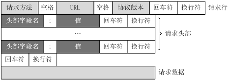
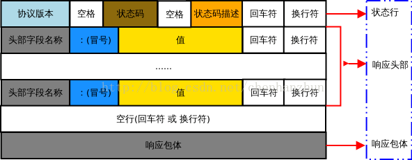

# 滴滴

## 1. 求两个几百G文件数据的交集

将这两个文件通过 hash 的方法，散列到小文件上，分别记为 a1 , a2, a3... an 和 b1, b2, b3, ... bn。再将 a1 与 b1 对比，将相同的数记录下来，依次处理 a2 和 b2 ... an 和 bn。

## 2. 如何在一个程序中用 socket 将百度首页的内容获取到，说一下步骤

1. 首先要从域名中获取到 IP 地址，因为建立 socket 连接需要用到 IP 地址；

2. 用 IP 地址建立起 socket 连接，获取 socket 的输入输出流；

3. 手动封装一个 HTTP GET 报文

   （详细描述 HTTP GET 报文头：

   请求方法 URL 协议版本 【请求行】

   头部字段名：值 【请求头部】

   ​							【空行】

   ........ ........				【请求数据】

   ）

   

   通过 socket 流将构造的HTTP 报文发送出去；

4. 用缓冲区从 socket 的输入流读入接收的数据；

5. 按照 HTTP 响应报文的格式对获取到的数据进行解析，便可等到百度首页的内容**（可以提一下 TCP 粘包对解析造成的响应）**

**HTTP 响应报文**

**HTTP 请求报文**

