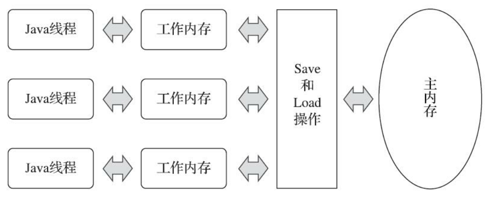

# 猿辅导一面面经


## 一、自我介绍

##  二、进程通信有哪几种方式？

消息队列、共享内存、无名管道、命名管道、信号量、socket

1. 父子进程关系管道 pipe：管道是一种半双工的通信方式，数据只能单向流动，而且只能在具有新缘关系的进程间使用。进程的亲缘关系通常是指父子进程关系。
2. 命名管道 FIFO：有名管道也是半双工的通信方式，但是它允许 **无亲缘的关系进程的通信。**
3. 消息队列 MessageQueue：消息队列是由消息组成的链表，存放在内核中并由消息队列标识符标识。消息队列克服了信号传递信息少、管道只能承载无格式字节流以及缓冲区大小受限等缺点。
4. 共享存储：共享内存就是映射一段能被其他进程所访问的内存，这段共享内存由一个进程创建，但多个进程都可以访问。共享内存是最快的IPC方式，它是针对其他进程间通信方式运行效率低而专门设计的。它往往与其他通信机制，如信号量，配合使用，来实现进程间的同步和通信。
5. 信号量 Semaphore：信号量是一个计数器，可以用来控制多从此进程对共享资源的访问。它常作为一种锁机制，防止某进程正在访问共享资源时，其他进程也访问该资源。因此，主要作为进程间以及同一进程内不同线程之间的同步手段。
6. 套接字 Socket：也是一种进程间通信机制。与其他通信机制不同的是，它可用于不同机器间的进程通信。
7. 信号（signal）：信号是一种比较复杂的通信方式，用于通知接收进程某个事件已经发生。

## 三、线程的几种状态，线程池中的空闲的线程处于什么状态？

1. 新建状态(**new** ）
2. 可运行(**ready**)：正在等待 CPU 时间片。
3. 运行(**running**)：得到CPU时间片开始运行。
4. 阻塞(**blocked**)：等待获取一个排它锁，如果其他线程释放了锁就会结束此状态。
5. 无限期等待(**waiting**)：等待其它线程显式地唤醒，否则不会被分配 CPU 时间片。
6. 限期等待(**time waiting**)：无需等待其他线程显式地唤醒，在一定时间之后会被系统自动唤醒。
7. 终止(**terminated**)：可以是线程结束任务后自己结束，或者产生了异常而结束。

- [`NEW`](file:///E:/JavaLearning/jdk-10.0.2_doc-all/docs/api/java/lang/Thread.State.html#NEW)
       A thread that has not yet started is in this state.     
- [`RUNNABLE`](file:///E:/JavaLearning/jdk-10.0.2_doc-all/docs/api/java/lang/Thread.State.html#RUNNABLE)
       A thread executing in the Java virtual machine is in this state.     
- [`BLOCKED`](file:///E:/JavaLearning/jdk-10.0.2_doc-all/docs/api/java/lang/Thread.State.html#BLOCKED)
       A thread that is blocked waiting for a monitor lock     is in this state.     
- [`WAITING`](file:///E:/JavaLearning/jdk-10.0.2_doc-all/docs/api/java/lang/Thread.State.html#WAITING)
       A thread that is waiting indefinitely for another thread to     perform a particular action is in this state.     
- [`TIMED_WAITING`](file:///E:/JavaLearning/jdk-10.0.2_doc-all/docs/api/java/lang/Thread.State.html#TIMED_WAITING)
       A thread that is waiting for another thread to perform an action     for up to a specified waiting time is in this state.     
- [`TERMINATED`](file:///E:/JavaLearning/jdk-10.0.2_doc-all/docs/api/java/lang/Thread.State.html#TERMINATED)
       A thread that has exited is in this state.    

---

- #### BLOCKED

  等待监视器锁而被阻塞的线程的线程状态。一个处于阻塞状态的线程正在等待一个监视器锁进入一个同步的块/方法，或者在调用`Object.wait`之后重新进入一个同步的块/方法。

  1. 等待一个监视器锁进入一个同步的块/方法会导致线程阻塞；
  2. 调用 `Object.wait`之后重新进入一个同步的块/方法会导致线程阻塞；

  等待获取锁会导致线程阻塞。

- #### WAITING

  调用了 `Object.wait` 没有指定 timeout 和 `Thread.join` 没有指定 timeout 会导致线程进行等待状态。

  处于等待状态的线程正在等待另一个线程执行特定的操作。例如，在一个对象上调用 `object.wait()`的线程正在等待另一个线程调用该对象上的 `object.notify()` 或者 `object.notifyAll`。 调用 `thread.join()` 的线程正在等待指定的线程终止。

所以线程池中空闲的线程处于 **waiting** 状态。

## 四、说一下 volatile 关键字（其中问到我 JMM 中线程的工作内存是哪一块内存？）

两个特性：**保证线程间内存可见性**与**防止指令重排**。

从 CPU层面说 volatile 是如何保证内存可见性的？

* **Lock 前缀指令**；
  1. Lock 前缀指令会引起处理器缓存回写到内存；
  2. 一个处理器的缓存回写到内存会导致其他处理器的缓存无效（处理器会使用 MESI 缓存一致协议去维护内部缓存和其他处理器缓存的一致性。）；

从 JMM 层说 volatile 写/读的内存语义是如何实现的？

为了实现 volatile 的内存语义，编译器在生成字节码时，会在指令序列中插入**内存屏障**来禁止特定类型的处理器重排序。

* 在每个 volatile 写操作的前面插入一个 StoreStore 屏障。
* 在每个 volatile 写操作的后面插入一个 StoreLoad 屏障。
* 在每个 volatile 读操作的前面插入一个 LoadLoad 屏障。
* 在每个 volatile 读操作的后面插入一个 LoadStore 屏障。

 

Java 内存模型

这里所讲的主内存、工作内存与 Java 内存区域中的 Java 堆、栈、方法区等并不是同一个层次的对内存的划分，这两者基本上是没有任何关系的。如果两者一定要勉强对应起来，那么从变量、主内存、工作内存的定义来看，主内存主要对应 Java 堆中的对象实例数据部分，**而工作内存则对应于虚拟机中的部分区域。**

## 五、操作系统是如何管理内存的？

## 六、比较分页与分段

对程序员的透明性：分布透明，但是分段需要程序员显示划分每个段。

地址空间的维度：分布是一维地址空间，分段是二维的。程序员在标识一个地址时，即需要给出段名，又需要给出段内地址。

大小是否可以改变：页的大小不可变，段的大小可以动态改变。

出现的原因：分页主要用于实现虚拟内存，从而获得更大的地址空间；分段主要是为了使进程和数据可以被划分为**逻辑上独立的地址空间并且有助于共享和保护。**

## 七、说一下 MySQL 的索引是什么结构的？

## 八、B+ 树与 B 树的比较

## 九、手撕代码（设计一个循环队列，能够重复利用队列里面的元素）

```java

public class CircleQueue {
    int[] queue;
    int head=0,tail=0;
    int count=0;
    int Capacity;
    public CircleQueue(int Capacity){
        this.Capacity=Capacity;
        queue = new int[Capacity];
    }

    public void push(int val){
        queue[tail++]=val;
        if(tail>=Capacity) tail %=Capacity;
        count++;
    }

    public int pop() throws Exception {
        if(count==0){
            throw new Exception("this queue is empty!");
        }else {
            int val = queue[head++];
            if(head>=Capacity) head %=Capacity;
            count--;
            return val;
        }
    }

    public static void main(String[] args) throws Exception {
        CircleQueue cq = new CircleQueue(5);
        int[] nums = {1,2,3,4,5};
        for(int i:nums){
            cq.push(i);
        }

        cq.push(100);
        cq.push(200);
        cq.push(300);
        System.out.println(cq.pop());
    }
}
```

## 题目[543. 二叉树的直径](https://leetcode-cn.com/problems/diameter-of-binary-tree/)

给定一棵二叉树，你需要计算它的直径长度。一棵二叉树的直径长度是任意两个结点路径长度中的最大值。这条路径可能穿过也可能不穿过根结点。

 

示例 :
给定二叉树

          1
         / \
        2   3
       / \     
      4   5    

返回 3, 它的长度是路径 [4,2,1,3] 或者 [5,2,1,3]。

```java
    public int diameterOfBinaryTree(TreeNode root) {
        maxDepth(root);
        return maxLen;
    }

    int maxLen=0;
    int maxDepth(TreeNode root){
        if(root==null) return 0;

        int leftLen = maxDepth(root.left);
        int rightLen = maxDepth(root.right);
        // 后序遍历
        maxLen=Math.max(maxLen,leftLen+rightLen);
        return Math.max(leftLen,rightLen)+1;
    } 
```

