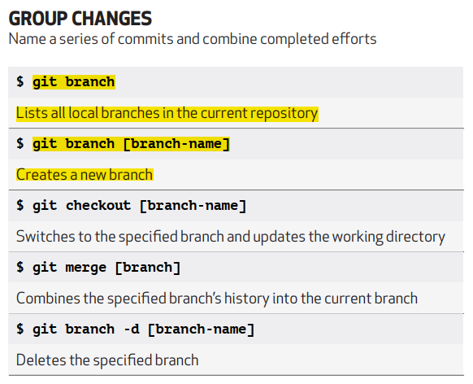
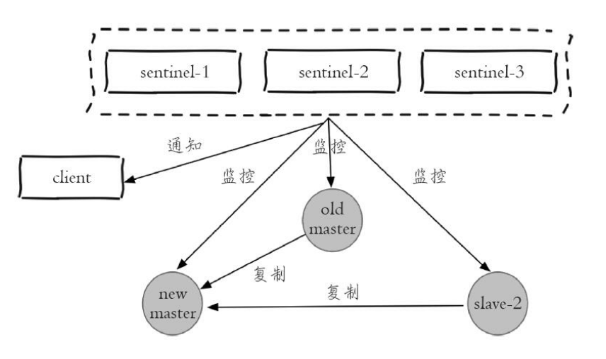

# 百度一面

## 一、分布式锁

## 二、阻塞队列

## 三、为什么 Redis 这么快

1. 完全基于内存，类似于 HashMap ， 优势是查找和操作的时间复杂度都是 O(1)。
2. 数据结构专门设计，支持 String，Hash， Set ，ZSet，List 等。可以根据各种场景来选择。
3. 采用单线程，不存在锁竞争和线程切换问题。
4. 使用多路 I/O 复用模型，非阻塞 IO；多路 I/O 复用模型是利用 select ， poll ，epoll 可以同时监察多个流的 I/O 事件的能力，在空闲的时候，会把当前线程阻塞掉，当有一个或多个流有 I/O 事件时，就从阻塞态中唤醒，于是程序就会轮询一遍所有的流，顺序处理就绪的流。
5. 持久化采用子线程进行磁盘操作。

## 四、ConcurrentHashMap : A 线程在读取数据，B 线程在删除/更新数据，是怎么执行的？

## 五、skiplist 与平衡树、哈希表的比较

（1） skiplist 和各种平衡树（如 AVL、红黑树等）的元素是有序排列的，而哈希表不是有序的。因此，在哈希表中只能做单个 key 的查找，不适宜做范围查找。

（2）**（范围查找）**在做范围查找时，平衡树比 skiplist 操作要复杂。在平衡树上，我们要通过中序遍历来完成范围查找。而在 skiplist 上进行范围查找就非常简单，只需要最小值后，对第 1 层链表进行若干步的遍历就可以实现。

（3）**（插入和删除）**平衡树的插入和删除操作可能引发子树的调整，逻辑复杂，而 skiplist 的插入和删除只需要修改相邻节点的指针，操作简单又快速。

（4）**（内存占用）**从内存占用来说，skiplist 比平衡树更灵活一些。一般来说，平衡树每个节点包含 2 个指针（分别指向左右子树），而 skiplist 每个节点包含的指针数目平均为 1/(1-p)，具体取决于参数 p 的大小。Redis 的实现为 p=1/4，那么平均每个节点包含 1.33 个指针，比平衡树更有优势。

（5）**（查找）**查找单个 key ， skiplist 和平衡树的时候复杂度都为 O(logn)，大体相当；而哈希表在保持较低的哈希值冲突概率的前提下，查找时间复杂度接近 O(1)，性能更高一些。所以平常使用的各种 Map，大都是基于哈希表实现的。

（6）**（实现难度）**从算法实现难度来说，skiplist 比平衡树要简单得多。

## 六、Git 命令

分支

## 七、MySQL 语句的执行顺序

## 八、Redis 高可用方案

参考：https://developer.aliyun.com/article/626532

### 方案一：Redis Sentinel 架构

为了避免 Redis 单点故障以及，主从复制模式下无法完成故障转移问题，可以使用 Redis Sentinel 架构 。

Redis Sentinel是一个分布式架构， 其中包含若干个 Sentinel 节点和 Redis 数据节点， 每个 Sentinel 节点会对数据节点和其余 Sentinel 节点进行监控， 当它发现节点不可达时， 会对节点做下线标识。 如果被标识的是主节点， 它还会和其他 Sentinel 节点进行“协商”， 当大多数 Sentinel 节点都认为主节点不可达时， 它们会选举出一个Sentinel节点来完成自动故障转移的工作， 同时会将这个变化实时通知给 Redis 应用方。 整个过程完全是自动的， 不需要人工来介入， 所以这套方案很有效地解决了 Redis 的高可用问题。  

该部署架构主要包括两部分：Redis Sentinel 节点和 Redis 数据节点。

其中 Redis Setinel 集群是由若干 Sentinel 节点组成的分布式集群，可以实现故障发现、故障自动转移。Redis Sentinel 的节点数量要满足奇数个。（用于）

#### Redis Sentinel 配置相关命令

#### 优缺点

**优点：**

* Redis Sentinel 集群部署简单；
* 能够解决 Redis 主从模式下的高可用切换问题；
* 可以很方便的实现 Redis 数据节点的线性扩展。

**缺点：**

* 资源浪费，Redis 数据节点中 slave 节点作为备份节点不提供服务；
* Redis Sentinel 主要是针对 Redis 数据节点中的主节点的高可用切换，对 Redis 的数据节点做失败判定分为主观下线和客观下线两种，对于 Redis 的从节点做主观下线，并不能执行故障转移。
* 不能解决读写分离问题，实现起来相对复杂。

**建议：**

* 合理设置参数，防止误切，控制切换灵敏度：
  * quorum
  * down-after-milliseconds 30000
  * failover-timeout 180000
  * maxclient
  * timeout
* 部署的各个节点服务器时间尽量要同步，否则日志的时序会混乱。
* Redis 建议使用 pipeline 和 multi-keys 操作，减少 RTT 次数，提高请求效率。

### 方案二：Redis Cluster

集群主要解决 Redis 分布式方面的需求，比如，当遇到单机内存，并发和流量等瓶颈时，Redis Cluster 能起到很好的负载均衡的目的。

Redis Cluster 集群节点的最小配置为6个节点（3主3从），其中主节点提供读写操作，从节点作为备用节点，不提供请求，只作为故障转移使用。

Redis Cluster 采用**虚拟槽分区**，所有的键根据哈希函数映射到 0~16383个整数槽内，每个节点负责维护一部分槽以及槽所映射的键值数据。

#### Redis Cluster 配置相关命令

#### 优缺点

**优点：**

* 无中心架构；
* 数据按照 slot 存储分布在多个节点，节点间数据共享，可动态调整数据分布；
* 可扩展性：节点可动态添加或删除；
* 高可用性：部分节点不可用时，集群仍可用。 通过增加从节点来做单机数据副本，能够实现故障自动转移，节点之间通过 gossip 协议（流言协议）交换状态信息，用投票机制完成 Slave 到 Master 的角色转换。

**缺点：**

* 节点会因为某些原因发生阻塞（阻塞时间大于 cluster-node-timeout），被判定下线，这种 failover 是没有必要的。
* 主从节点通过异步复制，不保证数据的强一致性。
* 多个业务使用同一套集群时，无法根据统计区分冷热数据，资源隔离性较差，容易出现相互影响的情况。
* Slave 节点在集群中充当备份节点，不能缓解读压力。
* Key 批量操作限制，如使用 mset, mget 目前只支持具有相同 slot 值的 Key 执行批量操作。对于映射为不同 slot 值的 Key 由于 Keys 不支持 slot 查询。

## 九、Rocket MQ 的高可用

## 十、MySQL 的高可用

