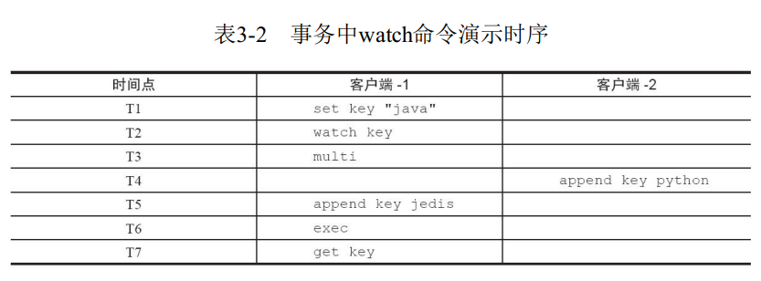
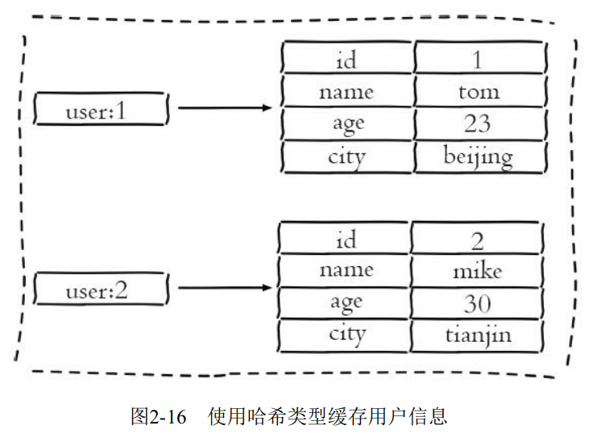

# 贝壳面经

## 1. 容器遍历时删除元素的快速失败与安全失败。

参考：https://blog.csdn.net/Mrzhoug/article/details/51635361

如果在遍历的过程中调用集合的 `remove()` 方法，就会抛出异常。

```java
E 	remove (int index) 	
Removes the element at the specified position in this list (optional operation).
```
```java
boolean 	remove (Object o) 	
Removes the first occurrence of the specified element from this list, if it is present (optional operation).
```


```java
for(int i=0;i<list.size();++i){
    list.remove(i);
}
```

遍历的过程中 `list.size()` 的大小变化了，就会抛出异常。所以，如果想在遍历过程中删除集合中的某个元素，就要用迭代器 `iterator` 的 `remove()` 方法，因为它的 `remove()` 方法不仅会删除元素，还会维护一个标志，用来记录目前是不是可删除状态，例如， 不能连续两次调用它的 `remove()` 方法，调用之前至少有一次 `next()` 方法的调用。

源码是这么描述的：`ArrayList` 继承了 `AbstractList`， 其中`AbstractList` 中有个`modCount`  代表了集合修改的次数。在`ArrayList`的 `iterator` 方法中会判断 `expectedModCount` 与  `modCount` 是否相等，如果相等继续执行，不相等报错，只有 `iterator` 的 `remove` 方法会在调用自身的 `remove` 之后让  `expectedModCount` 与 `modCount` 再相等，所以是安全的。

在使用 `set/map/list` 等集合时，边遍历边删除 / 边遍历边增加元素时都会抛出 `java.util.ConcurrentModificationException` 这样的异常

**错误场景 1 ：set**

```java
Set<String> set = new HashSet<String>();
for (int i = 0; i < 10000; i++) {
    set.add(Integer.toString(i));
}

for (String str : set) { //或使用iterator来循环，JDK5.0以上，这样的遍历底层也都是iterator实现。
    set.add("xxx"); //报错
    //set.remove(str); //报错
}
```

**错误场景 2：map**

```java
Map<String, String> map = new HashMap<String, String>();
for (int i = 0; i < 100; i++) {
    map.put(Integer.toString(i), Integer.toString(i));
}
for (String str : map.keySet()) {//或使用iterator来循环
    map.remove(str); //报错
}
```

**错误场景 3：list**

```java
List<String> list = new ArrayList<String>();
        for (int i = 0; i < 100; i++) {
            list.add(Integer.toString(i));
        }
        for (Iterator<String> it = list.iterator(); it.hasNext();) { 
            String val = it.next();
            if (val.equals("5")) {
                list.add(val); //报错
                //list.remove(val);   //报错    
            }
        }
```

### **错误原因：**

对于 `remove` 操作，`list.remove(o)` 的时候，只将 `modCount++`，而 `expectedModCount` 值未变，那么迭代器在取下一个元素的时候，发现该二值不等，则抛出 `ConcurrentModificationException`异常。

### 解决办法

`remove`:　用  `iterator` 提供的原生态 `remove()`。

`add`: `iterator` 没有提供原生的 `add()` 方法。要用新的容器暂存，遍历结束后，全部添加到原容器中。

**示例：**

`set/list `: 这两类常用的容器，就用 `Iterator()` 的 `remove`方法就可以了。

`map`: 直接使用 `ConcurrentHashMap` 就行。

**正确使用案例：**

```java
for (Iterator<String> it = list.iterator(); it.hasNext();) {
    String val = it.next();
    if (val.equals("5")) {
        it.remove(); 
    }
}


List<String> newList = new ArrayList<String>(); 
for (Iterator<String> it = list.iterator(); it.hasNext();) {
    String val = it.next();
    if (val.equals("5")) {
        newList.add(val);
    }
}
list.addAll(newList);
```


## 2. Integer 常量池问题

```java
	    Integer x = new Integer(100);
        Integer xx = Integer.valueOf(x);
        System.out.println(x == xx);
        Integer y = new Integer(100);
        int z = 100;
        System.out.println(x == y);
        System.out.println(x == z);

        System.out.println(z==Integer.valueOf(100));
```

```java

    /**
     * Returns an {@code Integer} instance representing the specified
     * {@code int} value.  If a new {@code Integer} instance is not
     * required, this method should generally be used in preference to
     * the constructor {@link #Integer(int)}, as this method is likely
     * to yield significantly better space and time performance by
     * caching frequently requested values.
     *
     * This method will always cache values in the range -128 to 127,
     * inclusive, and may cache other values outside of this range.
     *
     * @param  i an {@code int} value.
     * @return an {@code Integer} instance representing {@code i}.
     * @since  1.5
     */
    public static Integer valueOf(int i) {
        if (i >= IntegerCache.low && i <= IntegerCache.high)
            return IntegerCache.cache[i + (-IntegerCache.low)];
        return new Integer(i);
    }
```


## 3.  已知目的 ip 地址，本地的数据包是如何传输到目的主机的？

路由传输过程：先从本机发送到离我最近的一个网关，数据包的 ip 地址不变，但 mac 地址会改成网关的 mac 地址（Mac 地址用于局域网实体识别），然后再转发给路由器，路由器会根据它的路由表选择端口转发，一直到目的主机。

其中还可以提一下 NAT （网络地址转换），比如我们学校，所有的老师和同学都是用的一个公用地址进行对互联网的访问的。

## 4. 父类的静态代码块，父类构造器，子类的静态代码块，子类的构造器，先后执行顺序。

**静态代码块是给类初始化的，而构造代码块是给对象初始化的。**

当涉及到继承时，按照如下顺序执行：

1. 执行父类的静态代码块；
2. 执行子类的静态代码块；
3. 执行父类的构造代码块；
4. 执行子类的构造代码块；

## 5. Redis 支持事务么？

Redis 提供了简单的事务，将一组需要一起执行的命令放到 `multi` 和 `exec` 两个命令之间。`multi` 命令代表事务开始， `exec` 代表事务的结束，它们之间的命令是顺序执行的， 例如下面操作实现了上述用户关注问题  。

```redis
127.0.0.1:6379> multi
OK
127.0.0.1:6379> sadd user:a:follow user:b
QUEUED
127.0.0.1:6379> sadd user:b:fans user:a
QUEUED
```

此时命令并没有立即执行，只是暂时保存了 Redis 的命令队列中。

只有当 `exec` 执行后，用户 A 关注用户 B 的行为才算完成。如果要停止事务的执行，可以使用 `discard` 命令代替 `exec` 命令即可。 

### 命令出现错误时，Redis 的处理机制

#### 1. 命令错误

例如下面操作错将 `set` 写成 `sett` ， 属于语法错误，会造成整个事务无法执行，`key` 和 `counter` 的值未发生变化：

```redis
127.0.0.1:6388> mget key counter
1) "hello"
2) "100"
127.0.0.1:6388> multi
OK
127.0.0.1:6388> sett key world
(error) ERR unknown command 'sett'
127.0.0.1:6388> incr counter
QUEUED
127.0.0.1:6388> exec
(error) EXECABORT Transaction discarded because of previous errors.
127.0.0.1:6388> mget key counter
1) "hello"
2) "100"
```

#### 2. 运行时错误

例如用户 B 在添加粉丝列表时， 误把 `sadd` 命令写成了 `zadd` 命令， 这种就
是运行时命令， 因为语法是正确的：  

```redis
127.0.0.1:6379> multi
OK
127.0.0.1:6379> sadd user:a:follow user:b
QUEUED
127.0.0.1:6379> zadd user:b:fans 1 user:a
QUEUED
127.0.0.1:6379> exec
1) (integer) 1
2) (error) WRONGTYPE Operation against a key holding the wrong kind of value
127.0.0.1:6379> sismember user:a:follow user:b
(integer) 1
```

可以看到 `Redis `并不支持回滚功能， `sadd user： a： follow user： b`命令已经执行成功， 开发人员需要自己修复这类问题。  

### Redis 中控制事务是否执行

有些应用场景需要在事务之前， 确保事务中的 `key` 没有被其他客户端修
改过， 才执行事务， 否则不执行（类似乐观锁） 。 `Redis` 提供了`watch` 命令来解决这类问题， 表3-2展示了两个客户端执行命令的时序。  



可以看到“客户端-1”在执行 `multi `之前执行了 `watch` 命令， “客户
端-2”在“客户端-1”执行 `exec` 之前修改了 `key` 值， 造成事务没有执行（`exec`结果
为 `nil`） ， 整个代码如下所示：  

```redis
#T1： 客户端1
127.0.0.1:6379> set key "java"
OK
#T2： 客户端1
127.0.0.1:6379> watch key
OK
#T3： 客户端1
127.0.0.1:6379> multi
OK
#T4： 客户端2
127.0.0.1:6379> append key python
(integer) 11
#T5： 客户端1

127.0.0.1:6379> append key jedis // 客户端2
QUEUED

#T6： 客户端1
127.0.0.1:6379> exec
(nil)
#T7： 客户端1
127.0.0.1:6379> get key
"javapython"

```

`Redis` 提供了简单的事务， 之所以说它简单， 主要是因为它不支持事务
中的回滚特性， 同时无法实现命令之间的逻辑关系计算。

**可以用 Lua 脚本来实现事务。**

## 6. Redis 的 pipeLine 

Redis 客户端执行一条命令分为如下四过程：

1）发送命令

2）命令保存

3）命令执行

4）返回结果

其中 1）和4）称为 Round Trip Time （RTT，往返时间）

Redis 提供了批量操作命令（例如 mget，mset 等），有效地节约 RTT。

Pipeline （流水线）机制能改善上面这类问题，它能将一组 Redis 命令进行组装，通过一次 RTT 传输给 Redis ，再将这组 Redis 命令的执行结果按顺序返回给客户端。

## 7. Redis 想要实现对某一个 key 的监测，应用怎么做？

### 方法1： `watch` 命令

`watch` 命令用于监视一个（或多个）`key`， 如果事务执行之前（或这些）`key` 被其他命令所改动，那么事务将不执行。

### 方法2：使用发布/订阅功能

B 线程想要监测 A 线程是否对某个 key 的改动，A 线程若改动，则在它的频道上发布一条消息，B 线程订阅了 A 线程的频道，可以异步收到 A 线程是否改动特定变量的消息。

## 8. Spring 的 AOP 和 IOC功能？

Spring 的 AOP 是如何实现的，哪种方式的性能较好？

AOP 当中的概念：

* 切入点（Pointcut）：在哪些类，哪些方法上切入（**where**）
* 通知（Advice）：在方法执行的什么时间（**when**：方法前/方法后/方法前后）做什么 （**what** 增强的功能）
* 切面（Aspect）：切面 = 切入点 + 通知。通俗点就是：**在什么时机，什么地方，做什么增强**
* 织入（Weaving）：把切面加入到对象，并创建出代理对象的过程。（由 Spring 来完成）

Spring AOP 如何实现的？

Spring AOP 中的动态代理主要有两种方式，JDK 动态代理和 CGLIB 动态代理。JDK 动态代理通过反射来接收被代理的类，并且要求被代理的类必须实现一个接口。JDK 动态代理的核心是 `InvocationHandler` 接口和 `Proxy` 类。

如果目标类没有实现接口，那么 Spring AOP 会选择使用 CGLIB 来动态代理目标类。CGLIB （Code Generation Library），是一个代码生成的类库，可以在运行时动态地生成某个类的子类，注意 CGLIB 是通过继承的方式做的动态代理，因此如果某个类被标记为 `final`，那么它是无法使用 CGLIB 做动态代理。

**性能指标：**

1. CGLIB 所创建的动态代理对象在实际运行时性能要比 JDK 动态代理高，有研究表明，大概要高 10 倍；
2. CGLIB 在创建对象时所花费的时间要比 JDK 动态代理要多，有研究表明，大概要多 8 倍；
3. 对于 singleton 的代理对象或者是具有实例池的代理，因为无需要频繁的创建代理对象，所以采用 CGLib 动态代理比较合适，反之则比较适合用 JDK 动态代理。

**强制使用 CGLIB 实现 AOP：**

1.添加CGLIB依赖库
 2.在Spring配置文件中加入`<aop:aspectj-autoproxy proxy-target-class="true"/>`

参考：https://juejin.im/post/6844903604118093831

## 9. 应用服务器如何保证高可用？


## 10. 如何设计一个高并发低阻塞的线程池？

阻塞队列的容量要大，最大核心线程数要多。

## 11. Redis 的常用数据结构及应用场景

**字符串 `set key value`**

`setnx` 和 `setxx` 在实际使用中有什么应用场景？

以 `setnx` 命令为例子， 由于 `Redis` 的单线程命令处理机制， 如果有多个客户端同时执行 `setnx key value` ，根据 `setnx` 的特性只有一个客户端能设置成功， `setnx` 可以作为分布式锁的一种实现方案， `Redis` 官方给出了使用`setnx` 实现分布式锁的方法： http://redis.io/topics/distlock。  

**哈希**

应用场景：

可以建立用户的用户属性和行为的关联。



相比于使用字符串序列化缓存用户信息，哈希类型变得更加直观，并且在更新操作上会更加便捷。**可以将每个用户的 id 定义为键，多对 field-value 对应每个用户的属性。**

**列表**

在要求顺序的使用场景都可以使用列表。

**集合**

使用场景是标签（tag）。标签属于不可重复的数据。在需要不重复出现的场景下都可使用集合。

**有序集合**

有序集合比较典型的使用场景是**排行榜系统**。

## 12. 用Synchronized进行加锁，大量线程同时争抢一个锁时，只有一个线程获取到了锁，其余线程是处于什么状态？

synchronized 有一个锁升级的过程，当处于轻量级锁时，没抢到锁的线程仍在 CAS 争抢锁，处于 Running 状态。

当升级到了重量级锁时，没抢到锁的线程会处于阻塞状态。