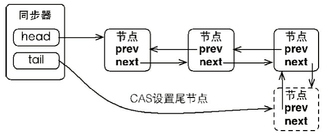

# 面经

## 阿里

### 一面——电话面

**1. 红黑树的特点**

参考：https://zh.wikipedia.org/wiki/%E7%BA%A2%E9%BB%91%E6%A0%91

1. **节点是红色或黑色的；**
2. **根是黑色；**
3. **所有叶子都是黑色（叶子是 NIL 节点）；**
4. 每个红色节点必须有两个黑色的子节点。（从每个叶子到根的所有路径上不能有两个连续的红色节点。）
5. 从任一节点到其每个叶子的所有简单路径都包含相同数目的黑色节点。（**黑高**）


**2. 数据库设置隔离级别的命令**

查看当前会话隔离级别：`select @@tx_isolation;`

查看系统当前隔离级别：`select @@global.tx_isolation;`

设置当前会话隔离级别：`set session transaction isolation level repeatable read;`

设置系统当前隔离级别：`set global transaction isolation level repeatable read;`

命令行，开始事务时：`set autocommit=off` 或 `start transaction`

**3. 数据库如何重建索引**

**4. 多线程的用途**

**5. wait 和 blocked 状态的区别**

**BLOCKED** 是指线程正在等待获取锁； **WAITING** 是指线程正在等待其他线程发来的通知（notify），收到通知后，可能会顺序向后执行（RUNNABLE），也可能会再次获取锁，进而被阻塞（**BLOCKED**）。

**6. 线程池有哪些类**

Java 通过 Executors 提供四种线程池，分别为：

* newCachedThreadPool 创建一个可缓存线程池，如果线程池长度超过处理需要，可灵活回收空闲线程，若无可回收，则新建线程。
* newFixedThreadPool 创建一个定长线程池，可控制线程最大并发数，超出的线程会在队列中等待；
* newScheduledThreadPool 创建一个定长线程池，支持定时及周期性任务执行；
* newSingleThreadExecutor 创建一个单线程化的线程池，它只会用唯一的工作线程来执行任务，保证所有任务按照指定顺序（FIFO）执行。

**7. 具体说说 AQS**


**8. 说说 CLH 队列**

**同步队列**

同步器依赖内部的同步队列（一个 FIFO 双向队列）来完成同步状态的管理，当前线程获取同步状态失败时，同步器会将当前线程以及等待状态等信息构造成为一个节点（Node）并将其加入同步队列，同时会阻塞当前线程，当同步状释放时，会把首节点中的线程唤醒，使其再次尝试获取同步状态。

同步队列中的节点（Node）用来保存获取同步状态失败的线程引用、等待状态以及前驱和后继节点，节点的属性类型与名称。

节点是构成同步队列（等待队列）的基础，同步器拥有首节点（head）和尾节点（tail），没有成功获取同步状态的线程将会成为节点加入该队列的尾部。


同步器提供了一个基于 CAS 的设置尾节点的方法：`compareAndSetTail(Node expect, Node update)`，它需要传递当前线程“认为”的尾节点和当前节点，只有设置成功后，当前节点才正式与之前的尾节点建立关联。




**9. BlockingQueue 的使用场景**

JDK7 提供了 7 个阻塞队列。分别是

* ArrayBlockingQueue：一个由数组结构组成的有界阻塞队列；
* LinkedBlockingQueue：一个由链表结构组成的有界阻塞队列；
* PriorityBlockingQueue：一个支持优先级排序的无界阻塞队列；
* DelayQueue：一个使用优先级队列实现的无界阻塞队列；
* SynchronousQueue：一个不存储元素的阻塞队列；
* LinkedTransferQueue：一个由链表结构组成的无界阻塞队列；
* LinkedBlockingDequeue：一个由链表结构组成的双向阻塞队列；

**10. 设计模式**

**11. 说一下设计模式：观察者模式**

**12. 观察者模式可以用在多线程中么，怎么使用**

notify 方法可以使用多线程；

还有... 

**13. MQ 的 ACK 状态**

**14. 了解堆外内存么，使用场景是什么**

**15. 数据库的隔离级别，每种隔离级别解决的问题**

**16. 数据库索引类型有哪几种（B+ 树、哈希索引... ）**

**17. 数据库：有一百个字段，查询需要用到50个字段，如何设计？**

**18. Redis 是部署在单独一台服务器还是跟应用服务器一起**

RPC 调用（序列化与反序列化，网络传输开销）

**19. Guava 一级缓存**

**20. 应用服务器使用了 Guava 缓存 ，频繁出现GC，如何排查？**

**21. 了解过消息中间件么，有哪几种，对比一下**

**22. 创建线程的几种方式？**

**23. callable 使用步骤**

**24. InnoDB 和 MyISAM 的区别？**

**25. 了解堆外内存么？，在什么场景下会使用堆外内存**

**参考**：

https://juejin.im/post/6844903710766661639

https://www.cnblogs.com/duanxz/p/3141647.html

Java 中的对象都是在 JVM 堆中分配的，其好处在于开发者不用关心对象的回收。但有利必有弊，堆内内存主要有两个缺点：1. GC 是有成本的，堆中的对象数量越多，GC 的开销也会越大。 2. 使用堆内内存进行文件、网络的IO时，JVM会使用堆外内存做一次额外的中转，也就是会多一次内存拷贝。

和堆内存相对应，堆外内存就是把内存对象分配在 Java 虚拟机堆以外的内存，这些内存直接受操作系统管理（而不是虚拟机），这样做的结果就是能够在一定程度上减少垃圾回收对应用程序造成的影响。

**堆外内存的实现**

Java 中分配堆外内存的方式有两种，一是通过 `ByteBuffer.java#allocateDirect` 得到一个 `DirectByteBuffer` 对象，二是直接调用`Unsafe.java#allocateMemory` 分配内存，但 `Unsafe` 只能在 JDK 的代码中调用，一般不会直接使用该方法分配内存。

其中`DirectByteBuffer`也是用Unsafe去实现内存分配的，对堆内存的分配、读写、回收都做了封装。

**堆外内存的使用场景**

* **适合长期存在或能复用的场景**
  * 堆外内存分配回收也是有开销的，所以适合长期存在的对象；
* **适合注重稳定的场景**
  * 堆外内存能有效避免因 GC 导致的暂停问题；
* **适合简单对象的存储**
  * 因为堆外内存只能存储字节数组，所以对于复杂的 DTO 对象，每次存储/读取都需要序列化/反序列化。
* **适合注重 IO 效率的场景**
  * 用堆外内存读写文件性能更好。

**堆外内存的优缺点**

堆外内存，其实就是不受JVM控制的内存。相比于堆内内存有几个优势： 
　　1 、减少了垃圾回收的工作，因为垃圾回收会暂停其他的工作（可能使用多线程或者时间片的方式，根本感觉不到 。
　　2 、加快了复制的速度。因为堆内在flush到远程时，会先复制到直接内存（非堆内存），然后在发送；而堆外内存相当于省略掉了这个工作。 
　　3、可以在进程间共享，减少JVM间的对象复制，使得JVM的分割部署更容易实现。
　　4、可以扩展至更大的内存空间。比如超过1TB甚至比主存还大的空间。

　而福之祸所依，自然也有不好的一面： 
　　1 堆外内存难以控制，如果内存泄漏，那么很难排查 
　　2 堆外内存相对来说，不适合存储很复杂的对象。一般简单的对象或者扁平化的比较适合。

站在系统设计的角度来看，使用堆外内存可以为你的设计提供更多可能。最重要的提升并不在于性能，而是决定性的。


**26. 方法区会发生OOM么，让你设计一个实验来证明一下**

JDK8以前称方法区为**Permanent Generation （永久代）**，JDK8后称方法区为**Meta Space（元空间）**。

JDK8前：

```
-XX: PermSize=128m
-XX: MaxPermSize=128m
```

JDK8后：

```
-XX: MetaspaceSize=128m
-XX: MaxMetaspaceSize=128m
```

---

**方法区和运行时常量池溢出**

在 JDK6 前运行时常量池是方法区的一部分，可以使得运行时常量池内容增多来达到方法区溢出的目的。

`String:intern()` 是一个本地方法，它的作用是如果字符串常量池中已经包含一个等于此 `String` 对象的字符串，则返回代表池中这个字符串的 `String` 对象的引用；否则，会将此 `String` 对象包含的字符串添加到常量池中，并且返回此 `String` 对象的引用。在 JDK6 或更早之前的 HotSpot 虚拟机中，常量池都是分配在永久代中，我们可以通过 `-XX: PermSize` 和 `-XX: MaxPermSize`限制永久代的大小，即可间接限制其中常量池的容量。

```java
/**
 * VM Args： -XX:PermSize=6M -XX:MaxPermSize=6M
 * @author zzm
 */
public class RuntimeConstantPoolOOM {
    public static void main(String[] args) {
// 使用Set保持着常量池引用， 避免Full GC回收常量池行为
        Set<String> set = new HashSet<String>();
// 在short范围内足以让6MB的PermSize产生OOM了
        short i = 0;
        while (true) {
            set.add(String.valueOf(i++).intern());
        }
    }
}
```

运行结果：

```java
Exception in thread "main" java.lang.OutOfMemoryError: PermGen space
	at java.lang.String.intern(Native Method)
	at org.fenixsoft.oom.RuntimeConstantPoolOOM.main(RuntimeConstantPoolOOM.java: 18)
```

从运行结果中可以看到，运行时常量池溢出时，在 `OutOfMemoryError` 异常后面跟随的提示信息是“PermGen space”，说明运行时常量池的确是属于方法区（即 JDK 6的 HotSpot 虚拟机中的永久代）的一部分。

而使用 JDK 7 或更高版本的 JDK 来运行这段程序并不会得到相同的结果，无论是在JDK 7中继续使用`-XX：MaxPermSize`参数或者在JDK 8及以上版本使用`-XX： MaxMeta-spaceSize`参数把方法区容量同样限制在6MB， 也都不会重现JDK 6中的溢出异常， 循环将一直进行下去， 永不停歇  。出现这种变化，是因为自 JDK 7起，原本存放在永久代的字符串常量池被移至 Java 堆之中，所以在 JDK 7 及以上版本，限制方法区的容量对该测试用例来说是毫无意义的。只会产生堆溢出。

我们再来看看方法区的其他部分的内容，方法区的主要职责是用于存放类型的相关信息，如类名、访问修饰符、常量池、字段描述、方法描述等。对于这部分区域的测试，基本思路是运行时产生大量的类去填满方法区，直到溢出为止。虽然直接使用 Java SE API 也可以动态产生类（如反射时的 `GeneraedConstructorAccessor`和动态代理等），但在本次实验中操作起来比较麻烦，因此借助了 CGLib 直接操作字节码运行时生成了大量的动态类。

值得特别注意的是，我们在这个例子中模拟的场景并非纯粹是一个实验，类似这样的代码确实可能会出现在实际应用中：当前的很多主流框架，如 Spring、Hibernate 对类进行增强时，都会使用到 CGLib 这类字节码技术，当增加的类越多时，就需要越大的方法区以保证动态生成的新类型可以载入内存。另外，很多运行于 java 虚拟机上的动态语言（例如 Groovy等）通常都会持续创建新类型来支撑语言的动态性，随着这类动态语言的流行，方法区溢出的场景也越来越容易遇到。

借助CGLib使得方法区出现内存溢出异常  ：

```java
/**
 * VM Args： -XX:PermSize=10M -XX:MaxPermSize=10M
 * @author zzm
 */
public class JavaMethodAreaOOM {
    public static void main(String[] args) {
        while (true){
            Enhancer enhancer = new Enhancer();
            enhancer.setSuperclass(OOMObject.class);
            enhancer.setUseCache(false);
            enhancer.setCallback(new MethodInterceptor(){
               public Object intercept(Object obj, Method method, Object[] args, MethodProxy proxy) throws Exception{
                   return proxy.invodeSuper(obj,args);
               } 
            });
        }
    }
    
    static class OOMObject{
        
    }
}
```

在 JDK 7 中的运行结果：

```java
Caused by: java.lang.OutOfMemoryError: PermGen space
	at java.lang.ClassLoader.defineClass1(Native Method)
	at java.lang.ClassLoader.defineClassCond(ClassLoader.java:632)
	at java.lang.ClassLoader.defineClass(ClassLoader.java:616)
	... 8 more
```

方法区溢出也是一种常见的内存溢出异常，一个类如果要被被垃圾收集器回收，要达成的条件是比较苛刻的。在经常运行时生成大量动态类的应用场景里，就应该特别关注这些类的回收状况。这类场景除了之前提到的程序使用了 CGLib 字节增强和动态语言外，常见的还有：大量 JSP 或动态产生 JSP文件的应用（JSP第一次运行时需要编译为 Java 类）。

在 JDK 8 以后，永久代便完全退出了历史舞台，元空间作为其替代者登场。

## 字节跳动

### 1. byte 按位逆序输出一个 byte

```java
    public static byte reverse(byte n){
        byte res=0;
        byte count =0;
        while (count<8){
            res <<=1;
            res |=(n&1);
            n >>=1;
            count++;
        }
        return res;
    }
```

参考：leetcode-cn.com/problems/reverse-bits/solution/xiang-xi-tong-su-de-si-lu-fen-xi-duo-jie-fa-by-4-9/

### 2. 实现一个树的前序遍历迭代器

**前序遍历迭代器**

```java
    static class TreePreIterator implements Iterator<TreeNode> {
        TreeNode nextNode;
        Stack<TreeNode> stack;

        public TreePreIterator(TreeNode root){
            this.nextNode =root;
            stack = new Stack<>();
        }

        @Override
        public boolean hasNext() {
            return (nextNode !=null) || (!stack.empty());
        }

        @Override
        public TreeNode next() {
            TreeNode res=null;
            if(nextNode !=null){
                stack.push(nextNode);
            }
            if(!stack.empty()){
                res=stack.pop();
                if(res.right!=null) stack.push(res.right);
                nextNode =res.left;
            }
            return res;
        }
    }
```

**中序遍历迭代器**

```java
    static class TreeInorderIterator implements Iterator<TreeNode>{
        TreeNode nextNode;
        Stack<TreeNode> stack;

        public TreeInorderIterator(TreeNode root){
            this.nextNode =root;
            stack = new Stack<>();
        }

        @Override
        public boolean hasNext() {
            return (nextNode !=null) || (!stack.empty());
        }

        @Override
        public TreeNode next() {
            TreeNode res=null;
            while (nextNode !=null){
                stack.push(nextNode);
                nextNode = nextNode.left;
            }

            if(!stack.isEmpty()){
                res=stack.pop();
                nextNode =res.right;
            }
            return res;
        }
    }
```


### 3. 广播与组播的区别

参考：https://colobu.com/2014/10/21/udp-and-unicast-multicast-broadcast-anycast/

**单播（unicast）**：是指封包在计算机网络的传输中，目的地址为单一目标的一种传输方式。它是现今网络应用最为广泛，通常所使用的网络协议或服务大多采用单播传输，例如一切基于 TCP 的协议；

**组播（multicast）**：也叫多播，多点广播或群播。指把信息同时传递给一组目的地址。它使用策略是最高效的，因为消息在每条网络链路上只需传递一次，而且只有在链路分叉时，消息才会复制。

**广播（broadcast）**：是指封包在计算机网络中传输时，目的地址为网络中所有设备的一种传输方式。实际上，这里所说的“所有设备”也是限定在一个范围中，称为“广播域”。

**任播（anycast）**:是一种网络寻址和路由的策略，使得资料可以根据路由拓扑来决定送到“最近”或“最好”的目的地。

### 4. 说一下 java 异步 IO


### 5. epoll 与传统 IO 的区别


### 6. HTTP 1.0 HTTP 1.1 HTTP 2.0 

1.0 -> 1.1

新增 长连接、管道、断点续传。

1.1 -> 2.0

多路复用、帧头压缩、服务端推送。 

## 小米面试

### 1. Redis 与 MySQL 的双写机制；

从强一致性与弱一致性出发回答；

参考：https://developer.aliyun.com/article/712285

客户端对数据库中的数据主要有两类操作，读（select）与写（DML）。针对 放入 redis 中缓存的热点数据，当客户端想读取的数据在缓存中就直接返回数据，即命中缓存（cache hit），当读取的数据不在缓存内，就需要从数据库中将数据读入缓存，即未命中缓存（cache miss）。所以读操作并不会导致缓存与数据库中的数据不一致。

对于写操作（DML），缓存与数据库中的内容都需要被修改，但两者的执行必定存在一个先后顺序，这可能会导致缓存与数据库中的数据不再一致，此时需要考虑两个问题：

1. 执行顺序的问题：先更新缓存还是先更新数据库？
2. 更新缓存的策略问题：当缓存中的内容变化时，是选择修改缓存（update），还是直接淘汰缓存（delete）？

**针对这两点问题，一共可以分为四种方案：**

1. 先更新缓存，再更新数据库；
2. 先更新数据库，再更新缓存；
3. 先淘汰缓存，再更新数据库；
4. 先更新数据库，再淘汰缓存；

#### 【疑问一】 更新 cache 还是淘汰 cache？

**淘汰 cache：**

优点：操作简单，无论更新操作是否复杂，直接将缓存中的旧值淘汰。

缺点：淘汰 cache 后，下一次查询无法在 cache 中查到，会有一次 cache miss，这时需要重新读取数据库。

**更新 cache：**

更新 cache 的意思就是将更新操作也放到缓存中执行，并不是数据库中的值更新后再将最新值传到缓存。

优点：命中率高，直接更新缓存，不会有 cache miss 的情况。

缺点：更新 cache 消耗较大。

当更新操作简单，如只是将这个值直接修改为某个值，更新 cache 与淘汰 cache 的消耗差不多。

但当更新操作的逻辑较复杂时，需要涉及到其它数据，如用户购买商品付款时，需要考虑打折等因素，这样需要缓存与数据库进行多次交互，将打折等信息传入缓存，再与缓存中的其它值进行计算才能得到最终结果，此时更新 cache 消耗要大于直接淘汰 cache。

所以选择直接淘汰缓存更好，如果之后需要再次读取这个数据，最多会有一次缓存失败。

**【更新 cache 的另一个问题】**

我们现在已经知道直接淘汰 cache 比更新 cache 要更好，现在再进一步思考下更新 cache 的其它问题。

对于上文列举的四种方案的前两种，即：

1. 先更新（update）缓存，再更新数据库；
2. 先更新数据库，再更新（缓存）；

当并发量较大时，同时有两个线程需要对同一个数据进行更新时，可能会出现以下问题：

**方案一、先更新（update）缓存，再更新数据库**

线程A更新了缓存

线程B更新了缓存

线程B更新了数据库

线程A更新了数据库

**方案二、先更新数据库，再更新（update）缓存**

线程A更新了数据库

线程B更新了数据库

线程B更新了缓存

线程A更新了缓存

如果不同的线程对同一个数据进行更新时，更新的先后顺序有明确要求，那么上述两种方案都会导致数据的不一致，解决的思路是“串行化”，即对同一个数据的修改，要以串行化的方式。

**结论：** 更新 cache 的消耗更大，且很可能造成数据的不一致，所以推荐直接淘汰 cache。

#### 【疑问二】执行顺序的问题

究竟是先淘汰缓存还是先更新数据库？

这里主要分为两个方面来考虑：

1. 更新数据库与淘汰是两个步骤，只能先后执行，如果在执行过程中后一步执行失败，哪种方案的影响最小？
2. 如果不考虑执行失败的情况，但更新数据库与淘汰缓存必然存在一个先后顺序，在上一个操作执行完毕，下一个操作还未完成时，如果并发较大，仍旧会导致数据库与缓存中的数据不一致，在这种情况下，用哪种方案影响最小？

另外，对于数据库而言，读写操作可以只作用在同一台服务器上，即底层只有一个数据库，也可以将读操作放在从库，写操作放在主库，即底层是主从架构，对于主从架构还需要考虑主从延迟，本文针对的是单节点模式。

#### 【数据库是单节点】

**情景一：** 更新数据库与淘汰缓存需要先后执行，如果在执行过程中后一步执行失败，哪种方案对业务的影响最小？

方案一、先淘汰缓存，再更新数据库

如果第一步淘汰缓存成功，第二步更新数据库失败，此时再次查询缓存，最多会有一次 cache miss。

方案二、先更新数据库，再淘汰缓存

如果第一步更新数据库成功，第二步淘汰缓存失败，则会出现数据库中是新数据，缓存中是旧数据，即数据不一致。解决办法：为确保缓存删除成功，需要用到“重试机制”，即当删除失效缓存后，返回一个错误，由业务代码再次重试，直到缓存被删除。

但对于方案一，如果更新数据库失败其实也是一个问题，为了确保数据库中的数据被正常更新，也需要“重试机制”，即当数据库中的数据更新失败后，也需要人工或业务代码再次重试，直到更新成功。

**【结论】** 总体而言，虽然方案二导致数据不一致的可能性更大，但在业务中，无论是淘汰缓存还是更新数据库，我们都需要确保它们真正完成了，所以个人认为在情景一下两种方案并没有什么优劣之分。

**重试机制的原理图：**


**情景二：** 假设没有操作会执行失败，但执行前一个操作后无法立即完成下一个操作，在并发操作较大的情况下，可能会导致数据不一致。此时，哪种方案对业务的影响最小？

#### 方案一、先淘汰缓存，再更新数据库

1. 在正常情况下，A、B两个线程先后对同一个数据进行读写操作：

   A 线程进行写操作，先淘汰缓存，再更新数据库；

   B 线程进行读操作，发现缓存中没有想要的数据，从数据库中读取更新后的新数据。

   此时没有问题。

2. 在并发量较大的情况下，采用同步更新缓存的策略：

   A 线程进行写操作，先成功淘汰缓存，但由于网络或其它原因，还未更新数据库或正在更新。

   B 线程进行读操作，发现缓存中没有想要的数据，从数据库中读取数据，但此时A线程还未完成更新操作，所以读取到的是旧数据，并且 B 线程将旧数据放入缓存。**注意此时是没有问题的**，因为数据库中的数据还未完成更新，所以数据库与缓存此时存储的都是旧值，数据没有不一致。

   在 B 线程将旧数据读入缓存后，A 线程终于将数据更新完成，**此时是有问题的**，数据库中是更新后的新数据，缓存中是更新前的旧数据，数据不一致。如果在缓存中没有对该值设置过期时间，旧数据将一直保存在缓存中，数据将一直不一致，直到之后再次对该值进行修改时才会在缓存中淘汰该值，此时可能会导致 cache 与数据库的数据一直或很长时间不一致。

3. 在并发量较大情况下，采用异步更新缓存的策略：

   A 线程进行写操作，先成功淘汰缓存，但由于网络或其它原因，还未更新数据库或正在更新；

   B 线程进行读操作，发现缓存中没有想要的数据，从数据库中读取数据，但 B 线程只是从数据库中读取想要的数据，并不将这个数据放入缓存中，所以并不会导致缓存与数据库的不一致。

   A 线程更新数据库后，通过订阅 binlog 来异步更新缓存，此时数据库与缓存的内容将一直都是一致的。

**进一步分析：**

如果采取同步更新缓存的策略，即如果缓存中没有数据，就读取数据库并将数据直接放入缓存，可能会导致数据长时间的不一致。

在这种情况下，可以用一些方法来进行优化：

1. 用串行化的思路

   即保证对同一个数据的读写严格按照先后顺序串行化进行，避免并发较大的情况下，多个线程同时对同一数据进行操作时带来的数据不一致性。

2. 延时双删 + 设置缓存的超时时间

   不一致的原因是，在淘汰缓存之后，旧数据再次被读入缓存，且之后没有淘汰策略，所以解决思路就是，在旧数据再次读入缓存后，再次淘汰缓存，即淘汰缓存两次（延迟双删）。

   引入延时双删后，执行步骤变为下面这种情形：

   A 线程进行写操作，先成功淘汰缓存，但由于网络或其它原因，还未更新数据库或正在更新。

   B 线程进行读操作，从数据库中读入旧数据，共耗时 N 秒。

   在 B 线程将旧数据读入缓存后，A 线程将数据更新完成，此时数据不一致。

   **A 线程将数据库更新完成后，休眠 M 秒（M 比 N 稍大即可），然后再次淘汰缓存，此时缓存中即使有旧数据也会被淘汰，此时可以保证数据的一致性。**

   其它线程进行读操作时，缓存中无数据，从数据库中读取的是更新后的新数据。

   利用延迟双删，可以很好的解决数据不一致的问题，其中A线程休眠的 M 秒，需要根据业务上读取的时间来衡量，只要比正常读取消耗的实际稍大就可以。但是个人感觉实际业务中需要根据场景来设置休眠的时间，这个不好确定。

利用延迟双删，可以很好的解决数据不一致的问题，其中 A 线程休眠的 M 秒，需要根据业务上读取的时间来衡量，只要比正常读取消耗的实际稍大就可以。但是个人感觉实际业务中需要根据场景来设置休眠时间。

**引入延时双删后，存在两个新问题：**

1. A 线程需要在更新数据库后，还要休眠M秒再次淘汰缓存，等所有操作都执行完，这一个更新操作才真正完成，降低了更新操作的吞吐量。

   解决办法：用“异步淘汰”的策略，将休眠 M 秒以及二次淘汰放在另一个线程中，A 线程在更新完数据库后，可以直接返回成功而不用等待。

2. 如果第二次缓存淘汰失败，则不一致依旧会存在。

   解决办法：用“重试机制”，即当二次淘汰失败后，报错并继续重试，直到执行成功。

   **“异步淘汰”策略：**

   

   A 线程执行完步骤 2 不再休眠 M 秒，而是往消息总线 esb 发送一个消息，发送完成后马上返回。

   **【小结】**

   在单节点下，用“先删缓存，再更新”的策略，如果采用同步更新缓存的策略，可能会导致数据长时间的不一致，可以通过一些方法来尽量避免不一致；如果采用异步更新缓存的策略，就不会导致数据不一致。

#### 方案二、先更新数据库，再淘汰缓存

在正常情况下：
  A线程进行写操作，更新数据库，淘汰缓存
  B线程进行读操作，从数据库中读取新的数据
不会有问题。

在并发较大的情况下，情形1：
  A线程进行写操作，更新数据库，还未淘汰缓存
  B线程从缓存中可以读取到旧数据，***此时数据不一致\***
  A线程完成淘汰缓存操作
  其它线程进行读操作，从数据库中读入最新数据，此时数据一致
不过这种情况并没有什么大问题，因为***数据不一致的时间很短，数据最终是一致的\*。**

在并发较大的情况下，情形2：
  A线程进行写操作，更新数据库，但更新较慢，缓存也未淘汰
  B线程进行读操作，读取了缓存中的旧数据
但这种情况没什么问题，毕竟更新操作都还未完成，数据库与缓存中都是旧数据，没有数据不一致。

在并发较大的情况下，情形3：
  A线程进行读操作，缓存中没有相应的数据，将从数据库中读数据到缓存，
此时分为两种情况，还未读取数据库的数据，已读取数据库的数据，不过由于网络等问题数据还未传输到缓存
  B线程执行写操作，更新数据库，淘汰缓存
  B线程写操作完成后，A线程才将数据库的数据读入缓存，对于第一种情况，A线程读取的是B线程修改后的新数据，没有问题，对于第二种情况，A线程读取的是旧数据，***此时数据会不一致\***
***不过这种情况发生的概率极低，因为一般读操作要比写操作要更快\***
万一担心存在这种可能，可以用“延迟双删”策略，在A线程读操作完成后再淘汰一次缓存。

**【小结】**
在该方案下，无论是采用同步更新缓存(从数据库读取的数据直接放入缓存中)，还是异步更新缓存(数据库中的数据更新完成后，再将数据同步到缓存中)，都不会导致数据的不一致
该方案主要只需要担心一个问题：如果第二步淘汰缓存失败，则数据会不一致
解决办法之前也提到过，用“重试机制”就可以，如果淘汰缓存失败就报错，然后重试直到成功。

**【单节点下两种方案对比】**
**先淘汰cache，再更新数据库：**
  采用同步更新缓存的策略，可能会导致数据长时间不一致，如果用延迟双删来优化，还需要考虑究竟需要延时多长时间的问题——读的效率较高，但数据的一致性需要靠其它手段来保证
  采用异步更新缓存的策略，不会导致数据不一致，但在数据库更新完成之前，都需要到数据库层面去读取数据，读的效率不太好——**保证了数据的一致性，适用于对一致性要求高的业务**
**先更新数据库，再淘汰cache：**
  无论是同步/异步更新缓存，都不会导致数据的最终不一致，在更新数据库期间，cache中的旧数据会被读取，可能会有一段时间的数据不一致，但读的效率很好——**保证了数据读取的效率，如果业务对一致性要求不是很高，这种方案最合适**


#### 方案三、canal + MQ 系统


## 2.  redis 默认缓存失效时间单位；

[ expire key seconds] 设置 key 的失效时间，单位是秒。可以使用 `ttl `命令来查看键的剩余时间。

如果想要更精确的控制键的过期时间应该使用 `pexpire` 命令， 单位是毫秒。对应可以使用 `pttl` 命令查看键的剩余时间。

### 3. 一个方法里的事务，方法里有接口调用，怎么保证一个方法的事务性；

分布式事务（二阶段提交/三阶段提交/可靠消息+消息队列）

### 4. AOP的一个使用场景；

### 5. GRPC 调用；

gRPC 是谷歌开源的 RPC 框架。

RCP 调用与HTTP 调用。


### 6. GC 线程算是守护线程么；

是。

### 7. redis 有没有队列这样的数据结构；List 结合使用 rpush/ rpop/ lpush /lpop 操作；

### 8. redis 与 MySQL 的双写机制；

### 9. Java 中怎么进行 redis 调用；

### 10. Redis 是多例的还是单例的？

多例的，在一台物理主机上是可以启动多个 redis 实例的。

### 11. 交易对接支付定和微信过程如何使用反射来解决？

RPC（动态代理+反射）

