# 项目总结

## 1. MySQL 怎么防止超卖？

参考：http://blog.ruaby.com/?p=103

按照正常的购买流程：查询商品库存，库存大于 0 时，生成订单，减去库存。如果出现并发，导致在查询商品库存时，多个线程在同一时刻看到的库存都是大于 0 ，会出现超卖现象。

基于 mysql 的事务和锁实现方式：

1. 开启事务；
2. 查询库存，并显式设置写锁（排他锁）：`SELECT * FROM table_name WHERE ... FOR UPDATE`；
3. 生成订单；
4. 减去库存，隐式地设置写锁（排他锁）：`UPDATE goods SET counts = count - 1 WHERE id = 1`；
5. `commit`，释放锁；

**注意：**

如果不开启事务，第二步即使加锁，第一个会话读库结束后，便会释放锁，第二个会话仍有机会再减去库存前读库存，出现超卖；

如果开启事务，第二步不加锁，第一个会话读库存结束后，第二个会话容易出现“脏读”，出现超卖；

既加事务，又加读锁：开启事务，第一个会话读库存时加读锁，并发时，第二个会话也允许获得读库存的读锁，但是在第一个会话执行写操作时，写锁便会等待第二个会话的读锁，第二个会话执行写操作时，写锁便会等待第一个会话的读锁，出现死锁。

既加事务，又加写锁：第一个会话读库存时加写锁，写锁会阻止其他事务的读锁和写锁。直到 `commit` 才会释放，允许第二个会话查询库存，不会出现超卖现象；

## 2. redis 预减库存，redis 会超卖，怎么解决？

使用 `redis` 的分布式锁

```
>set lock:distributed true ex 5 nx
OK
...
other code
...
>del lock:distributed
```

## 3. 下单、减库存，如果是分布式情况下需要调用两个不同的微服务，怎么保证事务？

**RocketMQ 消息的事务架构设计**

1. 生产者执行本地事务，修改订单支付状态（下单），并且提交事务；
2. 生产者发送事务消息到 broker 上，消息发送到 broker 上在没有确认之前消息对 consumer 是不可见状态（prepare 状态）；
3. 生产者确认事务消息，使得发送到 broker 上的事务消息对于消息者可见；
4. 消息者获取到消息进行消费，消费完之后执行 ack 确认；


RocketMQ 事务消息有三种状态：

1. ROLLBACK_MESSAGE：回滚事务；
2. COMMIT_MESSAGE：提交事务；
3. UNKNOW： broker 会定时回查 Producer 消息状态，直到彻底或失败；

### **分布式事务常见解决方案：**

#### **2PC**

说到 2PC 就不得不聊数据分布式事务中的 XA Transactions。

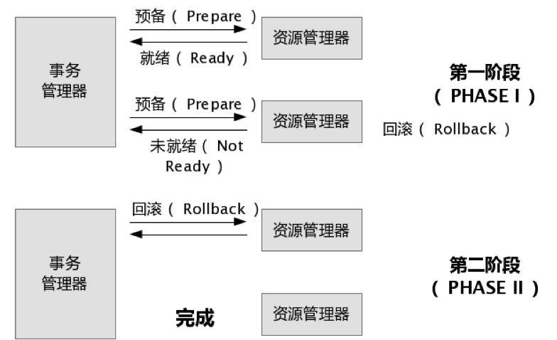

在 XA 协议中分为两阶段：

第一阶段：事务协调器要求每个涉及到事务的数据库预提交(precommit) 此操作，并反映是否可以提交；

第二阶段：事务协调器要求每个数据库提交数据，或者回滚数据。

**优点：**尽量保证了数据的强一致性，实现成本较低，在各大主流数据库都有自己的实现，对于 MySQL 是从 5.5 开始支持。

**缺点：**

* 单点问题：事务协调器在整个流程中扮演的角色很关键，如果其宕机，比如在第一阶段已经完成，在第二阶段正准备提交时事务协调器宕机，资源管理器会一直阻塞，导致数据库无法使用。
* 同步阻塞：在准备就绪之后，资源管理器中的资源一直处于阻塞，直到提交完成，释放资源。
* 数据不一致：两阶段提交协议虽然为分布式数据强一致性所设计，但仍然存在数据不一致性的可能，比如在第二阶段，假设协调者发出了事务 commit 的通知，但是因为网络问题该通知仅被一部分参与者所收到并执行了 commit 操作，其余的参考者则因为没有收到通知一直处于阻塞状态，这时就产生了数据的不一致性。

总的来说，XA 协议比较简单，成本较低，但是其单点问题，以及不能支持高并发（由于同步阻塞）依然是其最大的弱点。

#### TCC（Try-Confirm-Cancel）

TCC 事务机制相比于上面介绍的 XA，解决了其几个缺点：1. 解决了协调者单点，由主业务方起并完成这个业务活动。业务活动管理器也变成多点，引入集群。2. 同步阻塞：引入超时，超时后进行补偿，并且不会锁定整个资源，将资源转换为业务逻辑形式，粒度变小。3. 数据一致性：有了补偿机制后，由业务活动管理控制一致性。

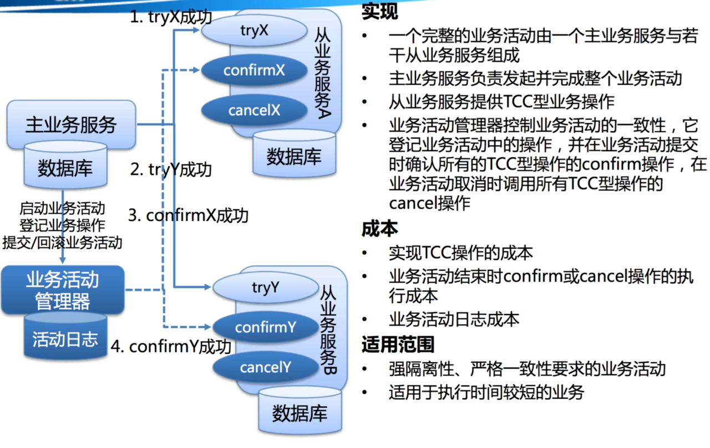

对于 TCC 的解释：

* Try 阶段：尝试执行，完成所有业务检查（一致性），预留必须业务资源（准隔离性）
* Confirm 阶段：确认执行真正执行业务，不作任何业务检查，只使用 Try 阶段预留的业务资源，Confirm 操作满足幂等性。要求具备幂等设计，Confirm 失败后需要进行重试；
* Cancel 阶段：取消执行，释放 Try 阶段预留的业务资源 Cancel 操作满足幂等性 Cancel 阶段的异常和 Confirm 阶段异常处理方案基本一致。

#### 本地消息表

此方案的核心是将需要分布式处理的任务通过消息日志的方式来异步执行。消息日志可以存储到本地文本、数据库或消息队列，再通过业务规则自动或人工发起重试。人工重试更多的是应用于支付场景，通过对账系统对事后问题的处理。

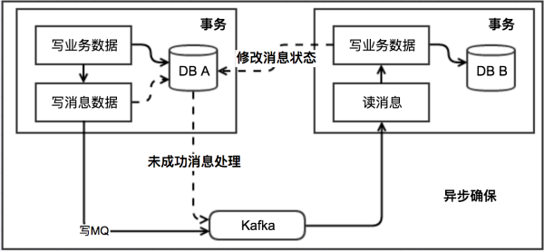

本地消息队列是 BASE 理论，是最终一致性模型，适用于对一致性要求不高的。实现这个模式时需要注意重试的幂等。

#### MQ 事务

**RocketMQ 消息的事务架构设计**

1. 生产者执行本地事务，修改订单支付状态（下单），并且提交事务；
2. 生产者发送事务消息到 broker 上，消息发送到 broker 上在没有确认之前消息对 consumer 是不可见状态（prepare 状态）；
3. 生产者确认事务消息，使得发送到 broker 上的事务消息对于消息者可见；
4. 消息者获取到消息进行消费，消费完之后执行 ack 确认；

**CAP 理论**

一致性（Consistency）

可用性（Availability）

分区容错性（Partition tolerance）

## 4. redis 集群 + 主从保证高可用

Redis Cluster 集群架构

Redis Cluster 实现了一种**混合形式**的查询路由，但并不是直接将请求从一个 Redis 节点转发到另一个 Redis 节点，而是在客户端的帮助下直接重定向（redirected）到正确的 Redis 节点。

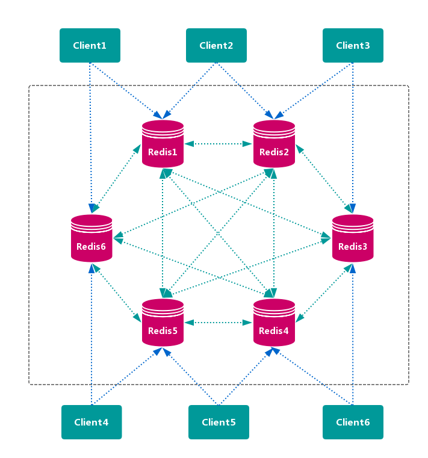

* 优点：无中心节点，数据按照槽存储分布在多个 Redis 实例上，可以平滑的进行节点 扩容/缩容，支持高可用和自动故障转移，运维成本低。
* 缺点：严重依赖 Redis-trib 工具，缺乏监控管理，需要依赖 Smart Client （维护连接，缓存路由表，MultiOp 和 Pipeline 不支持）。Failover 节点的检测过慢，不如中心节点 ZooKeeper 及时。Gossip 消息有一定开销。无法根据统计区分冷热数据。

### 数据分区算法

**哈希分区**

**顺序分区**

**虚拟槽分区**

虚拟槽分区巧妙地使用了哈希空间，使用分散度良好的哈希函数把所有数据映射到一个固定范围的整数集合中中，整数定义为槽（slot）。这个范围一般远远大于节点数，比如 Redis Cluster 槽范围是 0~ 16383。槽是集群内数据管理和迁移的基本单位。采用大范围槽的主要目的是为了方便数据拆分和集群扩展。每个节点会负责一定数量的槽，如图所示：

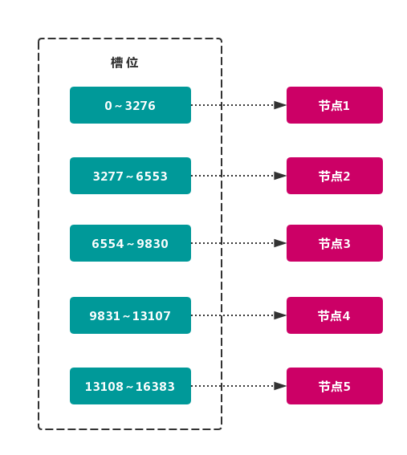

当前集群有 5 个节点，每个节点平均大约负责 3276 个槽。由于采用高质量的哈希算法，每个槽所映射的数据通常比较均匀，将数据平均划分到 5 个节点进行数据分区。Redis Cluster 就是采用虚拟槽分区。

 节点1： 包含 0 到 3276 号哈希槽。
 节点2：包含 3277  到 6553 号哈希槽。
 节点3：包含 6554 到 9830 号哈希槽。
 节点4：包含 9831 到 13107 号哈希槽。
 节点5：包含 13108 到 16383 号哈希槽。

这种结构很容易添加或者删除节点。如果增加一个节点 6 ，就需要从节点 1~5获得部分槽分配到节点 6 。如果想移除节点 1， 需要将节点 1 的槽移到节点 2 ~ 5上，然后将没有任何槽的节点 1 从集群中移除即可。

**由于从一个节点将 哈希槽 移动到另一个节点并不会 停止服务，所以无论 添加删除 或者 改变 某个节点的 哈希槽的数量 都不会造成 集群不可用 的状态。**

**说说 Redis Cluster 虚拟槽分区？**

Redis Cluster 采用虚拟槽分区，所有的键根据哈希函数映射到 0~16383 整数槽内，计算公式：slot = CRC16(key) & 16383。每个节点负责维护一部分槽以及槽所映射的键值数据。

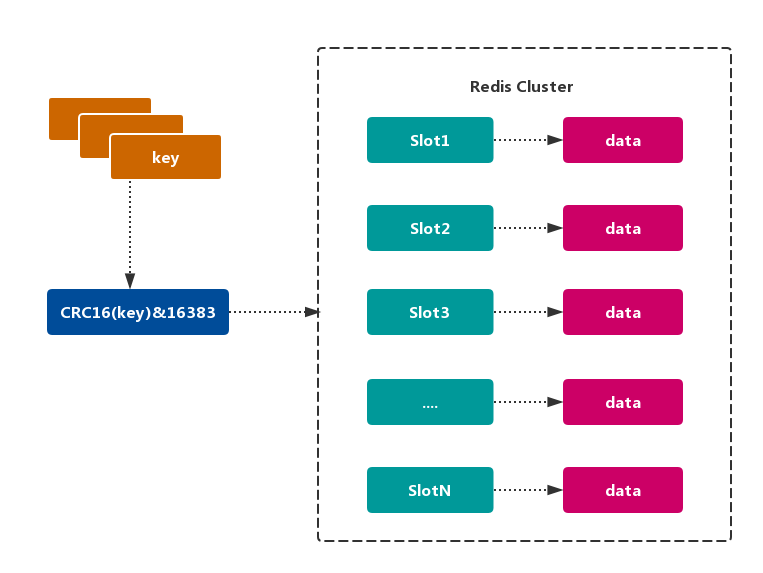

## 消息队列

### 1. 如何保证 RocketMQ 高可用-双主双从

1. 生产者通过 Name Server 发现 Broker；
2. 生产者发送队列消息到 2 个Broker 主节点；
3. Broker 主节点分别和各自从节点同步数据；
4. 消费者从主或者从节点订阅消息；

### 2. 如何保证消息不丢失？

**消息丢失的原因**

情况一：消息生产者没有成功发送到 MQ Broker；

情况二：消息发送到 MQ Broker 后，Broker 宕机导致内存中的消息数据丢失；

情况三：消费者获取到消息，但消费者还没有来得及处理宕机了，但此时 MQ 中消息已经删除了，消费者重启后不能再消费之前的消息了。

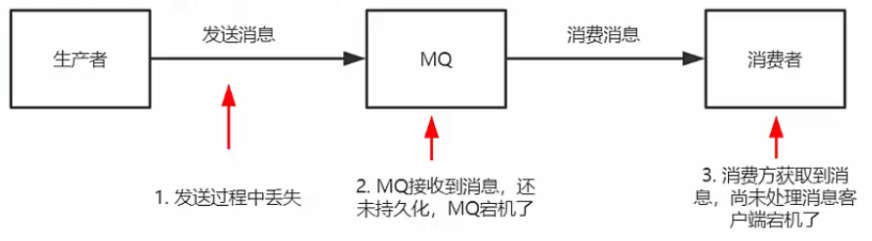

**确保消息不丢失方案**

1. 消息发送者发送给 MQ Broker 后，MQ Broker 给生产者确认收到；
2. MQ 收到消息后进行消息持久化；
3. 消费者收到消息处理完毕后手动进行 ACK 确认；
4. MQ 收到消费者 ACK 确认后删除持久化的消息；

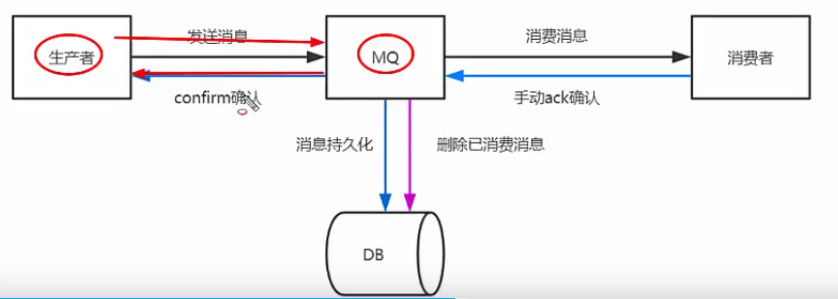

**小结**

* 消息丢失的原因

  发送方、MQ、消费方都有可能导致消息丢失；

* 如何保证消息不丢失；

  * 发送方可靠发送；
  * MQ 进行消息持久化；
  * 消费方消费完毕进行 ACK 确认，MQ 收到消费方的 ACK 确认再删除本地消息；

### 3. 如何保证消息不被重复消费？（如何保证消息消费的幂等性）

消息重复的根本原因是网络不可达。

* 发送时消息重复

  当一条消息已被成功发送到服务端，此时出现了网络闪断，导致服务端对客户端应答失败。如果此时生产者意识到消息发送失败并尝试再次发送消息，消费者后续会收到两条内容相同的消息。

  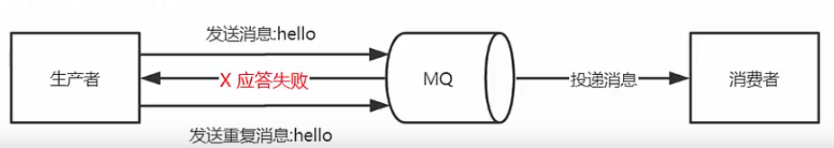

* 消费时消息重复

  消息消费的场景下，消息已投递到消费者并完成业务处理，当消费方给 MQ 服务端反馈应答时网络闪断。为了保证消息至少被消费一次，MQ 服务端将在网络恢复后再次尝试投递之前已被消费方处理过的消息，此时消费者就会收到两条内容相同的消息。

  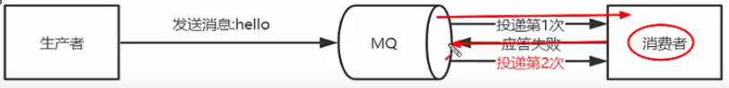

**总结：**

1. 消息发送者发送消息时携带一个全局唯一的消息 id；
2. 消费者获取消费后先根据 id 在 redis / db 中查询是否存在消费记录；
3. 如果没有消费过就正常消费，消费完毕后写入 redis / db；
4. 如果消息消费过就直接舍弃；

**小结**

**MQ 消息的重复问题和幂等性保证？**

* 消息重复原因
  * 网络不可达，不可避免；
* 幂等性
  * 消息携带全局ID，消费方接到消息时先查再处理，根据全局ID做判重操作；

### 4. 如何保证消息消费的顺序性？

**局部顺序消费**

1. 生产者根据消息ID将同一组消息发送到一个 Queue 中。
2. 多个消费者同时获取 一个Queue 中的消息进行消费。
3. MQ 使用 分段锁 保证单个 Queue 中的有序消费。

**什么是消息的顺序消费？**

* 消费方按照消息发送的顺序进行消费，分为全局顺序消息和局部顺序消息；
* 常见的是局部顺序消费；

**如何保证消息的顺序消息？**

* 全局顺序消息，生产者：MQ：消费者 = 1：1：1
* 局部顺序消息：
  * 1. 生产者将同一组消息发送到单个队列；
    2. 多个消费者并行对消息进行消息；
    3. Queue 通过分段锁保证消息消费的顺序性；

## 5. 基于 MQ 的分布式事务实现

**消息发送方：**

1. 生产者执行本地事务，修改订单支付状态（下单），并且提交事务；
2. 生产者发送事务消息到 broker 上，消息发送到 broker 上在没有确认之前消息对 consumer 是不可见状态（prepare 状态）；
3. 生产者确认事务消息，使得发送到 broker 上的事务消息对于消息者可见；
4. 消息者获取到消息进行消费，消费完之后执行 ack 确认；

## 6. 双亲委派模型

如果一个类加载器收到了加载某个类的请求，则该类加载器并不会去加载该类，而是把这个请求委派给父类加载器，每个层次的类加载器都是如此，因此所有的类加载请求最终都会传送到顶端的启动类加载器；只有当父类加载器在其搜索范围内无法找到所需的类，并将该结果反馈给子类加载器，子类加载器会尝试去自己加载。

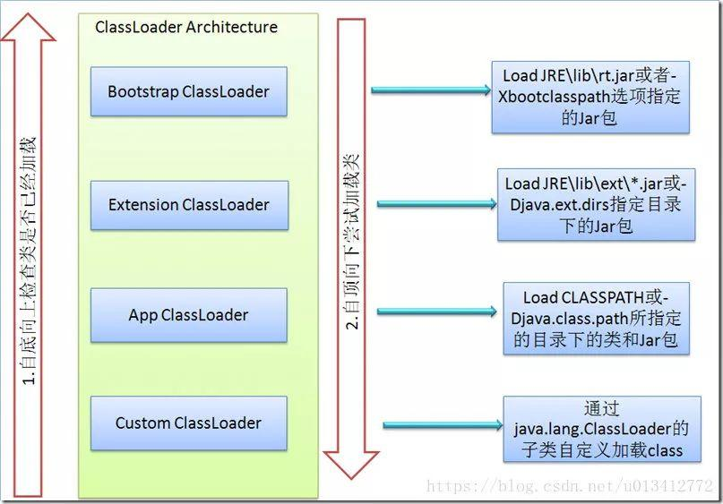

## 7. JDBC 为什么要破坏双亲委派模型

服务提供者接口（Service Provider Interface, SPI）

**因为类加载器受到加载范围的限制，在某些情况下父类加载器无法加载到需要的文件，这时就需要委托子类加载器去加载 class 文件。**

JDBC 的 Driver 接口定义在 JDK 中，其实现由各个数据库的服务商来提供，比如 MySQL 驱动包。DriverManager 类中要加载各个实现了 Driver 接口的类，然后进行管理，但是 DriverManager 位于 JAVA_HOME 中 jre/lib/rt.jar 包，由 BootStrap 类加载器加载，而其 Driver 接口的实现类是位于服务商提供的 jar 包，**根据类加载机制，当被装载的类引用了另外一个类时，虚拟机就会使用装载第一个类的类装载器装载被引用的类。** 也就是说 BootStrap 类加载器还要去加载 jar 包中的 Driver 接口的实现类。我们知道， BootStrap 类加载器默认只负责加载 JAVA_HOME 中 jre/lib/rt.jar 里所有的 class，所以需要由子类加载器去加载 Driver 实现，这就破坏了双亲委派模型。