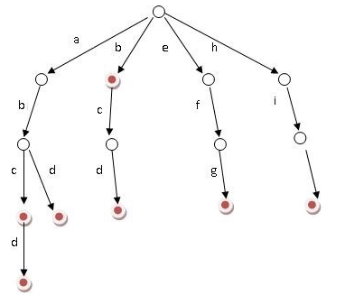

# [前缀树](https://leetcode-cn.com/problems/implement-trie-prefix-tree/)



**前缀树的信息存在连接处，而不是节点处。**

```java
class Trie{
	class TrieNode{
		private TrieNode[] nexts;
		private boolean isEnd;
		
		public TrieNode() {
			nexts = new TrieNode[26];
			isEnd = false;
		}
	}
    
	private TrieNode root;
	
	public Trie() {
		root = new TrieNode();
	}
	
    public void insert(String word) {
        TrieNode cur = root;
        for(char letter:word.toCharArray()) {
        	if(cur.nexts[letter-'a']==null) {
        		cur.nexts[letter-'a']=new TrieNode();
        	}
        	cur = cur.nexts[letter-'a'];
        }
        cur.isEnd = true;
    }
    
    /** Returns if the word is in the trie. */
    public boolean search(String word) {
    	TrieNode node = searchPrefix(word);
    	return node!=null && node.isEnd==true;
    }
    
    /** Returns if there is any word in the trie that starts with the given prefix. */
    public boolean startsWith(String prefix) {
    	TrieNode node = searchPrefix(prefix);
    	return node!=null;
    }
    
    private TrieNode searchPrefix(String word) {
    	TrieNode cur = root;
    	for(char letter:word.toCharArray()) {
    		if(cur.nexts[letter-'a']!=null) {
    			cur = cur.nexts[letter-'a'];
    		}else {
    			return null;
    		}
    	}
    	return cur;
    }
}
```

