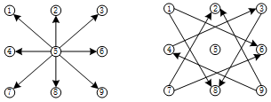

# [手机屏幕解锁模式](https://www.nowcoder.com/test/question/done?tid=33751534&qid=925105)

**题目描述**

  现有一个 3x3 规格的 Android 智能手机锁屏程序和两个正整数 m 和 n ，请计算出使用最少m 个键和最多 n个键可以解锁该屏幕的所有有效模式总数。  

  其中有效模式是指：  

  1、每个模式必须连接至少m个键和最多n个键；  

  2、所有的键都必须是不同的；  

  3、如果在模式中连接两个连续键的行通过任何其他键，则其他键必须在模式中选择，不允许跳过非选择键（如图）；  

  4、顺序相关，单键有效（这里可能跟部分手机不同）。  

   输入：m,n   

代表允许解锁的最少m个键和最多n个键
 输出：       满足m和n个键数的所有有效模式的总数          
    

 

  
   

##### **输入例子1:**

```
1,2
```


##### **输出例子1:**

```
65
```


##### **例子说明1:**

```
输入m=1，n=2，表示最少1个键，最多2个键，符合要求的键数是1个键和2个键，其中1个键的有效模式有9种，两个键的有效模式有56种，所以最终有效模式总数是9+56=65种，最终输出65
```

## 分析

这道题与一般的回溯的题目不太一样，这道题的难点在于下一个点可以不是与当前点相邻。这道题回溯的下探规则不能是一个点的相邻点（正上方/正下方/正左方/正右方/左上方/左下方/右上方/右下方）。因为这道题的下探点可以是矩形对角处。如何确定下探规则成为了解这道题的关键，这个下探规则需要适用于所有的点。

现在来确定下探规则：**将下探规则分为16个方向前8个用于下探相邻的点，后8个用于下探矩形对角的点。若在 A 方向上下探相邻的点发现该点已经走过，则再在 A 方向上再走多一步则可以下探到与当前点不相邻的点。**（**A方向为前8个常规方向）**

以上下探规则对所有点均适用。



```java
static int[][] directs = {{-1,1},{0,1},{1,1},{-1,0},{1,0},{-1,-1},{0,-1},{1,-1},
            {2,-1},{1,-2},{-2,-1},{-1,-2},{1,2},{2,1},{-2,1},{-1,2}};
```


## 代码

```java

public class Question64 {
    static int[][] directs = {{-1,1},{0,1},{1,1},{-1,0},{1,0},{-1,-1},{0,-1},{1,-1},
            {2,-1},{1,-2},{-2,-1},{-1,-2},{1,2},{2,1},{-2,1},{-1,2}};

    static int[][] dash = { {1,2,3},
                            {4,5,6},
                            {7,8,9}};

    static int[] nums = new int[10];

    static public int solution(int m,int n){
        m = m<=9 ? m : 9;
        n = n<=9 ? n : 9;
        int sum=0;
        int[] nums ={0, 9, 56, 320, 1624, 7152, 26016, 72912, 140704, 140704 };
        for (int i=m;i<=n;i++){
            sum += nums[i];
        }
        return sum;
    }

    static public void process(boolean[] V,int count,int x,int y){
        if(count==9){
            nums[count]++;
            return;
        }
        V[dash[x][y]]=true;
        nums[count]++;

        for(int i=0;i<directs.length;i++){
            int a= x+directs[i][0];
            int b= y+directs[i][1];
            if(canVisit(V,a,b)){
                process(V,count+1,a,b);
            }else if(i<8){ // 若是常规方向，则再多走一步则可以走到与当前点不相邻的点
                a +=directs[i][0];
                b +=directs[i][1];
                if(canVisit(V,a,b)){
                    process(V,count+1,a,b);
                }
            }
        }
        V[dash[x][y]]=false;
    }

    static boolean canVisit(boolean[] V,int i,int j){
        if(i<0 || i>=3 || j<0 || j>=3 || V[dash[i][j]]) return false;
        return true;
    }

    public static void main(String[] args) {
        for(int i=0;i<3;i++){
            for(int j=0;j<3;j++){
                process(new boolean[10],1,i,j);
            }
        }

        for (int num : nums) {
            System.out.print(num+" ");
        }
    }
}

```


## 参考

https://www.nowcoder.com/test/question/done?tid=33751534&qid=925105