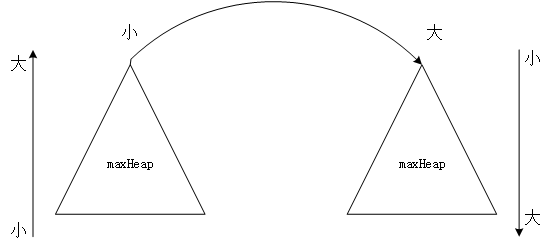

# [剑指 Offer 41. 数据流中的中位数](https://leetcode-cn.com/problems/shu-ju-liu-zhong-de-zhong-wei-shu-lcof/)

如何得到一个数据流中的中位数？如果从数据流中读出奇数个数值，那么中位数就是所有数值排序之后位于中间的数值。如果从数据流中读出偶数个数值，那么中位数就是所有数值排序之后中间两个数的平均值。

例如，

[2,3,4] 的中位数是 3

[2,3] 的中位数是 (2 + 3) / 2 = 2.5

设计一个支持以下两种操作的数据结构：

* void addNum(int num) - 从数据流中添加一个整数到数据结构中。
* double findMedian() - 返回目前所有元素的中位数。

示例 1：
```
输入：
["MedianFinder","addNum","addNum","findMedian","addNum","findMedian"]
[[],[1],[2],[],[3],[]]
输出：[null,null,null,1.50000,null,2.00000]
```
示例 2：
```
输入：
["MedianFinder","addNum","findMedian","addNum","findMedian"]
[[],[2],[],[3],[]]
输出：[null,null,2.00000,null,2.50000]
```

## 解决思路




```java
class MedianFinder {

    PriorityQueue<Integer> maxHeap ; 
    PriorityQueue<Integer> minHeap ;

    /** initialize your data structure here. */
    public MedianFinder() {
        maxHeap = new PriorityQueue<>((a,b)->(b-a));
        minHeap = new PriorityQueue<>((a,b)->(a-b));
    }
    
    public void addNum(int num) {
        maxHeap.add(num);
        if(!minHeap.isEmpty() && maxHeap.peek()>minHeap.peek()){
            minHeap.add(maxHeap.poll());
        }
        if(minHeap.size()-maxHeap.size()>1){
            maxHeap.add(minHeap.poll());
        }else if(maxHeap.size()-minHeap.size()>1){
            minHeap.add(maxHeap.poll());
        }
    }
    
    public double findMedian() {
        if(maxHeap.size()==minHeap.size()){
            return (maxHeap.peek()+minHeap.peek())/2.0;
        }
        
        if(maxHeap.size()>minHeap.size()){
            return maxHeap.peek()/1.0;
        }
        return minHeap.peek()/1.0;
    }
}
```

