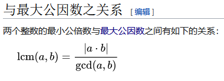
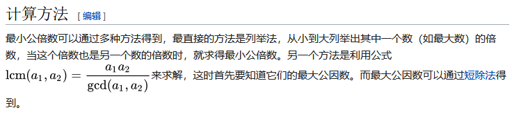

# 最小公倍数（Least Common Multiple）

## 与最大公因数之关系



## 计算方法



可以先利用**辗转相除法**计算最大公因子。

## Show me the code

```java
int GCD(int a, int b) {
	return a % b == 0 ? b : GCD(b, a % b);
}
int LCM(int a, int b) { 
	return a * b / GCD(a, b);
}
```

