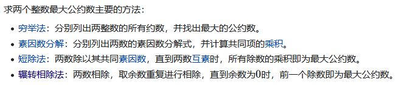
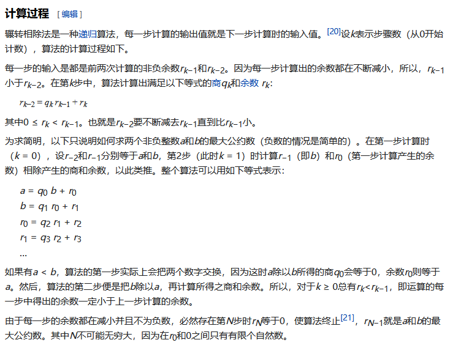
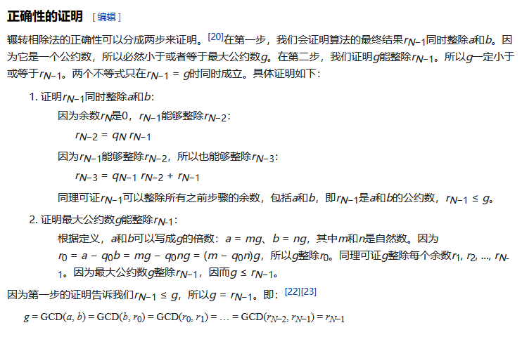
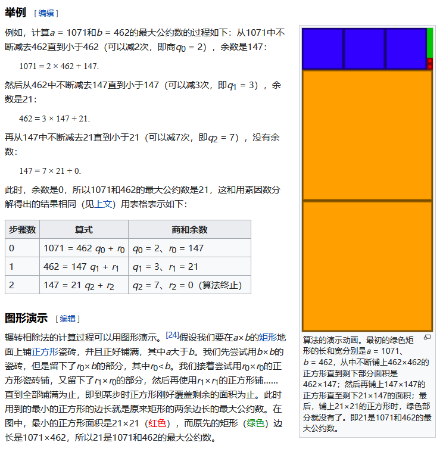

## 最大公因子(Highest Common Factor)与辗转相除法

## 求最大公因子的主要方法



## 计算过程



## 正确性证明



## 举例

举例里的，图形演示非常好，非常易于理解。



## Show me the code

```java
int GCD(int a, int b) {
	return a % b == 0 ? b : GCD(b, a % b);
}
```


## 参考

[辗转相除法](https://zh.wikipedia.org/wiki/%E8%BC%BE%E8%BD%89%E7%9B%B8%E9%99%A4%E6%B3%95)