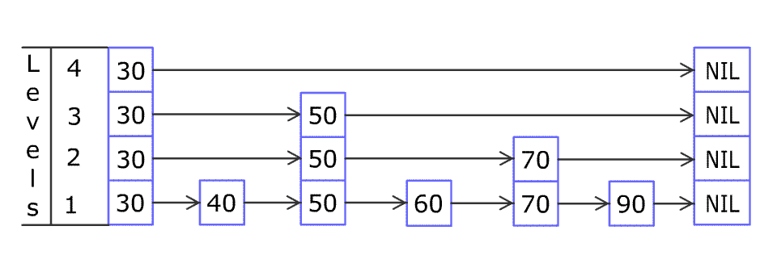

# [1206. 设计跳表](https://leetcode-cn.com/problems/design-skiplist/)

不使用任何库函数，设计一个跳表。

跳表是在 O(log(n)) 时间内完成增加、删除、搜索操作的数据结构。跳表相比于树堆与红黑树，其功能与性能相当，并且跳表的代码长度相较下更短，其设计思想与链表相似。

例如，一个跳表包含 [30, 40, 50, 60, 70, 90]，然后增加 80、45 到跳表中，以下图的方式操作：




Artyom Kalinin [CC BY-SA 3.0], via Wikimedia Commons

跳表中有很多层，每一层是一个短的链表。在第一层的作用下，增加、删除和搜索操作的时间复杂度不超过 O(n)。跳表的每一个操作的平均时间复杂度是 O(log(n))，空间复杂度是 O(n)。

在本题中，你的设计应该要包含这些函数：

* bool search(int target) : 返回target是否存在于跳表中。
* void add(int num): 插入一个元素到跳表。
* bool erase(int num): 在跳表中删除一个值，如果 num 不存在，直接返回false. 如果存在多个 num ，删除其中任意一个即可。
  了解更多 : https://en.wikipedia.org/wiki/Skip_list

注意，跳表中可能存在多个相同的值，你的代码需要处理这种情况。

样例:
```
Skiplist skiplist = new Skiplist();

skiplist.add(1);
skiplist.add(2);
skiplist.add(3);
skiplist.search(0);   // 返回 false
skiplist.add(4);
skiplist.search(1);   // 返回 true
skiplist.erase(0);    // 返回 false，0 不在跳表中
skiplist.erase(1);    // 返回 true
skiplist.search(1);   // 返回 false，1 已被擦除
```
约束条件:

* 0 <= num, target <= 20000
* 最多调用 50000 次 search, add, 以及 erase操作。

**show me the code**

```java
class Skiplist {

    Node head = new Node(null, null, 0);

    public boolean search(int target) {
        // 先往右再往下，缩小区间，套路都是这个套路
        for (Node p = head; p != null; p = p.down) {
            while (p.right != null && p.right.val < target) {
                p = p.right;
            }
            if (p.right != null && p.right.val == target) {
                return true;
            }
        }
        return false;
    }

    Random rand = new Random();

    // 2^64 已经相当大了
    Node[] stack = new Node[64];

    public void add(int num) {
        int lv = -1;
        for (Node p = head; p != null; p = p.down) {
            while (p.right != null && p.right.val < num) {
                p = p.right;
            }
            stack[++lv] = p;
        }
        boolean insertUp = true;
        Node downNode = null;
        while (insertUp && lv >= 0) {
            Node insert = stack[lv--];
            insert.right = new Node(insert.right, downNode, num);
            downNode = insert.right;
            insertUp = (rand.nextInt() & 1) == 0;
        }
        if (insertUp) {
            head = new Node(new Node(null, downNode, num), head, 0);
        }
    }

    public boolean erase(int num) {
        boolean exists = false;
        for (Node p = head; p != null; p = p.down) {
            while (p.right != null && p.right.val < num) {
                p = p.right;
            }
            if (p.right != null && p.right.val <= num) {
                exists = true;
                p.right = p.right.right;
            }
        }
        return exists;
    }

    static class Node {
        int val;
        Node right, down;

        public Node(Node r, Node d, int val) {
            right = r;
            down = d;
            this.val = val;
        }
    }
}

作者：stg
链接：https://leetcode-cn.com/problems/design-skiplist/solution/java-jing-jian-shi-xian-by-stg/
来源：力扣（LeetCode）
著作权归作者所有。商业转载请联系作者获得授权，非商业转载请注明出处。
```


## 参考

https://leetcode-cn.com/problems/design-skiplist/solution/java-jing-jian-shi-xian-by-stg/

https://leetcode-cn.com/problems/design-skiplist/solution/can-kao-redisshi-xian-by-bakezq/