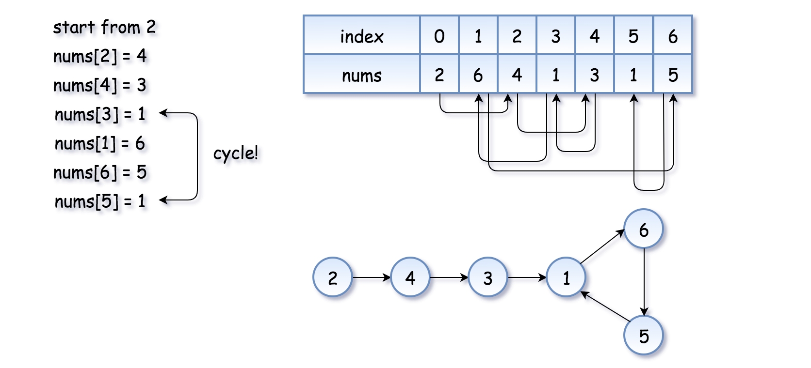
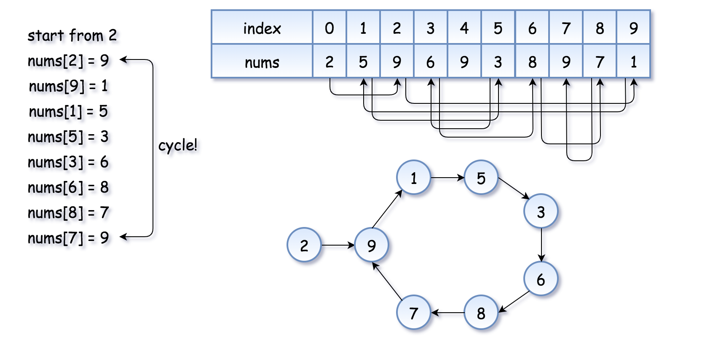
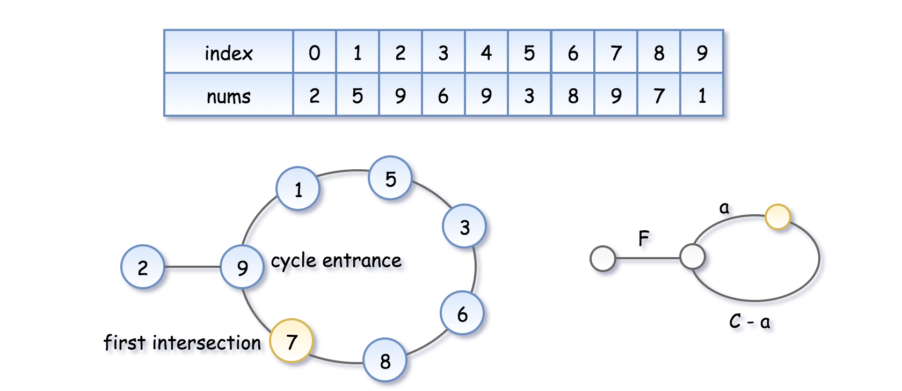

# 求链表入环节点衍生问题

## 287. [Find the Duplicate Number](https://leetcode.com/problems/find-the-duplicate-number/)

Given an array *nums* containing *n* + 1 integers where each integer is between 1 and *n* (inclusive), prove that at least one duplicate number must exist. Assume that there is only one duplicate number, find the duplicate one.

**Example 1:**

```
Input: [1,3,4,2,2]
Output: 2
```

**Example 2:**

```
Input: [3,1,3,4,2]
Output: 3
```

**Note:**

1. You **must not** modify the array (assume the array is read only).
2. You must use only constant, *O*(1) extra space.
3. Your runtime complexity should be less than *O*(*n*2).
4. There is only one duplicate number in the array, but it could be repeated more than once.

## Approach 3: Floyd's Tortoise and Hare (Cycle Detection)

**Intuition**

The idea is to reduce the problem to [Linked List Cycle II](https://leetcode.com/problems/linked-list-cycle-ii/solution/):

> Given a linked list, return the node where the cycle begins.

First of all, where does the cycle come from? Let's use the function `f(x) = nums[x]` to construct the sequence: `x, nums[x], nums[nums[x]], nums[nums[nums[x]]], ...`.

Each new element in the sequence is an element in nums at the index of the *previous* element.

If one starts from `x = nums[0]`, such a sequence will produce a linked list with a cycle.

> The cycle appears because `nums` contains duplicates. The duplicate node is a cycle entrance.

Here is how it works:



The example above is simple because the loop is small. Here is a more interesting example (special thanks to @[sushant_chaudhari](https://leetcode.com/sushant_chaudhari))



Now the problem is to find the entrance of the cycle.

[Floyd's algorithm](https://en.wikipedia.org/wiki/The_Tortoise_and_the_Hare) consists of two phases and uses two pointers, usually called `tortoise` and `hare`.

**In phase 1**, `hare = nums[nums[hare]]` is twice as fast as `tortoise = nums[tortoise]`. Since the hare goes fast, it would be the first one who enters the cycle and starts to run around the cycle. At some point, the tortoise enters the cycle as well, and since it's moving slower the hare catches the tortoise up at some *intersection* point. Now phase 1 is over, and the tortoise has lost.

> Note that the intersection point is not the cycle entrance in the general case.



To compute the intersection point, let's note that the hare has traversed twice as many nodes as the tortoise, *i.e.* `2d(tortoise)=d(hare)`, that means

`2(F + a) = F + nC + a`, where n is some integer.

> Hence the coordinate of the intersection point is `F + a = nC`.

**In phase 2**, we give the tortoise a second chance by slowing down the hare, so that it now moves with the speed of tortoise: `tortoise = nums[tortoise]`, `hare = nums[hare]`. The tortoise is back at the starting position, and the hare starts from the intersection point.


Let's show that this time they meet at the cycle entrance after F steps.

- The tortoise started from zero, so its position after F steps is F.
- The hare started at the intersection point **F + a = nC**, so its position after F steps is **nC + F**, that is the same point as **F**.
- So the tortoise and the (slowed down) hare will meet at the entrance of the cycle.

## show me the code

```java
class Solution {
    public int findDuplicate(int[] nums) {
        int fast=nums[0],slow=nums[0];
        do{
            fast=nums[fast];
            fast=nums[fast];
            slow=nums[slow];
        }while(fast!=slow);
        
        fast=nums[0];
        while(fast!=slow){
            fast=nums[fast];
            slow=nums[slow];
        }
        return fast;
    }
}
```

## Reference

https://leetcode.com/problems/find-the-duplicate-number/solution/

https://en.wikipedia.org/wiki/The_Tortoise_and_the_Hare