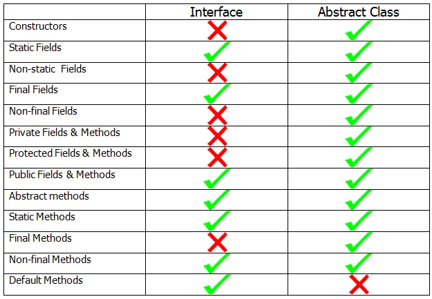

# JDK 8 以后接口与抽象类的区别

## 1. Abstract Classes Compared to Interfaces

Abstract classes are similar to interfaces. You cannot instantiate them, and they contain a mix of methods declared with or without an implementation. However, with abstract classes, you can declare fields that are not static and final, and define public, protected, and private concrete methods. With interfaces, all fields are automatically public, static, and final and all methods that you declare or define(as default methods) public. In addition, you can extend only one class, whether or not it is abstract, whereas you can implement any number of interfaces.

Which should you use, abstract classes or interfaces?

* Consider using **abstract classes** if any of these statements apply to your situation:
  * You want to **share code** among several closely related classes.
  * You expect that classes that extend your abstract class have **many common methods or fields**, or require ***access*** modifiers other than public (such as protected and private).
  * You want to declare **non-static or non-final fields**. This enables you to define methods that can access and **modify the state** of the object to which they belong.
* Consider using **interfaces** if any of these statements apply to your situation:
  * You expect that **unrelated classes would implement your interface**. For example, the interfaces ***Comparable*** and ***Cloneable*** are implemented by many unrelated classes.
  * You want to **specify the behavior of a particular data type**, but not concerned about who implements its behavior.
  * You want to take advantage of multiple inheritance of type.

## 2. Differences Between Interface And Abstract Class After Java 8

### 1) Fields

Interface fields are public, static and final by default . Interfaces still don't support non-static and non-final variables. Interfaces can only have public, static and final variables. On the other hand, abstract class can have static as well as non-static and final as well as non-final variables. 

### 2) Methods

After Java 8, an interface can have default and static methods along with abstract methods.  Interfaces don’t support final methods. But, abstract classes support  final as well as non-final methods and static as well as non-static  methods along with abstract methods. 

Also note that, only interfaces can have default methods. Abstract classes can’t have default methods.

### 3) Constructors

Interfaces can’t have constructors. Abstract classes can have any number of constructors.

### 4)Member's Accessibility

All members of interfaces are public by default. Interfaces don't support private and protected members. But, abstract classes support all type of members - private, protected and public members.

### 5) Multiple Inheritance

A class can extend only one abstract class, but can implement multiple interfaces. Thus, a class can inherit multiple properties from multiple sources only through interfaces, not through abstract classes.

## 3. Interface Vs Abstract Class After Java 8:

The below table and program summarizes the similarities and differences between interface and abstract class after Java 8.



```java
interface anyInterface
{
    int i = 10;            //By default, interface fields are public, static and final
     
    void abstractMethod();          //Interface can have abstract method
     
    default void defaultMethod()
    {
        System.out.println("Interface can have default method");
    }
     
    static void staticMethod() 
    {
        System.out.println("Interface can have static method");
    }
     
    //No constructors in an interface
     
    //No non-static and non-final variables in an interface
     
    //No private fields and methods in an interface
     
    //No protected fields and methods in an interface
     
    //No final methods in an interface
}
 
abstract class anyAbstractClass
{
    private int a;          //Abstract class can have private field
     
    protected int b;        //Abstract class can have protected field
     
    public int c;           //Abstract class can have public field
     
    static int d;           //Abstract class can have static field
     
    final int e = 10;       //Abstract class can have final field
     
    int f;                  //Abstract class can have non-static and non-final field
     
    public anyAbstractClass() 
    {
        System.out.println("Abstract class can have constructors");
    }
      
    abstract void abstractmethod();    //Abstract class can have abstract method
     
    private static void staticMethod() 
    {
        System.out.println("Abstract class can have private and static method");
    }
     
    public void nonStaticMethod()
    {
        System.out.println("Abstract class can have public and non-static method");
    }
     
    protected void protectedMethod() 
    {
        System.out.println("Abstract class can have protected method");
    }
     
    final void finalMethod()
    {
        System.out.println("Abstract class can have final method");
    }
     
    //No default method in an abstract class
}
```

## 4. 抽象类中的构造函数

抽象类是没有实例的，抽象类的构造函数并不像它名字那样起到构造实例的作用，更准确的说是叫做初始化函数。由于它可以非 `final` 字段。所以需要有初始化函数对其非 `final`字段进行初始化。

[3.8. Working with Class Instances](https://docs.oracle.com/javase/specs/jvms/se8/html/jvms-3.html#jvms-3.8) 

Java Virtual Machine class instances are created using the Java Virtual Machine's ***new*** instruction. Recall that at the level of the Java Virtual Machine, a constructor appears as a method with the compiler-supplied name `<init>`. This specially named method is known as the instance initialization method([§2.9](https://docs.oracle.com/javase/specs/jvms/se8/html/jvms-2.html#jvms-2.9)). Multiple instance initialization methods, corresponding to multiple  constructor, may exist for a given class. Once the class instance has been created and its instance variables, including those of the class and all of its superclasses, have been initialized to their default values, an instance initialization method of the new class instance is invoked. For  example:

```java
Object create() {
    return new Object();
}
```

compiles to:

```java
Method java.lang.Object create()
0   new #1              // Class java.lang.Object
3   dup
4   invokespecial #4    // Method java.lang.Object.<init>()V
7   areturn
```

由于继承抽象类的子类创建实例时，会首先进行递归父类的初始化，接着再进行子类自身的初始化。所以这也可以帮助理解抽象类为什么存在构造函数，即初始化函数。

[2.9. Special Methods](https://docs.oracle.com/javase/specs/jvms/se8/html/jvms-2.html#jvms-2.9)             

At the level of the Java Virtual Machine, every constructor written in the Java programming language appears as an ***instance initialization*** method that has the special name `<init>`. This name is supplied by a compiler. Because the name `<init>` is not a valid identifier, it cannot be used directly in a program written in the Java programming language. Instance initialization methods may be invoked only within the Java Virtual Machine by the ***invokespecial*** instruction, and they may be invoked only on uninitialized class instances. An instance initialization method takes on the access permissions of the constructor from which it was derived.

A class or interface has at most one class or interface initialization method and is initialized (§5.5) by invoking that method. The initialization method of a class or interface has the special name <clinit>, takes no arguments, and is void (§4.3.3). 

In a class file whose version number is 51.0 or above, the method must additionally have its `ACC_STATIC` flag (§4.6) set in order to be the class or interface initialization method. 

The name <clinit> is supplied by a compiler. Because the name <clinit> is not a valid identifier, it cannot be used directly in a program written in the Java programming language. Class and interface initialization methods are invoked implicitly by the Java Virtual Machine; they are never invoked directly from any Java Virtual Machine instruction, but are invoked only indirectly as part of the class initialization process. 

A method is signature polymorphic if all of the following are true:

* It is declared in the `java.lang.invoke.MethodHandle` class.
* It has a single formal parameter of type Object[].
* It has a return type of Object.
* It has the `ACC_VARARGS` and `ACC_NATIVE` flags set.

The Java Virtual Machine gives special treatment to signature polymorphic methods in the `invokevirtual `instruction (§invokevirtual), in order to effect invocation of a method handle. A method handle is a strongly typed, directly executable reference to an underlying method, constructor, field, or similar low-level operation (§5.4.3.5), with optional transformations of arguments or return values. These transformations are quite general, and include such patterns as conversion, insertion, deletion, and substitution. See the `java.lang.invoke` package in the Java SE platform API for more information. 

## Reference

https://docs.oracle.com/javase/tutorial/java/IandI/abstract.html

https://javaconceptoftheday.com/interface-vs-abstract-class-after-java-8/

https://docs.oracle.com/javase/specs/jvms/se8/html/jvms-3.html#jvms-3.8

https://docs.oracle.com/javase/specs/jvms/se8/html/jvms-2.html#jvms-2.9