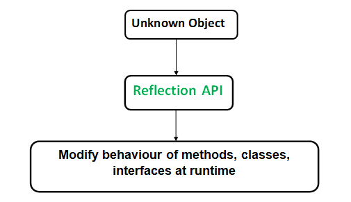

# Java 中创建对象的4种方式

| **使用 new 关键字** | 调用构造函数       |
| ------------------- | ------------------ |
| **使用反射方法**    | **调用构造函数**   |
| **使用 clone()**    | **未调用构造函数** |
| **使用反序列化**    | **未调用构造函数** |

本节暂不详细介绍使用 clone() 和 使用反序列化的方法。

## 1. 使用 new 关键字和使用反射方法

### 1.1 使用 new 关键字

使用 new 关键字来创建对象会用到 new 指令字节码，当 Java 虚拟机遇到一条字节码 new 指令时，首先将去检查这个指令的参数是否能在常量池中定位到一个类的符号引用，并且检查这个符号引用代表的类是否已被加载、解析和初始化过。如果没有，那必须先执行相应的类加载过程。

在类加载检查通过后，接下来虚拟机将为新生对象分配内存。对象所需要内存的大小在类加载完成后便可完全确定。

### 1.2 使用反射方法

使用反射方法来创建对象第一步先要获取到类的 class 对象，这一步会用到 **invokestatic** 字节码指令。第二步是通过反射来创建该类的实例对象，这一步会用到 **invokevirtual** 字节码指令。

在第一步中，获取类的 class 对象的过程与使用 new 关键字创建对象的过程类似，若该类型还未加载到内存中，就需要先执行类加载过程。一个类型从被加载到虚拟机内存中开始，到卸载出内存为止，它的整个生命周期将会经历加载（Loading）、验证（Verification）、准备（Preparation）、解析（Resolution）、初始化（Initialization）、使用（Using）、和卸载（Unloading）七个阶段。

加载-->连接（验证、准备、解析）---> 初始化 --> 使用 --> 卸载

关于在什么情况下需要开始类加载过程的第一个阶段“加载”，《Java 虚拟机规范》中并没有进行强制约束，这点可以交给虚拟机的具体实现来自由把握。但是对于初始化阶段，《Java 虚拟机规范》则是严格规定了有且只有六种情况必须立即对类进行“初始化”（而加载、验证、准备自然需要在此之前开始）：

1） 遇到 new 、getstatic 、 putstatic 或 invokestatic 这四条字节码指令时，如果类型没有进行过初始化，则需要先触发其初始化阶段。能够生成这四条指令的典型 Java 代码场景有：

* 使用new关键字实例化对象的时候。  
* 读取或设置一个类型的静态字段（被final修饰、 已在编译期把结果放入常量池的静态字段除外）
  的时候。  
* 调用一个类型的静态方法的时候。  

2）使用java.lang.reflect包的方法对类型进行反射调用的时候， 如果类型没有进行过初始化， 则需要先触发其初始化。  

3）当初始化类的时候， 如果发现其父类还没有进行过初始化， 则需要先触发其父类的初始化。  

4）当虚拟机启动时， 用户需要指定一个要执行的主类（ 包含main()方法的那个类） ， 虚拟机会先初始化这个主类。  

5）当使用JDK 7新加入的动态语言支持时， 如果一个java.lang.invoke.MethodHandle实例最后的解析结果为REF_getStatic、 REF_putStatic、 REF_invokeStatic、 REF_newInvokeSpecial四种类型的方法句柄， 并且这个方法句柄对应的类没有进行过初始化， 则需要先触发其初始化。  

6）当一个接口中定义了JDK 8新加入的默认方法（ 被default关键字修饰的接口方法） 时， 如果有这个接口的实现类发生了初始化， 那该接口要在其之前被初始化。  

## 2. Java 中的反射

### 1. Reflection in Java

Reflection is an API which is used to examine or modify the behavior of methods, classes, interfaces at runtime.

- The required classes for reflection are provided under java.lang.reflect package.
- Reflection gives us information about  the class to which an object belongs and also the methods of that class  which can be executed by using the object.
- Through reflection we can invoke methods at runtime irrespective of the access specifier used with them.



Reflection can be used to get information about –

1. **Class** The getClass() method is used to get the name of the class to which an object belongs.
2. **Constructors** The getConstructors() method is used to get the public constructors of the class to which an object belongs.
3. **Methods** The getMethods() method is used to get the public methods of the class to which an objects belongs.

```java
// A simple Java program to demonstrate the use of reflection 
import java.lang.reflect.Method; 
import java.lang.reflect.Field; 
import java.lang.reflect.Constructor; 

// class whose object is to be created 
class Test 
{ 
	// creating a private field 
	private String s; 

	// creating a public constructor 
	public Test() { s = "GeeksforGeeks"; } 

	// Creating a public method with no arguments 
	public void method1() { 
		System.out.println("The string is " + s); 
	} 

	// Creating a public method with int as argument 
	public void method2(int n) { 
		System.out.println("The number is " + n); 
	} 

	// creating a private method 
	private void method3() { 
		System.out.println("Private method invoked"); 
	} 
} 

class Demo 
{ 
	public static void main(String args[]) throws Exception 
	{ 
		// Creating object whose property is to be checked 
		Test obj = new Test(); 

		// Creating class object from the object using 
		// getclass method 
		Class cls = obj.getClass(); 
		System.out.println("The name of class is " + 
							cls.getName()); 

		// Getting the constructor of the class through the 
		// object of the class 
		Constructor constructor = cls.getConstructor(); 
		System.out.println("The name of constructor is " + 
							constructor.getName()); 

		System.out.println("The public methods of class are : "); 

		// Getting methods of the class through the object 
		// of the class by using getMethods 
		Method[] methods = cls.getMethods(); 

		// Printing method names 
		for (Method method:methods) 
			System.out.println(method.getName()); 

		// creates object of desired method by providing the 
		// method name and parameter class as arguments to 
		// the getDeclaredMethod 
		Method methodcall1 = cls.getDeclaredMethod("method2", 
												int.class); 

		// invokes the method at runtime 
		methodcall1.invoke(obj, 19); 

		// creates object of the desired field by providing 
		// the name of field as argument to the 
		// getDeclaredField method 
		Field field = cls.getDeclaredField("s"); 

		// allows the object to access the field irrespective 
		// of the access specifier used with the field 
		field.setAccessible(true); 

		// takes object and the new value to be assigned 
		// to the field as arguments 
		field.set(obj, "JAVA"); 

		// Creates object of desired method by providing the 
		// method name as argument to the getDeclaredMethod 
		Method methodcall2 = cls.getDeclaredMethod("method1"); 

		// invokes the method at runtime 
		methodcall2.invoke(obj); 

		// Creates object of the desired method by providing 
		// the name of method as argument to the 
		// getDeclaredMethod method 
		Method methodcall3 = cls.getDeclaredMethod("method3"); 

		// allows the object to access the method irrespective 
		// of the access specifier used with the method 
		methodcall3.setAccessible(true); 

		// invokes the method at runtime 
		methodcall3.invoke(obj); 
	} 
} 

```

**Important observations :** 

1.  We can invoke an method through reflection if we know its name and parameter types.  We use below two methods for this purpose
    **getDeclaredMethod() :** To create an object of method to be invoked. The syntax for this method is

   ```java
   Class.getDeclaredMethod(name, parametertype)
   name- the name of method whose object is to be created
   parametertype - parameter is an array of Class objects
   ```

   **invoke() :**  To invoke a method of the class at runtime we use following method–

   ```java
   Method.invoke(Object, parameter)
   If the method of the class doesn’t accepts any 
   parameter then null is passed as argument.
   ```

2. Through reflection we can **access the private variables and methods** of a class with the help of its class object and invoke the method by  using the object as discussed above. We use below two methods for this  purpose.

   **Class.getDeclaredField(FieldName) :**  Used to get the private field.  Returns an object of type Field for specified field name.
    **Field.setAccessible(true) :**   Allows to access the field irrespective of the access modifier used with the field.

**Advantages of Using Reflection:**

- **Extensibility Features:** An application may make use of external, user-defined classes by creating instances of  extensibility objects using their fully-qualified names.
- **Debugging and testing tools**: Debuggers use the property of reflection to examine private members on classes.

**Drawbacks:**

- **Performance Overhead:** Reflective operations have  slower performance than their non-reflective counterparts, and should be avoided in sections of code which are called frequently in  performance-sensitive applications.
- **Exposure of Internals:**  Reflective code breaks abstractions and therefore may change behavior with upgrades of the platform.

### 2.Java 使用反射创建实例的两个步骤

1. 首先拿到类型的 class 对象 （三种方式）
   * 类.class ，如 Person.class
   * 对象.getClass()
   * Class.forName("类全路径");
2. 通过反射创建实例对象（两种方式）
   * Class.newInstance()
   * 调用类对象的构造方法

### 3. 反射的应用场景

* JDBC 的数据库的连接

  在JDBC 的操作中，如果要想进行数据库的连接，则必须按照以上的几步完成

1. 通过Class.forName()加载数据库的驱动程序 （通过反射加载，前提是引入相关了Jar包）
2. 通过 DriverManager 类进行数据库的连接，连接的时候要输入数据库的连接地址、用户名、密码
3. 通过Connection 接口接收连接

* Spring 框架的使用

  Spring 通过 XML 配置模式装载 Bean 的过程：

1. 将程序内所有 XML 或 Properties 配置文件加载入内存中
2. Java类里面解析xml或properties里面的内容，得到对应实体类的字节码字符串以及相关的属性信息
3. 使用反射机制，根据这个字符串获得某个类的Class实例
4. 动态配置实例的属性

Spring 这样做的好处是：

* 不用每一次都要在代码里面去new或者做其他的事情
* 以后要改的话直接改配置文件，代码维护起来就很方便了
* 有时为了适应某些需求，Java类里面不一定能直接调用另外的方法，可以通过反射机制来实现

## 3. 使用 Cloneable 来创建对象

`public interface Cloneable`

A class implements the `Cloneable` interface to indicate to the `Object.clone()` method that it is legal for that method to make a field-to-field copy of instances of that class.

Invoking Object's clone method on an instance that does not implement the `Cloneable` interface results in the exception `CloneNotSupportedException` being thrown.

By convention, classes that implement this interface should override `Object.clone` (which is protected) with a public method.See [`Object.clone()`](https://docs.oracle.com/javase/7/docs/api/java/lang/Object.html#clone()) for details on overriding this method. 

Note that this interface does not contain the `clone` method. Therefore, it is not possible to clone an object merely by virtue of the fact that it implements this interface. Even if the clone method is invoked reflectively, there is no guarantee that it will succeed.

**By convention, the returned object should be obtained by calling `super.clone`. If a class and all of its superclasses (except `Object`) obey this convention, it will be the case that `x.clone().getClass() == x.getClass()`.**

```java
class Student implements Cloneable{
    int rollNo;
    String name;

    public Student(int rollNo,String name){
        this.rollNo=rollNo;
        this.name=name;
    }

    // 重写 clone() 方法，将访问权限修改为 public
    public Object clone() throws CloneNotSupportedException {
        return super.clone();
    }

    @Override
    public String toString() {
        return "Student{" +
                "rollNo=" + rollNo +
                ", name='" + name + '\'' +
                '}';
    }
}

public class CloneExample  {
    public static void main(String[] args) throws CloneNotSupportedException {
        Student s1=new Student(101,"Asami");
        Student s2= (Student) s1.clone();
        System.out.println(s1.toString());
        System.out.println(s2.toString());
    }
}
```


## 参考

[1] 深入理解Java虚拟机：JVM高级特性与最佳实践（第三版）

[2] [Reflection in Java](https://www.geeksforgeeks.org/reflection-in-java/)

[3] https://docs.oracle.com/javase/7/docs/api/java/lang/Cloneable.html

[4] https://docs.oracle.com/javase/7/docs/api/java/lang/Object.html#clone()