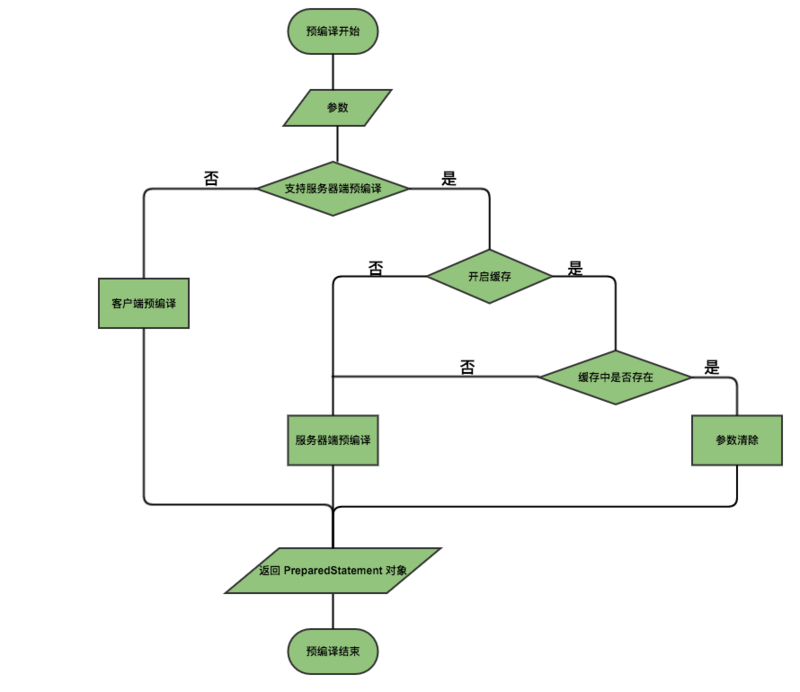

# Mybatis 深入理解之 # 与 $ 区别以及 sql 预编译

```sql
select * from user where name = "ruhua";
```

希望 `name`后的参数 `"ruhuq"`是可动态变化的，在 `sqlMap`的 xml 文件中使用如下的 sql 可以实现动态传递参数 `name`：

```sql
select * from user where name = #{name};
```

或者

```sql
select * from user where name = '${name}';
```

对于上述情况而言，使用`#{}`和`${}` 的结果是相同的，但在某些情况下，我们只能使用二者其一。

## ’#‘ 与 '$'

### 区别

动态 SQL 是 mybatis 的强大特性之一，也是它优于其他 ORM 框架的一个重要原因。mybatis 在对 SQL 语句进行预编译之前 ，会对 SQL 进行动态解析，解析为一个 BoundSql 对象。

在动态 SQL 解析阶段，`#{}`和`${}` 会有不同的表现：

**#{} 解析为一个JDBC 预编译语句的参数标记符。**

例如，sqlMap 中如下的 sql 语句

```sql
select * from user where name = #{name};
```

解析为：

```sql
select * from user where name = ?;
```

一个 `#{}` 被解析为一个参数占位符 `?`。

而 **${} 仅仅为一个纯粹的 String 替换，在动态 SQL 解析阶段将会进行变量替换**

综上所得，`${}` 的变量替换阶段是在动态 SQL 解析阶段，而 `#{}` 的变量的替换是在数据库管理系统(DBMS)中。

## 用法 tips 

### 1. 在可以使用 #{ } 的地方尽量使用 #{ } 

首先这是为了性能考虑的，相同的预编译 SQL 可以重复利用。

其次，**${} 在预编译之前被变量替换了，这会存在 SQL 注入的问题**。 例如，

```sql
select * from ${tableName} where name = #{name}
```

假如，我们的参数 `name` 为  `user; delete user; --` ，那么 SQL 动态解析阶段之后，预编译之前的 SQL 将变为

```sql
select * from user; delete user; -- where name = ?;
```

`--` 之后的语句将作为注释，不起作用，因此本来的一条查询语句偷偷地包含了一个删除表数据的SQL！。

### 2. 表名作为变量时，必须使用 ${ }

这是因为，表名是字符串，使用 sql 占位符替换字符串时会带上单引号 `''`，这会导致 SQL 语法错误，例如：

```sql
select * from #{tableName} where name = #{name};
```

预编译后的SQL变为：

```sql
select * from ? where name = ?;
```

假设我们传入的参数为 `tableName = "user", name = "ruhua"`，那么在占位将进行变量替换后，SQL语句变为

```sql
select * from 'user' where name = 'ruhua';
```

上述 SQL 语句是存在语法错误的，表名不能加单引号 `''`.(注意：反引号```是可以的)。

## SQL 预编译

**SQL 预编译指的是数据库驱动在发送 SQL 语句和参数给 DBMS 之前对 SQL 语句进行编译，这样 DBMS 执行 SQL 时，就不需要重新编译。**

1. 预编译阶段可以优化 SQL 的执行。

   预编译之后的 SQL 多数情况下可以直接执行，DBMS不需要再次编译。

2. 预编译语句对象可以重复利用

   把一个 SQL 预编译后产生的 PreparedStatement 对象缓存下来，下次对于同一个 SQL ，可以直接使用这个缓存的 PreparedStatement 对象。



## 总结

`#{}` 在动态解析时，用`?` 符进行替换，再进行预编译。

`${}` 在动态解析时，用实参进行替换，再进行预编译。（**有SQL注入的风险）**


##  参考

[Mybatis 深入理解之 # 与 $ 区别以及 sql 预编译](https://segmentfault.com/a/1190000004617028)

