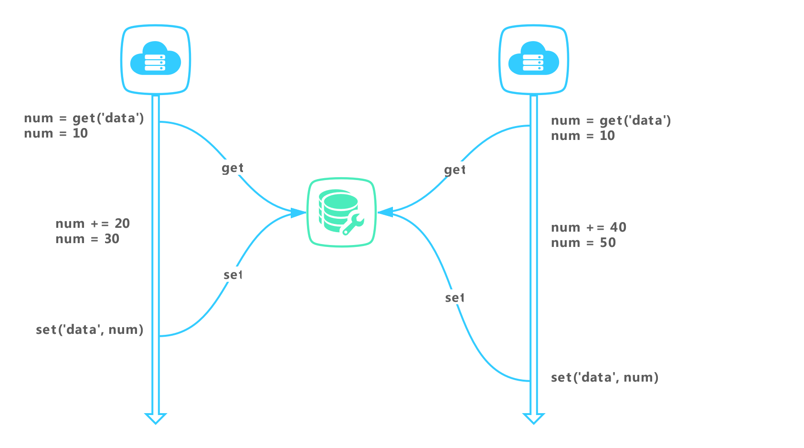
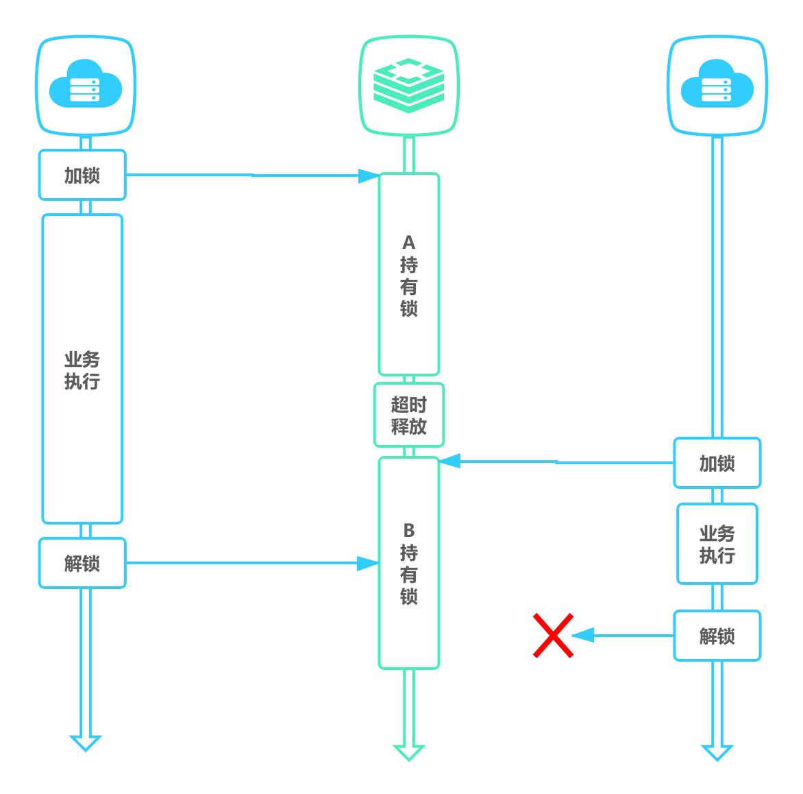
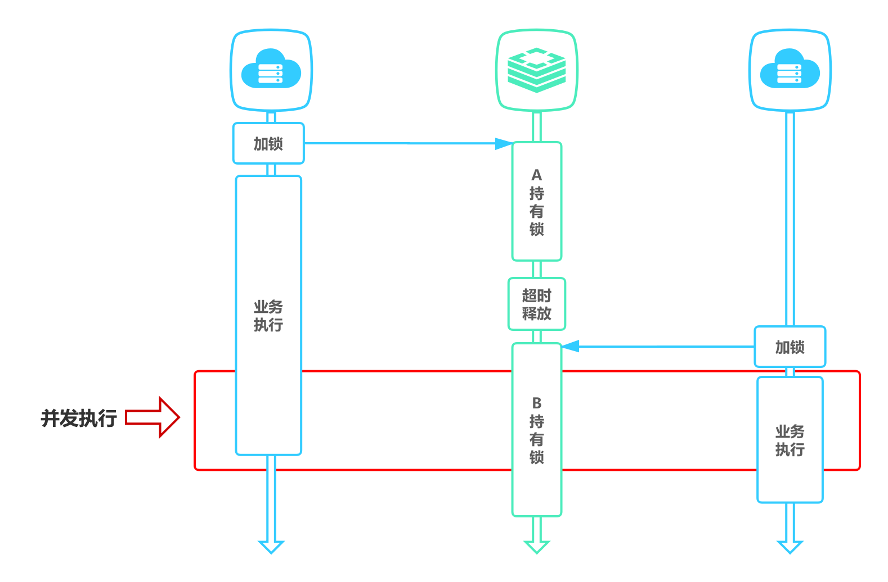

# 分布式锁实现之 redis 篇

**多线程锁（）**指一个确定的时刻只能有一个线程拿到锁，并操作对应的资源。**分布式锁**指一个确定的时刻只能有一个节点拿到锁，并操作对应的资源。

## 为何需要分布式锁

Martin Kleppmann 是英国剑桥大学的分布式系统的研究员，Martin 认为一般我们使用分布式锁有两个场景：

* **效率：**使用分布式锁可以避免不同节点重复相同的工作，这些工作会浪费资源。比如用户付了钱之后有可能不同节点会发出多封短信。
* **正确性：**加分布式锁同样可以避免破坏正确性的发生，如果两个节点在同一条数据上面操作，比如多个节点机器对同一个订单操作不同的流程有可能会导致该笔订单最后的状态出现错误，造成损失。

## 分布式锁的一些特点

* **互斥性：**和多线程锁（本地锁）一样，互斥性是最基本的，但是分布式锁需要保证在不同节点的不同线程的互斥。
* **可重入性：**同一个节点上的同一个线程如果获取了锁之后那么也可以再次获取这个锁。
* **锁超时：**和本地锁一样支持锁超时，防止死锁。
* **高效，高可用：**加锁和解锁需要高效，同时也需要保证高可用防止分布式锁失效，可以增加降级。
* **支持阻塞和非阻塞：**和 ReentrantLock 一样支持 lock 和 tryLock 以及 tryLock(long timeout)。
* **支持公平锁和非公平锁（可选）：**公平锁是按照请求回销的顺序获得锁，非公平锁就相反，是无序的。

## 一、引言

我们在系统中修改已有数据时，需要先读取，然后进行修改保存，此时很容易遇到并发问题。由于修改和保存不是原子操作，在并发场景下，部分对数据的操作可能会丢失。在单服务器系统中，我们常用本地锁来避免并发带来的问题，然而，当服务采用集群方式部署时，本地锁无法在多个服务器之间生效，这时保证数据一致性就需要分布式锁来实现。




## 二、实现

Redis 锁主要利用 Redis 的 setnx 命令。

* 加锁命令： SETNX key value, 当键不存在时，对键进行设置操作并返回成功，否则返回失败。KEY 是锁的唯一标识，一般按业务来决定命名。
* 解锁命令：DEL key，通过删除键值来释放锁，以便其他线程可以通过 SETNX 命令来获取锁。
* 锁超时：EXPIRE key timeout，设置 key 的超时时间，以保证即使锁没有被显示释放，锁也可以在一定时间后自动释放，避免资源被永远锁住。

则加锁解锁伪代码如下：

```java
if (setnx(key, 1) == 1){
    expire(key, 30)
    try {
        //TODO 业务逻辑
    } finally {
        del(key)
    }
}
```

上述锁实现方式存在一些问题：

### 1. SETNX 和 EXPIRE 非原子性

如果 `SETNX` 成功，在设置锁超时时间后，服务器挂掉、重启或网络问题等，导致 `EXPIRE` 命令没有被执行，锁没有设置超时时间变成死锁。


可以使用 lua 脚本来解决这个问题。示例：

```lua
if (redis.call('setnx', KEYS[1], ARGV[1]) < 1)
then return 0;
end;
redis.call('expire', KEYS[1], tonumber(ARGV[2]));
return 1;

// 使用实例
EVAL "if (redis.call('setnx',KEYS[1],ARGV[1]) < 1) then return 0; end; redis.call('expire',KEYS[1],tonumber(ARGV[2])); return 1;" 1 key value 100
```

参考：https://juejin.im/post/6844903999045369870

在 Redis 2.8 中加入了 `setnx`与 `expire`组合在一起的原子指令。

```redis
>set lock:distributed true ex 5 nx
OK
...
other code
...
>del lock:distributed
```


### 2. 锁误解除

如果线程 A 成功获取到了锁，并且设置了过期时间 30 秒，但线程 A 执行时间超过了 30 秒，**锁过期自动释放**，此时线程 B 获取到了锁；随后A执行完成，**线程 A 使用 DEL 命令来释放锁**，但此时线程 B  加的锁还没有执行完成，**线程 A 实际释放的是线程 B 的锁**。




通过在 value 中设置当前线程加锁的标识，在删除之前验证 key 对应的 value 判断锁是否是当前线程持有。可生成一个 **UUID** 标识当前线程， 使用 lua 脚本做验证标识和解锁操作。(用一个 **UUID** 来表示该键)

```lua
// 加锁
String uuid = UUID.randomUUID().toString().replaceAll("-","");
SET key uuid NX EX 30
// 解锁
if (redis.call('get', KEYS[1]) == ARGV[1])
    then return redis.call('del', KEYS[1])
else return 0
end
```

### 3. 超时解锁导致并发

如果线程 A 成功获取锁并设置过期时间 30 秒，但线程A执行时间超过了 30 秒，锁过期自动释放，此时线程B 获取到了锁，线程A 和线程B 并发执行。



A、B两个线程发生并发显然是不被允许的，一般有两种方式解决该问题：

* 将过期时间设置足够长，确保代码逻辑在逻辑在锁释放之前能够执行完成；
* 为获取锁的线程增加守护线程，为将要过期但未释放锁增加有效时间。


### 4. 不可重入

当线程在持有锁的情况下再次请求加锁，如果一个锁支持一个线程多次加锁，那么这个锁就是可重入的。如果一个不可重入锁被再次加锁，由于该锁已经被持有，再次加锁会失败。Redis 可通过进行重入计数，加锁时加 1，解锁时减 1 ，当计数归 0 时释放锁。

在本地记录重入次数，如 Java 中使用 ThreadLocal 进行重入次数统计，简单示例代码：

```java
private static ThreadLocal<Map<String, Integer>> LOCKERS = ThreadLocal.withInitial(HashMap::new);
// 加锁
public boolean lock(String key) {
  Map<String, Integer> lockers = LOCKERS.get();
  if (lockers.containsKey(key)) {
    lockers.put(key, lockers.get(key) + 1);
    return true;
  } else {
    if (SET key uuid NX EX 30) {
      lockers.put(key, 1);
      return true;
    }
  }
  return false;
}
// 解锁
public void unlock(String key) {
  Map<String, Integer> lockers = LOCKERS.get();
  if (lockers.getOrDefault(key, 0) <= 1) {
    lockers.remove(key);
    DEL key
  } else {
    lockers.put(key, lockers.get(key) - 1);
  }
}
```

本地记录重入次数虽然高效，但如果考虑到过期时间和本地、Redis 一致性的问题，就会增加代码的复杂性。另一种方式是 使用 Redis Map 数据结构来实现分布式锁，即存锁的标识也对重入次数进行计数。Redission 加锁示例：

```lua
// 如果 lock_key 不存在
if (redis.call('exists', KEYS[1]) == 0)
then
    // 设置 lock_key 线程标识 1 进行加锁
    redis.call('hset', KEYS[1], ARGV[2], 1);
    // 设置过期时间
    redis.call('pexpire', KEYS[1], ARGV[1]);
    return nil;
    end;
// 如果 lock_key 存在且线程标识是当前欲加锁的线程标识
if (redis.call('hexists', KEYS[1], ARGV[2]) == 1)
    // 自增
    then redis.call('hincrby', KEYS[1], ARGV[2], 1);
    // 重置过期时间
    redis.call('pexpire', KEYS[1], ARGV[1]);
    return nil;
    end;
// 如果加锁失败，返回锁剩余时间
return redis.call('pttl', KEYS[1]);
```

### 5. 无法等待锁释放

上述命令执行都是立即返回的，如果客户端可以等待锁释放就无法使用。

* 可以通过客户端轮询的方式解决该问题，当未获取到锁时，等待一段时间重新获取锁，直到成功获取锁或等待超时。这种方式比较消耗服务器资源，当并发量比较大时，会影响服务器的效率。
* 另一种方式是使用 Redis 的发布订阅功能，当获取锁失败时，订阅锁释放消息，获取锁成功后释放时，发送锁释放消息。（异步通知）如下：


Redis 主要提供了发布消息、订阅频道、取消订阅以及按照模式订阅和取消订阅等命令。

1. 发布消息

   ```redis
   publish channel message
   ```

   例：

   ```redis
    publish channel:sports "Tim won the championship"
   ```

2. 订阅消息

   ```redis
   subscribe channel [channel ...]
   ```

   

## 三、集群

### 1. 主备切换

为了保证 Redis 的可用性，一般采用主从方式部署。主从数据同步有异步和同步两种方式，Redis 将指令记录在本地内存 buffer 中，然后将异步 buffer 中的指令同步到从节点，从节点一边执行同步的指令流来达到和主节点一致的状态，一边向主节点反馈同步的情况。

在包含主从模式的集群部署方式中，当主节点挂掉时，从节点会取而代之，但客户端无明显感知。当客户端 A 成功加锁，指令还未同步，此时主节点挂掉，从节点提升为主节点，新的主节点没有锁的数据，当客户端 B 加锁时就会成功。


### 2. 集群脑裂

集群脑裂指因为网络问题，导致 Redis master 节点跟 slave 节点和 sentinel 集群处于不同的网络分区，因为 seentinel 集群无法感知到 master 的存在，所以将 slave 节点提升为 master 节点，此时存在两个不同的 master 节点。 Redis Cluster 集群部署方式同理。

当不同的客户端连接不同的 master 节点时，两个客户端可以同时拥有同一把锁。如下：


## 四、结语

Redis 以其高性能著称，但使用其实现分布式锁来解决并发仍存在一些困难。Redis 分布式锁只能作为一种缓解并发的手段，如果要完全解决并发问题，仍需要数据库的防并发手段。

## 参考

[分布式锁的实现之 redis 篇](https://xiaomi-info.github.io/2019/12/17/redis-distributed-lock/)

[搞懂“分布式锁”，看这篇文章就对了](https://mp.weixin.qq.com/s/hoZB0wdwXfG3ECKlzjtPdw) 

[Redis 分布式锁的正确实现方式（ Java 版 ）](https://mp.weixin.qq.com/s/qJK61ew0kCExvXrqb7-RSg)