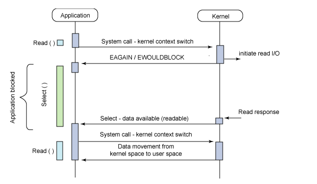
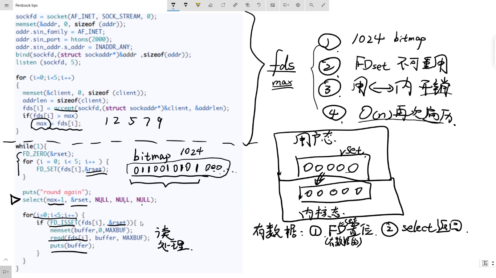
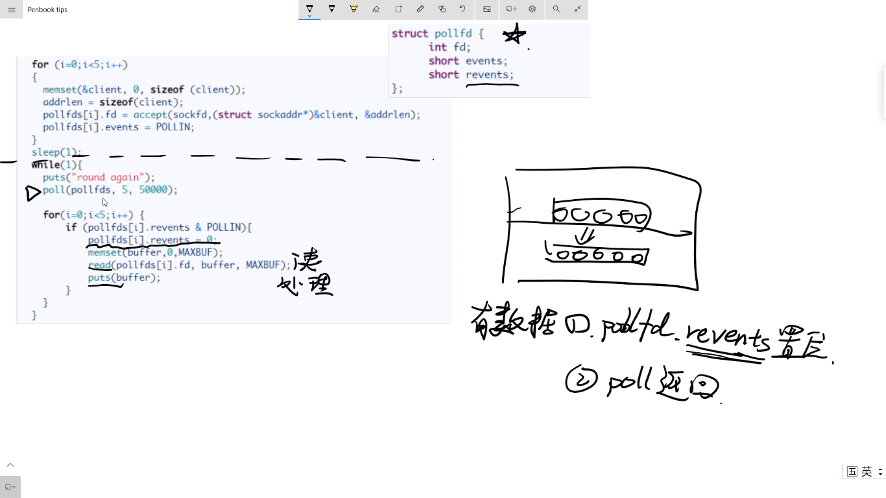
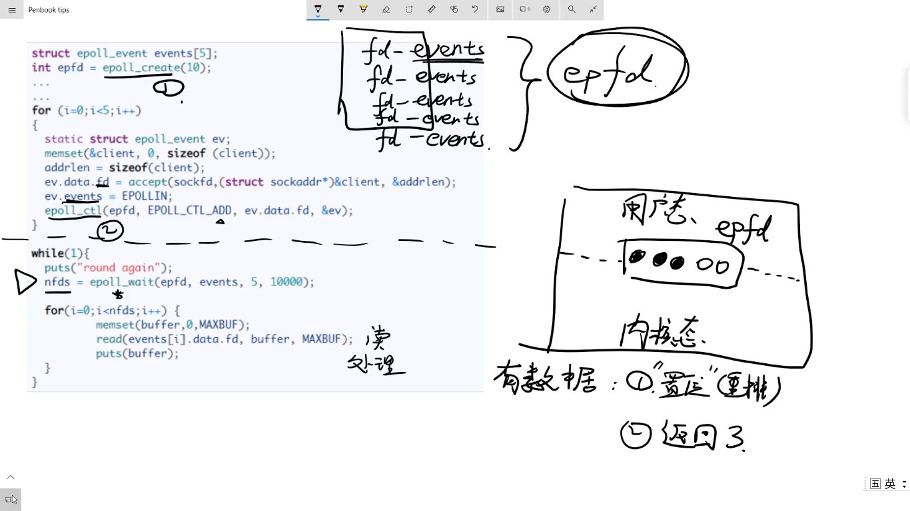

# select , poll , epoll 之间的区别

select，poll，epoll 都是 IO 多路复用的机制。I/O 多路复用就是通过一种机制，可以监视多个描述符，一旦某个描述符就绪（一般是读就绪或者写就绪），能够通知程序进行相应的读写操作。**但 select , poll, epoll 本质上都是同步 IO，因为他们都需要在读写事件就绪后自己负责进行读写，也就是说这个读写过程是阻塞的**，而异步 IO 则无需自己负责进行读写，异步IO 的实现会负责把数据从内核拷贝到用户空间。

## 1. select 的实现

**select 原理概述：**

select 的核心功能是调用 tcp 文件系统的 poll 函数，不停的查询，如果没有想要的数据，主动执行一次调度（防止一直占用 CPU），直到有一个连接有想要的消息为止。

select 的几大缺点：

（1）每次调用 select ，都需要把 fd 集合从用户态拷贝到内核态，这个开销在 fd 很多时会很大；

（2）同时每次调用 select 都需要遍历传递进来的所有 fd，这个开销在 fd 很多时也很大；

（3）select 支持的文件描述符数量有限；

---

**select** 

**poll**

**epoll**

## 参考

https://www.cnblogs.com/aspirant/p/9166944.html

https://www.cnblogs.com/anker/p/3265058.html

https://zhuanlan.zhihu.com/p/58095676

