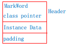
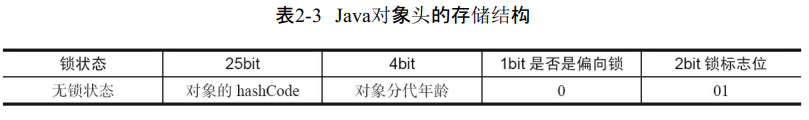
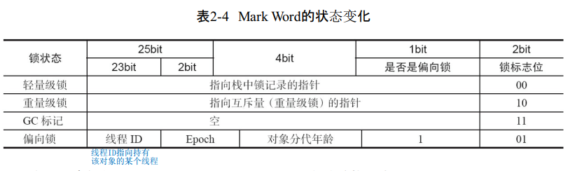
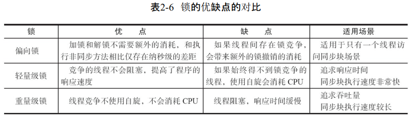

# synchronized 的实现原理与应用

在 JDK1.6 之前 synchronized 是一个重锁，在 JDK 1.6 引入偏向锁和轻量锁和锁升级后，它的执行性能就比之前好很多了。

synchronized 实现同步的基础：Java 中的每一个对象都可以作为监视器（锁），一共有3种表现形式。

* 对于普通同步方法，锁是当前实例对象；
* 对于静态同步方法，锁是当前类的Class对象；
* 对于同步代码块，锁是 synchronized 括号里配置的对象；

代码块的同步是使用字节码指令`monitorenter`和 `monitorexit`实现的，方法的同步也可以使用这两个指令实现。

## 锁存在于对象头里

Java 对象里的 Mark Word 里默认存储对象的 HashCode、分代年龄和锁标记位。

运行期间，Mark Word 里存储的数据会随着锁标志位的变化而变化。Mark Word 可能变化为存储以下4种数据。

## 锁升级

synchronized 的锁一共有4种状态，依次升级过程为：无锁状态、偏向锁状态、轻量级锁状态、重量级锁状态。锁可以升级但不能降级。

### 偏向锁

当一个线程访问同步块并获取锁时，会在对象头和栈帧中的锁记录里存储偏向的线程ID，以后该线程在进入和退出同步块时不需要进行CAS操作来加锁和解锁，只需要简单判断对象头的Mark Work里的偏向是否指向该线程即可。

### 轻量级锁

**加锁**

线程执行同步块前，JVM会先在当前线程的栈帧中创建用于存储锁记录的空间，并将对象头中的 Mark Word 复制到锁记录中。然后线程尝试使用CAS将对象头中的 Mark Word 替换为指向锁记录的指针。如果成功，则当前线程获得锁，如果失败，则表示有竞争，开始自旋。

**解锁**

轻量级解锁时，会使用CAS将栈帧中存放的 Mark Word替换回到对象头，如果成功，则表示没有竞争发生。如果失败，则表示存在竞争，锁就会膨胀成重量级锁。

## 为什么锁不会降级

因为自旋会消耗CPU，为了避免无用的自旋（比如获得锁的线程被阻塞住了），一旦锁升级成重量级锁，就不会再恢复到轻量级锁状态。当锁处于这个状态下，其他线程试图获取锁时都会被阻塞住，当持有锁的线程释放锁之后会唤醒这些线程，被唤醒的线程就会进行新一轮的锁争夺。

## 锁的优缺点对比

## 原子操作的实现原理

### 处理器如何实现原子操作

1. **第一个机制是通过总线锁定保证原子性。**所谓总线锁定就是使用处理器提供的一个 LOCK# 信号，当一个处理器在总线上输出此信号时，其他处理器的请求将被阻塞住，那么该处理器可以独占共享内存。
2. **第二个机制是通过缓存锁定来保证原子性。**在同一时刻，只需要保证对某个内存地址的操作是原子性即可，但总线锁定把CPU和内存之间的通信锁住了，这使得锁定期间，其他处理器不能操作其他内存地址的数据，所以总线锁定的开销比较大，目前处理器在某些场合下使用缓存锁定代替总线锁定进行优化。

### 有两种情况下处理器不会使用缓存锁定

1. 当操作的数据不能被缓存在处理器内部，或操作的数据跨多个缓存行（cache line）时，会调用总线锁定；
2. 处理器不支持缓存锁定时，会调用总线锁定；

### Java 如何实现原子操作

使用循环CAS实现原子操作。

#### CAS实现原子操作的三大问题

1. **ABS 问题。**ABA问题的解决思路就是使用版本号。在变量前面追加上版本号，每次变量更新时把版本号加1。
2. **循环时间开销大。**自旋CAS如果长时间不成功，会给CPU带来非常大的执行开销。
3. **只能保证一个共享变量的原子操作。**当对一个共享变量执行操作时，可以使用循环CAS的方式来保证原子操作，但是对多个共享变量操作时，循环CAS就无法保证操作的原子性，这个时候就可以用锁。

#### 使用锁机制实现原子操作

除了偏向锁，JVM实现锁的方式都用了循环CAS，即当一个线程想进入同步块时使用循环CAS的方式来获取锁，当它退出同步块时使用循环CAS释放锁。

## 参考

Java 并发编程的艺术

[Monitors – The Basic Idea of Java Synchronization ](https://www.programcreek.com/2011/12/monitors-java-synchronization-mechanism/)

[Difference between lock and monitor – Java Concurrency](https://howtodoinjava.com/java/multi-threading/multithreading-difference-between-lock-and-monitor/)