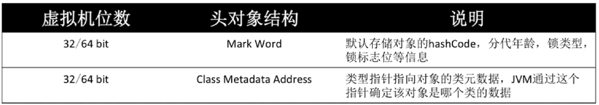
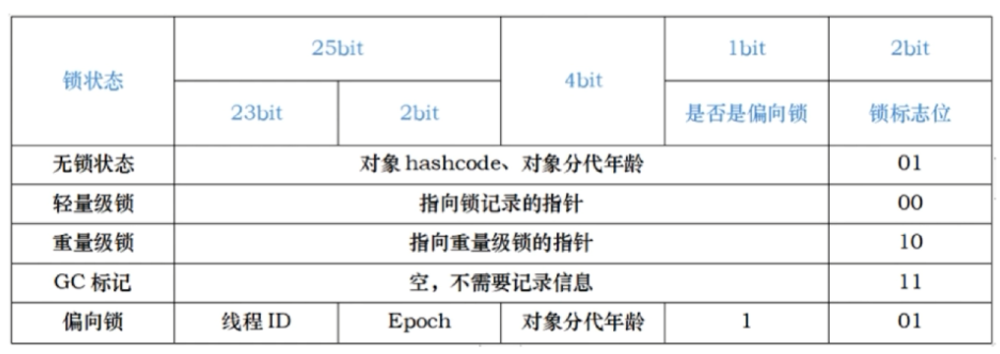
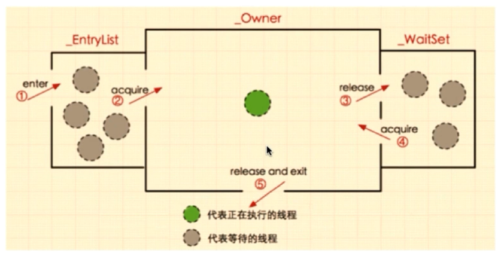
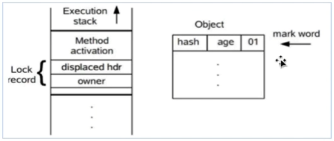
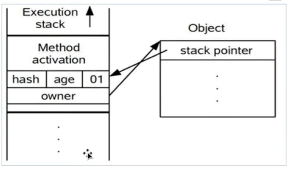
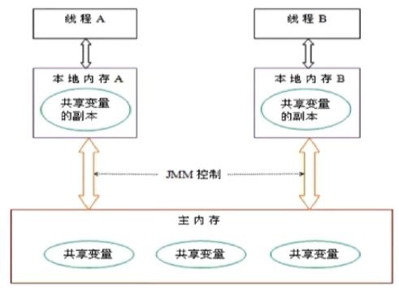
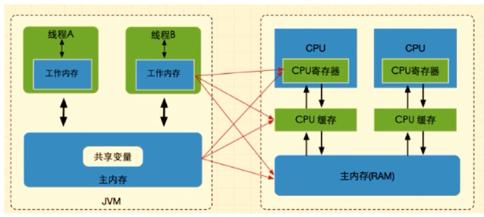
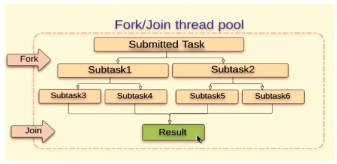
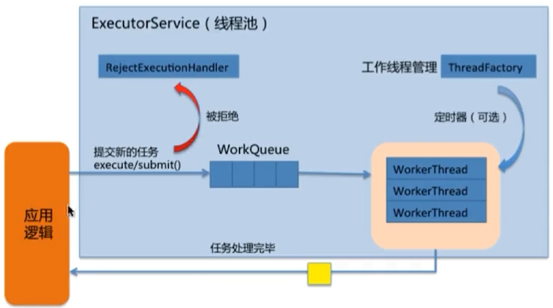

# synchronized 底层实现原理

## 实现 synchronized 的基础

* Java 对象头
* Monitor

## 对象在内存中的布局

* 对象头
* 实例数据
* 对齐填充

## 对象头结构



Mark Word



Monitor：每个 Java 对象天生自带了一把看不见的锁。

```c
ObjectMonitor(){
    _header = NULL;
    _count = 0;
    _waiters = 0;
    _recursions = NULL;
    _object = NULL;
    _WaitSet = NULL;
    _WaitSetLock = 0;
    _Responsible = NULL;
    _succ = NULL;
    _cxq = NULL;
    FreeNext = NULL;
    _EntryList = NULL;
    _SpinFreq = 0;
    _SpinClock = 0;
    OwnerIsThread = 0;
    _previous_owner_tid = 0;
}
```

## Monitor 锁的竞争、获取与释放



## 什么是重入

从互斥锁的设计上来说，当一个线程试图操作一个由其他线程持有的对象锁的临界资源时，将会处于阻塞状态，但当一个线程再次请求自己持有对象的临界资源时，这种情况属于重入。

## 为什么对 synchronized 嗤之以鼻

* 在早期版本中，synchronized 属于重量级锁，依赖于 Mutex Lock 实现；
* 线程之间的切换需要从用户态转换到核心态，开销较大；

## Java 6 以后，synchronized 性能得到了很大的提升

* Adaptive Spinning
* Lock Eliminate
* Lock Coarsening
* Lightweight Locking
* Biased Locking
* ...

## 自旋锁与自适应自旋锁

### 自旋锁

* 许多情况下，共享数据的锁定状态持续时间较短，切换线程不值得；
* 通过让线程执行忙循环等待锁的释放，不让出 CPU；
* 缺点：若锁被其他线程长时间占用，会带来许多性能上的开销；

### 自适应自旋锁

* 自旋的次数不再固定；
* 由前一次在同一个锁上的自旋时间及锁的拥有者的状态来决定；
  * 若上一个线程可以通过自旋来获得锁，则 JVM 也认为当前线程可以通过自旋来获得锁；
  * 若很少有线程可以通过自旋获得锁，则 JVM 会省掉自旋这个环节。
* 

### 锁消除

* JIT 编译时，对运行上下文进行扫描，去除不可能存在竞争的锁。

### 锁粗化

* 通过扩大加锁的范围，避免反复加锁和解锁；

## synchronized 的四种状态

* 无锁、偏向锁、轻量级锁、重量级锁

锁膨胀方向：无锁 -> 偏向锁 -> 轻量级锁 -> 重量级锁

**偏向锁：减少同一线程获取锁的代价**

* 大多数情况下，锁不存在多线程竞争，总是由同一线程多次获得

核心思想：

如果一个线程获得了锁，那么锁就进入偏向模式，此时 Mark Word 的结构也变为偏向锁结构，当该线程再次请求锁时，无需再做任何同步操作，即获取锁的过程只需要检查 Mark Word 的锁标记位为偏向锁以及当前线程 Id 等于 Mark Word 的 Thread ID 即可，这样就省去了大量有关锁申请的操作。

不适用于锁竞争比较激烈的多线程场合。

**轻量级锁**

轻量级锁是由偏向锁升级来的，偏向锁运行在一个线程进入同步块的情况下，当第二个线程加入锁争用时，偏向锁就会升级为轻量级锁。

适用的场景：线程交替执行同步块。

若存在同一时间访问同一锁的情况，就会导致轻量级锁膨胀为重量级锁。

**轻量级锁的加锁过程**

（1）在代码块进入同步块时，如果同步对象锁状态为无锁状态（锁标志为“01”状态），虚拟机首先将在当前线程的栈帧中建立一个名为锁记录（Lock Record）的空间，用于存储对象目前的 Mark Word 的拷贝官方称之为 Displaced Mark Word。这时线程堆栈与对象头的状态如图所示：



（2）拷贝对象头中的 Mark Word 复制到锁记录中。

（3）拷贝成功后，虚拟机将使用 CAS 操作尝试将对象的 Mark Word 更新为指向 Lock Record 的指针，并将 Lock record 里的 owner 指针指向 object mark word 。如果更新成功，则执行步骤（4），否则执行步骤（5）。

（4）如果这个更新动作成功了，那么这个线程就拥有了该对象的锁，并且对象 Mark Word 的锁标志位设置为 “00”，即表示 此对象处于轻量级锁定状态，这时线程堆栈与对象头的状态如图所示：



（5）如果这个更新操作失败了，虚拟机首先会检查对象的 Mark Word 是否指向当前线程的栈帧，如果是就说明当前线程已经拥有了这个对象的锁，那就可以直接进入同步块继续执行。否则说明多个线程竞争锁，轻量级锁就要膨胀为重量级锁，锁标志的状态值变为“10”，Mark Word 中存储的就是指向重量级锁（互斥量）的指标，后面等待锁的线程也要进入阻塞状态。而当前线程便尝试使用自旋来获取锁。

### 锁的内存语义

当线程释放锁时，Java 内存模型会把该线程对应的本地内存中的共享变量刷新到主内存中；

而当线程获取锁时，Java 内存模型会把该线程对应的本地内存置为无效，从而使用被监视器保护的临界区代码必须从主内存中读取共享变量。

## synchronized 和 ReentrantLock 的区别

* synchronized 是关键字，ReentrantLock 是类；
* ReentrantLock 可以对获取锁的等待时间进行设置，避免死锁；
* ReentrantLock 可以获取各种锁的信息；
* ReentrantLock 可以灵活地实现多路通知；
* 机制：sync 操作 Mark Word， lock 调用 Unsafe 类的 park() 方法；

## 什么是 Java 内存模型中的 happens-before

### Java 内存模型 JMM

Java 内存模型（即 Java Memory Model，简称 JMM）本身是一种抽象的概念，并不真实存在，它描述的是一组规则或规范，通过这组规范定义了程序中各个变量（包括实例字段，静态字段和构成数组对象的元素）的访问方式。



## JMM 中的主内存和工作内存

### JMM 中的主内存

* 存储 Java 实例对象；
* 包括成员变量、类信息、常量、静态变量等；
* 属于数据共享的区域，多线程并发操作时会引发线程安全问题；

### JMM 中的工作内存

* 存储当前方法的所有本地变量信息，本地变量对其他线程不可见；
* 字节码行号指示器、Native 方法信息；
* 属于线程私有数据区域，不存在线程安全问题；

### JMM 与 Java 内存区域划分是不同的概念层次

* JMM 描述的是一组规则，围绕原子性、有序性、可见性展开；
* 相似点：存在共享区域和私有区域；

### 主内存与工作内存的数据存储类型以及操作方式

* 方法里的基本数据类型本地变量将直接存储在工作内存的栈帧结构中；
* 引用类型的本地变量：引用存储在工作内存中，实例存储在主存中；
* 成员变量、static 变量、类信息均会被存储在主内存中；
* 主内存共享的方式是线程各拷贝一份数据到工作内存，操作完成后刷新回主内存；

**JMM 如何解决可见性问题**



**指令重排序需要满足的条件**

* 在单线程环境下不能改变程序运行的结果；
* 存在数据依赖关系的不允许重排序；

**无法通过 happens-before 原则推导出来的才能进行指令的重排序**

### happens-before 的八大原则 

1. 程序次序规则：一个线程内，按照代码顺序，书写在前面的操作先行发生于书写在后面的操作；
2. 锁定规则：一个 unlock 操作先行发生于后面对于同一个锁的 lock 操作；
3. volatile 变量规则：对一个变量的写操作先行发生于后面对这个变量的读操作；
4. 传递规则：如果操作A 先行发生于操作B ，而操作B 又先行发生操作C，则可以得到操作 A 先行发生于操作 C；
5. 线程启动规则：Thread 对象的 start() 方法先行发生于此线程的每一个动作；
6. 线程中断规则：对线程 interrupt() 方法的调用先行发生于被中断线程的代码检测到中断事件的发生；
7. 线程终结规则：线程中所有的操作都先行发生于线程的终止检测，我们可以通过 Thread.join() 方法结束、Thread.isAlive() 的返回值手段检测到线程已经终止执行；
8. 对象终结规则：一个对象的初始化完成先行发生于它的 finalize() 方法的开始；

## volatile 保证可见性，不保证原子性

### volatile 变量为何立即可见？

当写一个 volatile 变量时，JMM 会把该线程对应的工作内存中的共享变量值刷新到主内存中；

当读取一个 volatile 变量时，JMM 会把该线程对应的工作内存置为无效；

### volatile 如何禁止重排优化

内存屏障（Memory Barrier）

1. 保证特定操作的执行顺序；
2. 保证某些变量的内存可见性；

通过插入内存屏障指令禁止在内存屏障前后的指令执行重排序优化。

强制刷出各种 CPU 的缓存数据，因此任何 CPU 上的线程都能读取到这些数据的最新版本。

## volatile 和 synchronized 的区别

1. volatile 本质是在告诉 JVM 当前变量在寄存器（工作内存）中的值是不确定的，需要从主存中读取；synchronized 则是锁定当前变量，只有当前线程可以访问该变量，其他线程被阻塞住直到该线程完成变量操作为止；
2. volatile 仅能使用在变量级别；synchronized 则可以使用在变量、方法和类级别；
3. volatile 仅能实现变量的修改可见性，不能保证原子性；而 synchronized 则可以保证变量修改的可见性和原子性；
4. volatile 不会造成线程的阻塞；synchronized 可能会造成线程的阻塞；

## CAS（Compare and Swap）

**CAS 思想**

* 包含三个操作——内存位置（V）、预期原值（A）和新值（B）

**缺点**

* 若循环时间长，则开销很大；
* 只能保证一个共享变量的原子操作；
* ABA 问题； **解决: AtomicStampedReference**

## Java 线程池

Fork/ Join 框架

Work-Stealing 算法：某个线程从其他队列里窃取任务来执行

* 把大任务分割成若干个小任务并行执行，最终汇总每个小任务结果后得到大任务结果的框架

  

### 为什么要使用线程池

* 降低资源消耗；
* 提高线程的可管理性；

**ThreadPoolExecutor**



**ThreadPoolExecutor的构造函数**

* corePoolSize：核心线程数量

* maximumPoolSize：线程不够用时能够创建的最大线程数

* workQueue：任务等待队列

* keepAliveTime：保活时间

* threadFactory：创建新线程，Executors.defaultThreadFactory()

* handler：线程池的饱和策略

  * AbortPolicy：直接抛出异常，这是默认策略
  * CallerRunsPolicy：用调用者所在的线程来执行任务
  * DiscardOldestPolicy：丢弃队列中靠前的任务，并执行当前任务
  * DiscardPolicy：直接丢弃任务
  * 实现 RejectedExecutionHandler 接口的自定义 handler

  

### 线程池的大小如何选定

* CPU 密集型：线程数=按照核数或者核数 + 1 设定；
* I/O 密集型：线程数 = CPU核数 * （1 + 平均等待时间/ 平均工作时间）；