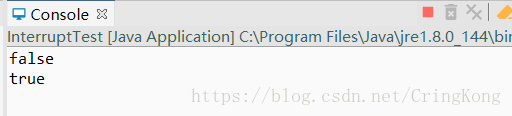
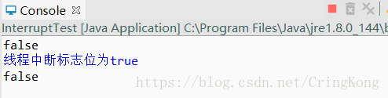

# 线程中断

## 1. interrupt()

`interrupt()` 函数所做的是形式上中断一个线程。

为什么说是形式上的中断，因为这个函数不会真正意义上的打断一个正在运行的线程，而是修改这个线程的中断状态码（interrupt status）。同时，对于处于 sleep()、wait() 和 join() 方法阻塞下的线程，该方法会线程抛出一个异常。对于可中断通道（NIO 中的 Channel ）的阻塞状态，该方法会关闭通道，抛出异常。对于 NIO 中选择器的阻塞（Selector.selector），该方法等同于调用选择器的 wakeup() 方法。

Java 并不希望暴力地去杀死一个线程（因为 Java 线程是基于操作系统的，而操作系统是可以直接杀死一个进程的），而是希望你通过优良的设计实现一种优雅的中断方式。

```java
public class InterruptTest {
    public static void main(String[] args) {
        Thread thread = new Thread(new Runnable() {
            @Override
            public void run() {
                while (true) {
                    System.out.println(Thread.currentThread().getName()+" 依旧在运行");
                }
            }
        });
        
        thread.start();
        // 执行线程的interrupt()方法
        thread.interrupt();
    }
}
```

线程依旧在运行。

## 2. isInterrupted()

这个方法会返回线程的中断标志。

```java
    public static void main(String[] args) {
        Thread thread = new Thread(new Runnable() {
            @Override
            public void run() {
                // TODO Auto-generated method stub
                while (true) {
                }
            }
        });

        thread.start();
        System.out.println(thread.isInterrupted());
        thread.interrupt();
        System.out.println(thread.isInterrupted());
```



可以看到，调用某一个线程对象的`isInterrupted()`方法会返回该线程的中断状态码。调用`interrupt()`方法以后，会改变这个线程的中断状态码。

## 3. interrupted()

这个方法会返回**当前**线程的中断标志位，**同时会重置中断标志位。**

```java
public static void main(String[] args) {
        Thread thread = new Thread(new Runnable() {

            @Override
            public void run() {
                // TODO Auto-generated method stub
                while (true) {
                    if (Thread.interrupted()) {
                        System.err.println("线程中断标志位为true");
                    }
                }
            }
        });
        System.out.println(thread.isInterrupted());
        thread.start();     
        thread.interrupt();
        System.out.println(thread.isInterrupted());
    }
```



可以看出：

1. 该方法是一个`Thread`类的静态方法，**调用时会返回当前线程的中断状态码。**
2. 调用完该方法以后，中断状态码会被重置。

## 中断的使用

通常，中断的使用场景有以下几个：

* 点击某个桌面应用中的取消按钮时；
* 某个操作超过了一定的执行时间限制需要中止时；
* 一组线程中的一个或多个出现错误导致整组都无法继续时；
* 当一个应用或服务需要停止时；

## 参考

https://blog.csdn.net/CringKong/article/details/80526996