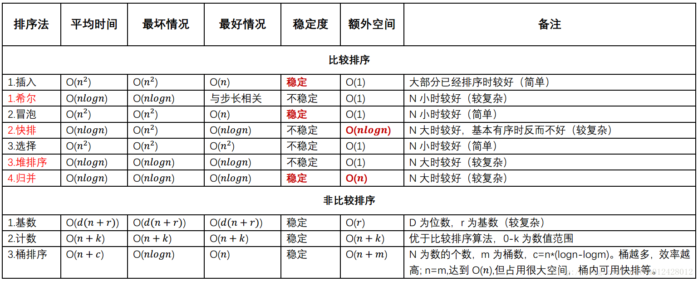

# 各排序时间复杂度

上图的快排的额外空间复杂度应该为 `O(logn)`

* 快速排序

  最好时间复杂度：每次都能选到中间的元素作为 pivot，这样每次都可以平均分为两部分。此时递归树高为 `O(logn)`，每一层都需要比较`O(n)`次，所以最好的时间复杂度为：`O(nlogn)`

  最差时间复杂度：若序列中的元素基本有序，快速排序将退化为冒泡算法。其递归树高为`O(n)`，第一层都需要比较`O(n)`次。所以最坏时间复杂度为`O(n^2)`。

  空间复杂度：快速排序需要一个栈空间来实现递归。若每一趟排序都将记录序列均匀地分割成长度相似的两个子序列，则栈的最大深度为`floor(log2n)+1`(包括最外层参量进栈)。但是，若每趟排序之后，pivot 位置均偏向子序列的一端，则为最坏情况，栈的最大深度为 `n`。

  稳定性：不稳定

* 插入排序

* 堆排序

  最好时间复杂度：`O(nlogn)`

  最坏时间复杂度：`O(nlogn)`

  空间复杂度：`O(n)`

  稳定性：不稳定

* 归并排序

  一趟归并排序的操作是，调用`ceiling(n/2h)`次算法 merge 将`SR[1..n]`中前后相邻且长度为 `h`的有序段进行两两归并，得到前后相邻、长度为 `2h`的有序段，并存放在`TR[1..n]`中，整个归并排序进行`ceiling(log2n)`趟。可见，实现归并排序需要和待排记录等数量的辅助空间，其时间复杂度为`O(nlogn)`。