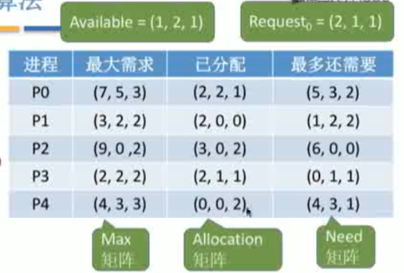

# 银行家算法笔记

## 银行家算法

假设**系统中有 n 个进程，m 种资源**。每个进程在运行前先声明对各种资源的最大需求数，则可用一个 `n*m` 的矩阵（可用二维数组实现）表示所有进程对各种资源的**最大需求数**。不妨称为**最大需求矩阵 Max**， `Max[i,j]=k`表示进程 `Pi` 最多需要 `K` 个资源 `Rj`。 同理，系统可以用一个` n*m`的**已分配矩阵 Allocation** 表示对所有进程的资源分配情况。 **`Max - Allocation = Need` 矩阵**， 表示各进程最多还需要多少各类资源。

另外，还要用一个长度为 `m` 的**一维数组 `Available`** 表示当前系统中还有多少可用资源。

某进程 `Pi` 向系统申请资源， 可用一个长度为 `m` 的一维数组 `Request_i` 表示本次申请的各种资源数量。



可用**银行家算法**预判本次分配是否会导致系统进入不安全状态：

1. 如果 `Request_i[j]<=Need[i,j] (0<=j<=m)`便转向 2；否则认为出错。（**因为它所需要的资源数已超过它所宣布的最大值**）

2. 如果 `Request_i[j]<=Available[j](0<=j<=m)`，便转向 3；否则表示尚无足够资源， `Pi`必须等待。

3. 系统试探着把资源分配给进程`Pi`，并修改相应的数据（并非真的分配，修改数值只是为了做预判）：

   ```java
   Available = Available - Request;
   Allocation[i,j] = Allocation[i,j]+Request_i[j];
   Need[i,j]=Need[i,j]=Request_i[j];
   ```

4. 操作系统执行**安全性算法**，检查此次资源分配后，系统是**否处于安全状态**。若安全，才正式分配；否则，恢复相应数据，让进程阻塞等待。

## 知识点回顾与重要考点

**数据结构：**

* 长度为 `m` 的一维数组 `Available` 表示还有多少可用资源；
* `n*m` 矩阵 `Max`表示各进程对资源的最大需求数；
* `n*m`矩阵 `Allocation` 表示已经给各进程分配了多少资源；
* `Max - Allocation = Need` 矩阵表示各进程最多还需要多少资源；
* 用长度为 `m` 的一维数组 `Request` 表示进程此次申请的各种资源数；

**银行家算法步骤：**

1. 检查此次申请是否超过了之前声明的最大需求数；
2. 检查此时系统剩余的可用资源是否还能满足这次请求；
3. 试探着分配，更改各数据结构；
4. 用安全性算法检查此次分配是否会导致系统进入不安全状态；

**安全性算法步骤：**

检查当前的剩余可用资源是否满足某个进程的最大需求，如果可以，就把该进程加入安全序列，并把该进程持有的资源全部回收。

不断重复上述过程，看最终是否能让所有进程都加入安全序列。

系统处于不安全状态未必死锁，但死锁时一定处于不安全状态。系统处于安全状态一定不会死锁。

## 参考

[银行家算法](https://zh.wikipedia.org/wiki/%E9%93%B6%E8%A1%8C%E5%AE%B6%E7%AE%97%E6%B3%95#%E5%AE%89%E5%85%A8%E5%92%8C%E4%B8%8D%E5%AE%89%E5%85%A8%E7%9A%84%E7%8A%B6%E6%80%81)