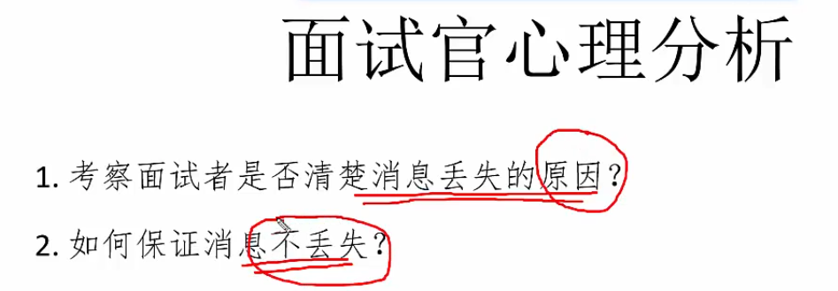
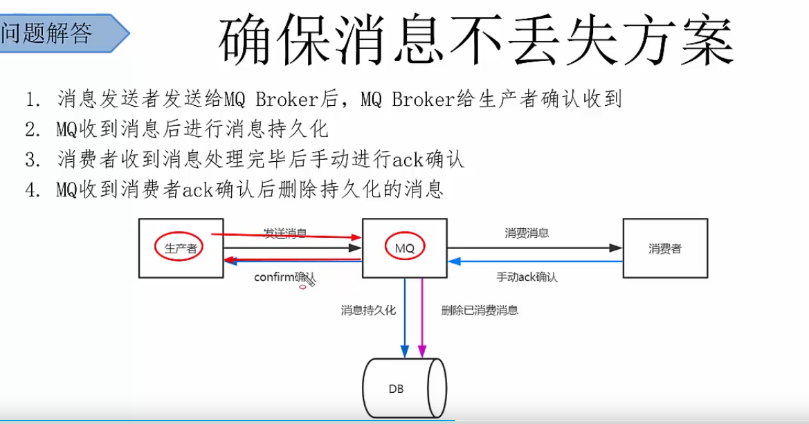
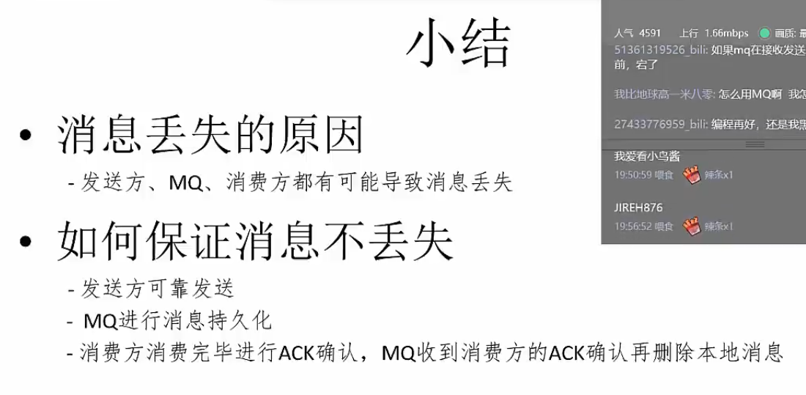
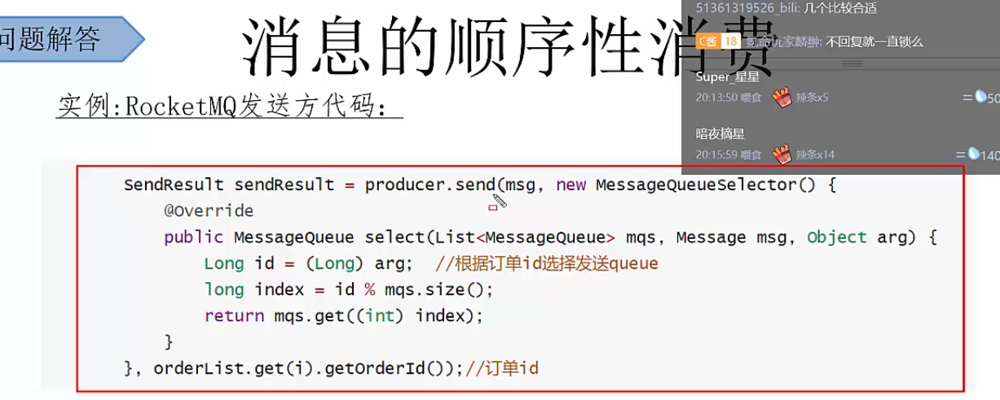

# 消息队列

## 1.为什么要用消息队列？（消息队列的应用场景？）

## 2. 各种消息队列产品的比较？

## 3. 消息队列的优点和缺点？

## 4. 如何保证消息队列的高可用？

集群

## 5. 如何保证消息不丢失？

## 6. 如何保证消息不被重复消费？（如何保证消息消费的幂等性？）

## 7. 如何保证消息消费的顺序性？

## 8. 基于 MQ 的分布式事务实现

