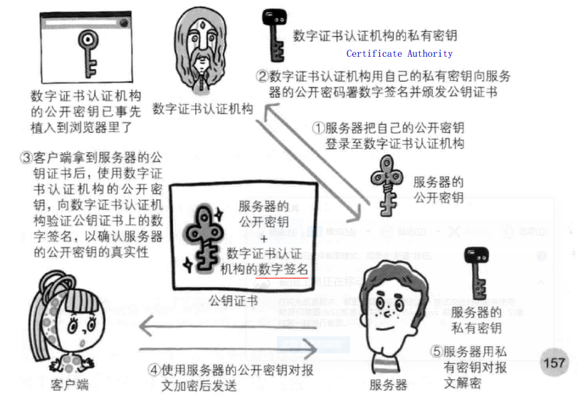
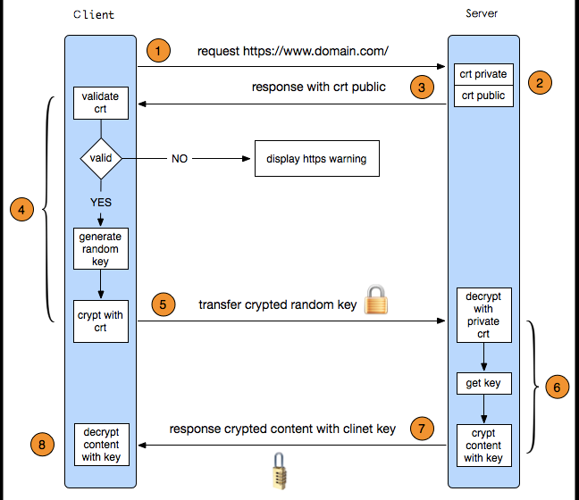
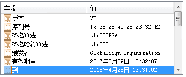
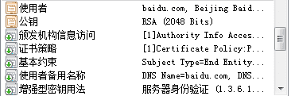

# HTTPS 流程

## 前言：

要使用 https，需要在网站的服务器上配置 https 证书 （一般是 nginx，或者 tomcat），证书可以使用自己生成，也可以向专门的 https 证书提供商进行购买。这两种的区别是自己生成的证书是不被浏览器信任的，所以当访问的时候会提示不安全的网站，需要点击信任之后才能继续访问。而购买的 https 证书会提示安全。

这是因为浏览器预置了一些 https 证书提供商的证书，在浏览器获取到服务器的 https 证书进行验证时就知道这个 https 证书是可信的；而自己生成的证书，浏览器获取到之后无法进行验证是否可信，所以就给出不安全的提示。

## 1. 什么是 https 

https 简单地说就是安全版的 http，因为 http 协议的数据都是明文进行传输的，所以对于一些敏感信息的传输就很不安全，为了安全传输敏感数据，网景公司设计了SSL（Secure Socket Layer）,在 http 的基础上添加了一层安全传输层，对所有的数据都加密后再进行传输，客户端和服务端收到加密数据后按照之前约定好的秘钥进行解密。

## 2. 加密和解密

加密方式大体可以分为对称加密和非对称加密。

* 对称加密：就是加密和解密都是用同一个秘钥，这种方式的优点就是速度快，缺点就是在管理和分配密钥时不安全。

* 非对称加密算法：非对称加密有一个秘钥对，叫做公钥和私钥。私钥自己持有，公钥可以公开地发送给使用的人。使用公钥进行加密的信息，只有和其配对的私钥可以解开。目前常见的非对称加密算法是 RSA，非对称的加密算法的优点是安全，因为他不需要把私钥暴露出去。

  在正式的使用场景中一般都是对称加密和非对称加密结合使用，使用非对称加密完成秘钥的传递，然后使用对称秘钥进行数据加密和解密。

## 3. https 证书的申请流程

1. 在服务器上生成 CSR 文件（证书申请文件，内容包括证书公钥，使用的 HASH 算法，申请的域名，公司名称，职位等信息）。
2. 把 CSR 文件和其他可能的证件上传到 CA 认证机构，CA 机构收到证书申请之后，使用申请中的 HASH 算法，对部分内容进行计算摘要，然后使用 CA 机构自己的私钥对这段摘要信息进行签名。
3. 然后 CA 机构把签名过的证书通过邮件形式发送到申请者手中。
4. 申请者收到证书之后部署到自己的 web 服务器中。

## 4. 客户端和服务器端交互流程

1. client Hello，客户端先向服务器发出加密通信的请求

   **（1）支持的协议版本，比如 TLS 1.0 版；**

   **（2）一个客户端生成的随机数 random1 ，稍后用于生成“对话密钥”；**

   **（3）支持的加密方法，比如 RSA 公钥加密；**

   （4）支持的压缩方法；

2. 服务器收到请求，然后响应 server Hello

   **（1）确认使用的加密通信协议版本，比如 TLS 1.0 版本。如果浏览器与服务器支持的版本不一致，服务器关闭加密通信；**

   **（2）一个服务器生成的随机数 random2，稍后用于生成“对话密钥”；**

   **（3）确认使用的加密方法，比如 RSA 公钥加密；**

   （4）**服务器证书；**

   

   

3. 客户端收到证书后会首先进行验证

   * **验证流程**

     （1）CA 机构 在签发证书时，会使用 CA 机构的私钥对证书进行签名。证书里的签名算法字段用 sha256RSA 表示，CA 机构使用 sha256 对证书进行摘要，然后使用 RSA 算法对摘要进行私钥签名。使用了私钥签名之后，只有用公钥才能验证签名。

     （2）如果使用的是购买的证书，那么很可能，颁发这个证书的 CA 机构 的公钥已经预置在操作系统中。这样浏览器就可以使用 CA 机构的公钥对服务器的证书进行验证签名。确定这个证书是不是由正规的 CA 机构颁发的。验证签名之后得到 CA 机构使用 sha256 摘要得到的证书摘要，然后客户端再使用 sha256 对证书内容进行一次摘要，如果得到的值和验证签名之后得到的摘要值相同，则表示证书没有被修改过。

     （3）如果验证通过，就会显示出安全字样，如果没有验证通过，就会显示不安全的提示。

   * **生成随机数**

     验证通过后，客户端会生成一个随机数 **pre-master**（**预掌握**） secret，然后使用证书中的公钥进行加密，然后传递给服务器端。

4. 服务端收到使用公钥加密的内容，在服务器端使用私钥解密之后获得随机数 pre-master secret，然后根据 random1 , random2，pre-master secret 通过一定的算法得出 session Key 和 MAC 算法秘钥，作为后面交互过程中使用对称秘钥。同时客户端也会使用 random1, random2, pre-master secret 和同样的算法生成 session Key 和 MAC 算法的秘钥。

5. 然后再后续的交互中就使用 session Key 和 MAC 算法和秘钥对传输的内容进行加密和解密。

