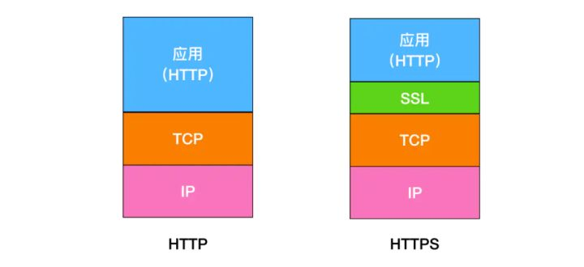

# Http 面试题

## HTTP 有哪些方法？

* HTTP 1.0 定义了三种请求方法：GET、POST和HEAD方法；
* HTTP 1.1 新增了五种请求方法：OPTIONS、PUT、DELETE、TRACE和CONNECT

## 这些方法的具体作用是什么？

* **GET：通常用于请求服务器发送某些资源；**
* **HEAD：请求资源的头部信息，并且这些头部与HTTP GET 方法请求时返回的一致。该请求方法的一个使用场景是在下载一个大文件前先获取其大小再决定是否要下载，以此可以节约带宽资源。**
* OPTIONS：用于获取目的资源所支持的通信选项；
* **POST：发送表单数据给服务器**
* PUT：用于新增资源或者使用请求中的有效负载替换目标资源的表现形式；
* DELETE：用于删除指定的资源
* PATCH：用于对资源进行部分修改
* CONNECT：HTTP/1.1 协议中预留给能够将连接改为管道方式的代理服务器
* TRACE：回显服务器收到的请求，主要用于测试或诊断。

## GET 和 POST 的区别

HTTP中包括许多方法,GET和POST是HTTP中最常用的两个方法,基本上使用HTTP方法中有99%都是使用GET方法和POST方法，所以有必要对这两个方法有更加深刻的认识．

*  GET方法一般用于请求，比如你在浏览器地址输入` www.baidu.com`, 其实就是发送了一个 GET 请求,它的主要特征是请求服务器返回资源,而POST方法一般用于`<form>`表单的提交,相当于是把信息交给服务器,等待服务器作出响应,GET相当是 pull 拉的操作,而POST相当于是一个 pust 推的操作.

* GET 方法是不安全的，因为在发送请求的过程中，你的请求参数会拼在URL后面，从而导致容易被攻击者窃取，对你的信息造成破坏和伪造；

  ```
  /test/demo_form.asp?name1=value1&name2=value2 
  ```

  而 POST 方法是把参数放在请求体 body 中的,这对用户而言不可见.

  ```
   POST /test/demo_form.asp HTTP/1.1
   Host: w3schools.com
   name1=value1&name2=value2 
  ```

* GET 请求的 URL 有长度限制,而 POST 请求会把参数和值放在消息体中,对数据长度没有要求;

* GET 请求会被浏览器主动 cache, 而 POST 不会,除非手动设置;

* GET 请求是可以响应浏览器的 `回退/前进`操作的,而 POST 操作会再次提交表单请求;

* GET 请求在发送过程中会产生一个TCP数据包, POST操作在发送过程中会产生两个 TCP 数据包;

  对于 GET 请求,浏览器会把 http header 和 data 一并发出去,服务器响应 200 (返回数据); 而对于 POST ,浏览器先发送 header , 服务器响应 100 continue, 浏览器再发送 data, 服务器响应 200 ok (返回数据).

## HTTP 和 HTTPS 的区别

HTTP 全称为 `Hypertext Transfer Protoco`, HTTPS 全称为 `Hypertext Transfer Protocol Secure`. HTTPS 多了安全性这个概念, 它是由 + TLS/SSL 协议组合而成. 而安全性的保证正是 TLS/SSL所做的工作.

 

HTTPS 在TCP层之上多了一层 SSL , 即安全套接字层.

HTTP 和 HTTPS 最主要的区别为:

* HTTP 在地址栏以 `http://`开头, 而 HTTPS 在地址栏以 `https://`开头;
* HTTP 是未经安全加密的协议,它的传输过程容易被监听和劫持, 发送方和接收方容易被伪造; 而 HTTPS 是经过安全加密的协议, 它通过**密钥交换算法 - 签名算法 - 对称加密算法 - 摘要算法** 来解决安全加密的问题.
* HTTP 的默认端口是 **80** , 而 HTTPS 的默认端口是 **443**.

## 关于 SSL

SSL (Secure Socket Layer)

SSL 采用了一种叫做公钥加密的非对称加密处理方式.

### 公钥加密,私钥解密

使用公开密钥加密方式,发送密文的一方使用对方的公开密钥进行加密处理,对方收到被加密的信息后,再使用自己的私胡密钥进行解密.利用这种方式,不需要发送用来解密的私有密钥,也不必担心密钥被攻击者窃听而盗走.

## HTTPS 是如何保证安全的?

**HTTP + 加密 + 认证 + 完整性保护 = HTTPS**

### 加密（防窃听）

SSL 使用的是**非对称加密**. 与此对应就会有**对称加密**.

**对称加密:**

即通信双方都使用同一个密钥进行加解密,对称加密虽然很简单,性能也好,但是无法解决首次把秘钥发给对方的问题,很容易会监听.

**非对称加密:**

1. 私钥 + 公钥 = 密钥对;
2. 即用公钥加密的数据,只有对应的私钥才能解密.
3. 因为通信双方的手里都有一套自己的密钥对, 通信双方会先把自己的公钥都先发给对方;
4. 然后对方再拿着这个公钥来加密数据响应给对方,等到到了对方那里,对方再用自己的私钥进行解密.

非对称加密虽然安全性更高，但是带来的问题就是速度很慢，影响性能。

解决方案：

那么结合两种加密方式，将对称加密的密钥使用非对称加密的公钥进行加密，然后发送出去，接收方使用私钥进行解密得到对称加密的密钥，然后双方可以使用对称加密来进行沟通。

### 认证（防伪装）

此时又带来一个问题:中间人问题

若此时在客户端和服务器之间存在一个中间人,这个中间人只需要把原本双方通信互发的公钥,换成自己的公钥, 那这样中间人就可以轻松解密通信双方所发送的所有数据.

所以这个时候需要一个安全的第三方颁发证书（CA），证明身份的身份，防止被中间人攻击。

证书中包括：签发者、证书用途、使用者公钥、使用者私钥、使用者的HASH算法、证书到期时间等

### 完整性保护（防篡改）

但是问题来了，如果中间人篡改了证书，那么身份证明是不是就无效了？这个证书就白买了，这个时候需要一个新的技术，数字签名。

数字签名就是用CA自带的HASH算法对证书的内容进行HASH得到一个摘要，再用CA的私钥加密，最终组成数字签名。（**摘要经过加密，就得到数字签名**）

当别人把他的证书发过来的时候,我再用同样的Hash算法,再次生成消息摘要，然后**用CA的公钥对数字签名解密**,得到CA创建的消息摘要,两者一比,就知道中间有没有被人篡改了。

这个时候就能最大程度保证通信的安全了。

## HTTP/2 特点

### 二进制分帧

HTTP/1.1 版的头信息肯定是文本（ASCII编码），数据体可以是文本，也可以是二进制。HTTP/2 则是一个彻底的二进制协议，头信息和数据体都是二进制，并且统称为"帧"（frame）：头信息帧和数据帧。

二进制协议的一个好处是，可以定义额外的帧。HTTP/2 定义了近十种帧，为将来的高级应用打好了基础。如果使用文本实现这种功能，解析数据将会变得非常麻烦，二进制解析则方便得多。

### 多工

HTTP/2 复用TCP连接，在一个连接里，客户端和浏览器都可以同时发送多个请求或回应，而且不用按照顺序一一对应，这样就避免了"队头堵塞"。

举例来说，在一个TCP连接里面，服务器同时收到了A请求和B请求，于是先回应A请求，结果发现处理过程非常耗时，于是就发送A请求已经处理好的部分， 接着回应B请求，完成后，再发送A请求剩下的部分。

这样双向的、实时的通信，就叫做多工（Multiplexing）。

### 数据流

因为 HTTP/2 的数据包是不按顺序发送的，同一个连接里面连续的数据包，可能属于不同的回应。因此，必须要对数据包做标记，指出它属于哪个回应。

HTTP/2 将每个请求或回应的所有数据包，称为一个数据流（stream）。每个数据流都有一个独一无二的编号。数据包发送的时候，都必须标记数据流ID，用来区分它属于哪个数据流。另外还规定，客户端发出的数据流，ID一律为奇数，服务器发出的，ID为偶数。

数据流发送到一半的时候，客户端和服务器都可以发送信号（`RST_STREAM`帧），取消这个数据流。1.1版取消数据流的唯一方法，就是关闭TCP连接。这就是说，HTTP/2 可以取消某一次请求，同时保证TCP连接还打开着，可以被其他请求使用。

客户端还可以指定数据流的优先级。优先级越高，服务器就会越早回应。

### 头信息压缩

HTTP 协议不带有状态，每次请求都必须附上所有信息。所以，请求的很多字段都是重复的，比如`Cookie`和`User Agent`，一模一样的内容，每次请求都必须附带，这会浪费很多带宽，也影响速度。

HTTP/2 对这一点做了优化，引入了头信息压缩机制（header compression）。一方面，头信息使用`gzip`或`compress`压缩后再发送；另一方面，客户端和服务器同时维护一张头信息表，所有字段都会存入这个表，生成一个索引号，以后就不发送同样字段了，只发送索引号，这样就提高速度了。

### 服务器推送

HTTP/2 允许服务器未经请求，主动向客户端发送资源，这叫做服务器推送（server push）。

常见场景是客户端请求一个网页，这个网页里面包含很多静态资源。正常情况下，客户端必须收到网页后，解析HTML源码，发现有静态资源，再发出静态资源请求。其实，服务器可以预期到客户端请求网页后，很可能会再请求静态资源，所以就主动把这些静态资源随着网页一起发给客户端了。


## 参考

[面试官（9）：可能是全网最全的http面试答案](https://juejin.im/post/5d032b77e51d45777a126183#heading-1)

[HTTP 协议入门](https://www.ruanyifeng.com/blog/2016/08/http.html)