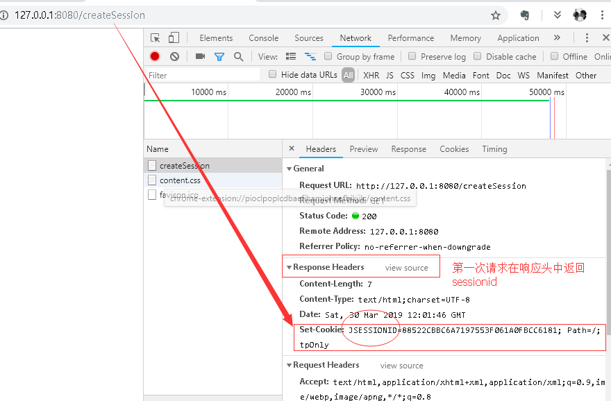
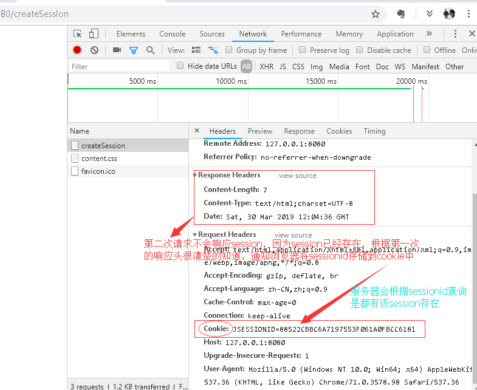
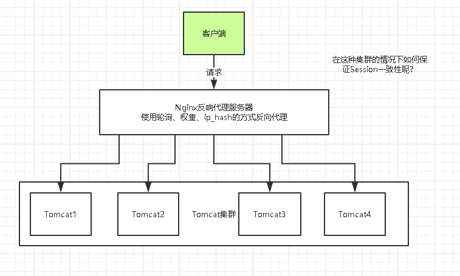
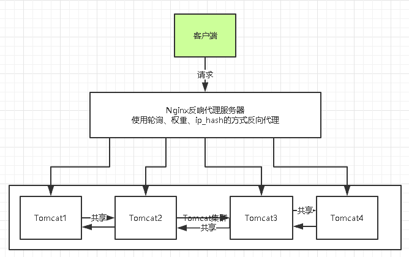
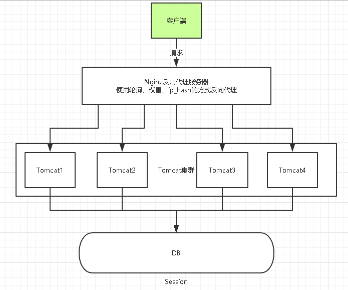

# 分布式会话一致性问题

## 什么是 Session

   session 是一种服务端的会话机制。（被称为域对象）作为范围是一次会话的范围。

   服务器为每个用户创建一个会话，存储用户的相关信息，以便多次请求能够定位到同一个上下文。这样，当用户在应用程序的 Web 页之间跳转时，存储在 Session 对象中的变量将不会丢失，而是在整个用户会话中一直存在下去。当用户请求来自应用程序的 Web 页时，如果该用户还没有会话，则 Web 服务器将自动创建一个 Session 对象。当会话过期或被放弃后，服务器将终止该会话。

   Web开发中，web-server可以自动为同一个浏览器的访问用户自动创建session，提供数据存储功能。最常见的，会把用户的登录信息、用户信息存储在session中，以保持登录状态。

## Session 为什么会不一致？

在基于请求与响应的`HTTP`通讯中，当第一次请求来时，服务器端会接受到客户端请求，会创建一个`session`，使用响应头返回`sessionid`给客户端。浏览器获取到`sessionid`后会保存到本地`cookie`中。



  当第二次请求来时，客户端会读取本地的`sessionid`，存放在请求头中，服务端在请求头中获取对象的`sessionid`在本地`session`内存中查询。



```java
// 默认创建一个session，默认值为true，如果没有找到对象的session对象，就会创建该对象，并且将生成的sessionid 存入到响应头中。
HttpSession session = request.getSession();

    @Override
    public HttpSession getSession() {

        if (request == null) {
            throw new IllegalStateException(
                            sm.getString("requestFacade.nullRequest"));
        }

        return getSession(true);
    }
// 默认情况下就是true，如果session不存在，则创建一个存入到本地，
// 假设修改为false会是什么样子的呢，就会关闭session功能。
```

但是`session`属于会话机制，当前会话结束时，`session`就会被销毁，并且`web`程序会为每一次不同的会话创建不同的`session`，所以在分布式场景下，即使是调用同一个方法执行同样的代码，但是他们的服务器不同，自然`web`程序不同，整个上下文对象也不同，理所当然`session`也是不同的。

## 分布式 Session 的诞生

  单服务器`web`应用中，`session`信息只需存在该服务器中，这是我们前几年最常接触的方式，但是近几年随着分布式系统的流行，单系统已经不能满足日益增长的百万级用户的需求，集群方式部署服务器已在很多公司运用起来，当高并发量的请求到达服务端的时候通过负载均衡的方式分发到集群中的某个服务器，**这样就有可能导致同一个用户的多次请求被分发到集群的不同服务器上，就会出现取不到session数据的情况，于是session的共享就成了一个问题。**



如上图，假设用户包含登录信息的session都记录在第一台`web-server`上，反向代理如果将请求路由到另一台`web-server`上，可能就找不到相关信息，而导致用户需要重新登录。

可以将`Nginx` 的反向代理策略更改为 `ip_hash`用于解决这个问题。

## Session 一致性解决方案

### 1. session复制（同步）Tomcat 自带该功能



**思路**：多个`web-server` 之间相互同步`session`，这样每个`web-server`之间都包含全部的session

**优点**：`web-server` 支持的功能，应用程序不需要修改代码

**不足**：

- `session` 的同步需要数据传输，占**内网带宽**，有时延
- 所有`web-server` 都包含所有`session`数据，数据量受内存限制，无法水平扩展
- 有更多`web-server` 时工作量非常大

### 2. 客户端存储法

**思路**：服务端存储所有用户的`session`，内存占用较大，**可以将session存储到浏览器cookie中，**每个端只要存储一个用户的数据了

**优点**：服务端不需要存储

**缺点**：

- 每次`http`请求都携带`session`，占**外网带宽**
- 数据存储在端上，并在网络传输，存在泄漏、篡改、窃取等安全隐患
- `session`存储的数据大小受`cookie`限制

这种方式，虽然不是很常用，但也可行。

### 3. 反向代理 hash 一致性

**思路**：`web-server`为了保证高可用，有多台冗余，反向代理层能不能做一些事情，让同一个用户的请求保证落在一台`web-server` 上呢？

使用`Nginx`的负载均衡算法其中的`hash_ip`算法将`ip`固定到某一台服务器上，这样就不会出现`session`共享问题，因为同一个`ip`访问下，永远是同一个服务器。

**缺点**：失去了`Nginx`负载均衡的初心。

**优点**：

- 只需要改`nginx`配置，不需要修改应用代码
- 负载均衡，只要`hash` 属性是均匀的，多台`web-server`的负载是均衡的
- 可以支持`web-server`水平扩展（`session` 同步法是不行的，受内存限制）

**不足**：

- 如果`web-server`重启，一部分`session`会丢失，产生业务影响，例如部分用户重新登录
- 如果`web-server`水平扩展，`rehash`后`session`重新分布，也会有一部分用户路由不到正确的`session`。

### 4. 后端统一集中存储



**思路：**将session存储在web-server后端的存储层，数据库或者缓存

**优点**：

- 没有安全隐患
- 可以水平扩展，数据库/缓存水平切分即可
- web-server重启或者扩容都不会有session丢失

**不足**：增加了一次网络调用，并且需要修改应用代码

对于db存储还是cache，个人推荐后者：session读取的频率会很高，数据库压力会比较大。如果有session高可用需求，cache可以做高可用，但大部分情况下session可以丢失，一般也不需要考虑高可用。

方案：使用`Spring Session`框架，相当于将`Session`之缓存到`Redis`中。

问：在项目发布的时候，`Session`如何控制不会失效的?

答：使用缓存框架，缓存`Session`的值（这里可以使用`Redis`加上`EhCache`实现一级和危机缓存）

### 5. 使用 Token 的方式代替 Session 功能

   在移动端，是没有`Session`这个概念的，都是使用`Token`的方式来实现的。

`token`最终会存放到`Redis`中，`redis-cluster`分片集群中是默认支持分布式共享的。完美的解决的共享问题。

推荐使用 4、5方式。

1. 生成登录凭证 token, UUID。

```java
String uuidToken = UUID.randomUUID().toString();
```

2. 建立 token 和用户登录态之间的联系

```java
redisTemplate.opsForValue().set(uuidToken,userModel);
```

3. 下发 token 到前端

4. 前端页面

   ```javascript
   var token = data.data;
   token=window.loadStorage["token"];
   ```

5. 前端每次请求都会带上这个 token.

## 参考

[分布式解决方案-分布式session一致性问题](https://www.jianshu.com/p/b889f9a49fec)