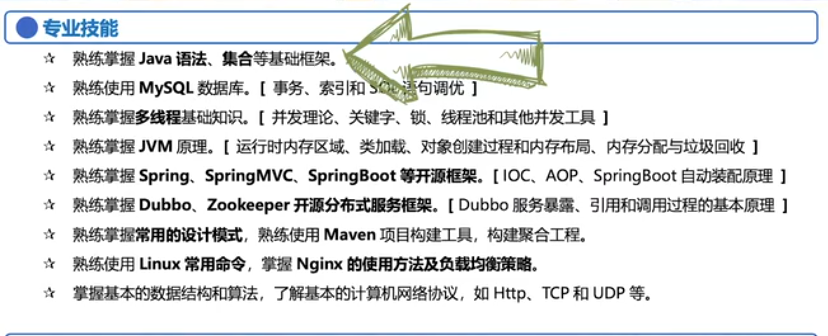
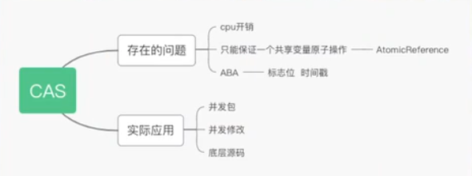
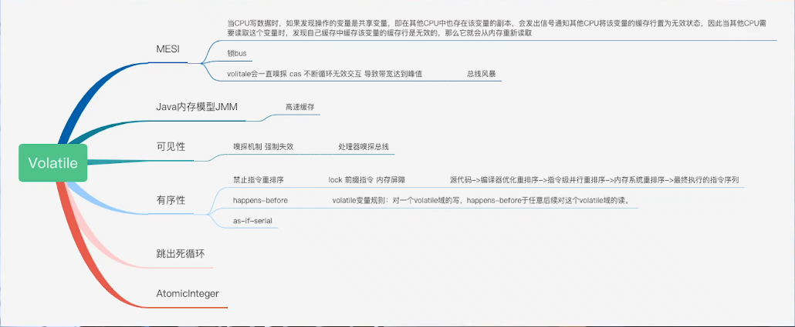
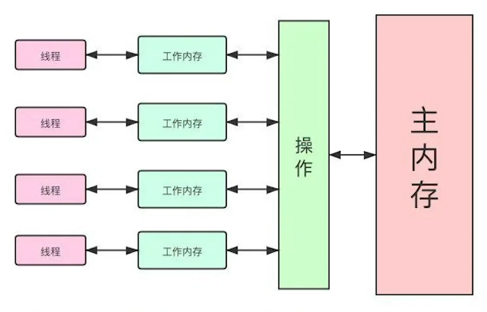
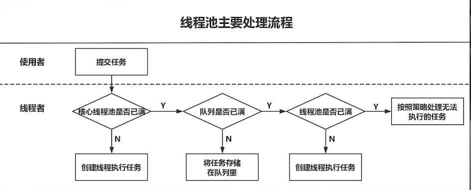

# 面试笔记

## 集合

Collection 下的 ArrayList, LinkedList

Set 下的 HashSet

Map下的HashMap,可能涉及到线程安全的 ConcurrentHashMap

ArrayList 的底层是数组，1.5 倍扩容。查询效率高，删除效率低。

LinkedList 的底层是带有头节点和尾节点的双向链表，提供了两种插入方式，一个是头插 LinkedFirst，还有尾插 LinkedLast。它的特性非常适合经常增加、删除操作的场景。但它的查询在数据量大的时候会比较慢。因为LinkedList 是从头到尾遍历查询所以很慢，ArrayList 是根据索引查询的所以会很快。

在线程安全场景下，如何使用 List？

Vector 与 ArrayList 一样底层都是一个数组。区别是，它其中大部分的方法都被 synchronized 关键字所修饰，所以说它是线程安全的。它的扩容与 ArrayList 不同，是2倍扩容。

HashMap 的扩容机制：

它含有的桶数默认是16，loadFactory 是 0.75，个数阈值为16*0.75=12。当它的哈希桶占用的容量大于12时，它就会触发扩容，它会扩容成之前哈希桶容量的2倍。它会把之前的元素再次进行一次哈希运算，然后添加到新的哈希桶中，再按照链表或红黑树的方式再组织起来，总体来说扩容机制就是这样。

HashMap 不是线程安全的。在插入操作的时候多线程会有数据覆盖的可能。在1.7 的时候还有一个线程不安全的原因是它在put 的时候还有个 resize 的过程。在 JDK 1.7 时是头插，所以在这个 resize 过程中可能会形成一个环形链表导致一直死循环。JDK1.8 时改成的尾插。

ReentrantLock 相比 Synchronized 有三个高级特性：1.如果有一个线程长期等待不到一个锁的时候，为了防止死锁，可以手动的调用 lockInterruptibly 方法，尝试让它去释放这个锁，释放自己的资源不去等待。2. ReentrantLock 可以构建公平锁，但是不推荐使用，它会让 ReentrantLock 的性能下降。3. 此外，它提供了一个 condition ，可以指定唤醒绑定到 condition 身上的线程，来实现**选择性通知的机制**。

并发包下的 CountDownLatch, CyclicBarrier, Semaphore.

CountDownLatch 适合于单线程在运行时，有一段过程又希望并发地去执行，后来又回归到一个单线程的状态。它适合一个线程等待一批线程达到一个同步点之后再去执行。它的计数器是不能重用的。

CyclicBarrier ，是一个类似的CountDownLatch。但是它没有一个线程等待一批线程，它是一批线程达到一个同步点后再往下走。

CountDownLatch 是如何实现计数功能的？

ReentrantLock 中的 AKS中可以看到，它里面有 state 标志位，用 volatile 修饰。

volatile 是 JDK 提供的线程同步的最轻量级的一个关键字。

这就需要说到计算机模型，为了加速CPU的计算，增加了 L1 , L2, L3 三级缓存。线程是在缓存中工作的，它是从主存中取数据到缓存中，计算完成后再写回主存中。这就涉及到了线程间的数据可见性是如何保证的。

JMM（java 内存模型）

volatile 是不能保证原子性的，可以使用 synchronized 和 ReentrantLock 通过加锁的方式来保证原子性。

总线嗅探机制造成的问题：总线风暴。

线程池的运行机制

线程池是有一个核心线程数，若没有设置成预启动加载时，它的线程数是0。当你提交一个新任务时，它会首先建立一个核心线程去执行任务。如果一直来任务，之前的任务又没有执行完，它就会一直建立核心线程。当达到最大核心线程数时，若还在忙，那么就会将任务放入 BlockingQueue 里。若 BlockingQueue 队列也放满了，且核心线程都在忙，就会新建非核心线程，若超过最大非核心线程数，就会触发一个拒绝策略。JDK 内置了四种拒绝策略，第一种是 AbortPolicy, 通过抛出异常来解决；第二种是 DiscardPolicy ，丢弃这个任务；第三种是 DiscardOldestPolicy ，丢弃你最早的未执行的任务；第四种是 CallerRunsPolicy, 谁调用我的这个线程去执行你的这个任务。这种方式是会影响到新任务的提交速度的。

阻塞队列有三种。ArrayBlockingQueue，LinkedBlockingQueue。它们的底层是基于AQS来实现的。

关于线程池中还有一个比较重要的参数，在构造线程池时，要提供一个线程的 threadFactory，一定要指定它名称，这是很重要的一点。也可以将它设置为守护线程，当你的BM关闭时，可以让线程跟着它一块消亡。

## MySQL 调优的思路。

有一条是最基本的，表要有主键。因为有主键的表MySQL 会创建簇索引，聚簇索引的好处是它的主键和数据行是在一行的。在用 explain 查询语句的时候会发现，它的type 级别是 const，这是很高的一种级别。

另外，如果一条 SQL 语句查询很慢，可以去查看它是否建立了相应的索引。建立索引时要尽量选择 where 条件后面的字段或是 order by 或是 group by 或是 join 连接的字段来作为索引列，这些索引列也要排个序来符合最左匹配原则。排序时，要根据它们的索引选择器，你的非重复的数据行和重复的数据行的比例，大的放左小的放右这样的形式。对于多列的索引列要建立联合索引而非多个单个索引。这是索引上的优化。

另外在书写SQL时，不要将索引列放到表达式中，比如说你用了一些反向判断，NotNULL, 不等于， Not in 等这种关键字。它都会让你的索引失效。

若数据查询非常频繁，可以选择使用覆盖索引，因为覆盖索引不用回表，可以直接得到结果。

若建立的索引没有生效，可以考虑下是不是MySQL 的其它原因造成的。MySQL 底层是根据随机采样来计算索引基数。如果它采样错了，它就会认为，虽然你的索引选择性比较大，但它认为你的索引选择性比较小，就可能不走你的索引。此时可以通过加 force index 强制让它走该索引。若此时仍然不生效，尝试刷新下它的信息，用 analyze TABLES,看它有没有重新组队。

唯一索引（聚簇索引）覆盖索引（普通索引）

聚簇索引是保存主键ID与整行数据，覆盖索引是保存主键ID与索引列字段。

MVCC与事务隔离级别的关系。

redo log, undo log , bin log

Spring 它是怎么去做到事务隔离级别的？

它是提供了一个注解，叫做 Transactional 并且它提供了一个事务传播行为，传播特性有7个，隔离级别比MySQL 多一个，为默认隔离级别。

Spring 的AOP是如何实现的，有哪些实现方式？

若被代理类实现了接口的话，可以用JDK的动态代理去实现，若没有的话，则使用cglib 字节码生成技术去创建代理类对象。底层是如何实现的？

JDK的动态代理主要是使用 Java 反射中的两个类，一个是 Proxy, 一个是 InvocationHandler。它通过 bind 的方式去绑定之前的代理，跟原来的实现类做一个关系，并且它是通过 Proxy.nexInstance来创建代理对象，然后通过反射 invoke 去执行那个方法。

Spring 的生命周期是怎么样的么？

可以粗略地分为三个阶段，首先是 Bean 的一次加工，还 Bean 的二次加工过程。

首先，Bean 的第一次加工，将对象进行实例化，在这个实例化的前后，有一个BeanPostProcessor 在做前置和后置处理。第二步就是它的依赖注入过程，首先会设置它的一个属性值，然后它对 bean 实现的 BeanAware 相关接口。

怎么解决它的循环依赖？

有一个三级缓存的概念。

## JVM 的内存模型

指的是运行时的内存区域是吧。JVM 运行时的内存区域可以分为两大类：一个是它线程的私有区，另一个是线程的共享区。对于线程私有这块，首先第一个就是它程序计数器，这在JVM中栈内存中比较小的一个地方，也是唯一一块不会OM的区域。程序计数器指向的是下一行要执行的指令。另外线程私有的是虚拟机栈与本地方法栈。虚拟机栈使用的是栈帧，一个方法的调用就是从入栈到出栈的过程。

线程的共享区，首先要说到的是方法区，方法区它其实只是JVM的一个规范。在JDK1.7 时，它的实现在 HotSpot 虚拟机中叫做永久代，这里面存放的是一些常量池常量，还有类的元数据信息。在JDK 1.8 时，它不在运行时内存了，而是转移到了一个直接内存中，叫做元空间，这里存放的是类型的元数据信息。这个方法区也是会OOM的。还有一个区域是堆，它存放的是Java对象的实例，它也是GC重点回收的一个区域。它也是会产生OOM的。最后一个要关注的是运行时常量池，它是在JDK1.8时转移到堆中，之前是在元空间，现在转移到了堆中，存放的是类加载后运行时常量池和静态常量。元空间放到堆中的好处是OOM的机率相对之前变小了很多。

你知道OOM的排查思路和过程么？

借助一些类似于 jvisualvm 的工具，把它的堆栈dump 下来进行排查。

现在有哪些垃圾回收算法与垃圾回收器？

垃圾回收算法有三个：第一个是标记清除，标记一些不可达的对象。如何判断对象是否可达，一种是引用计数，它的缺点是可能会产生循环依赖；一种是根搜索，根据JVM中可以作为 GC Roots的根节点来开一个链，如果不在这个链上则可以判断可回收了，虚拟机栈中对象和方法区中的静态变量所引用的对象还有常量所引用的对象，还有方法区中所引用的一些对象都可以作为可达性分析的根节点。

标记清除的缺点是会造成内存碎片。

第二个算法是标记复制，复制就是简单的将推划分成两块，在GC的时候将一些活动对象直接复制到另一半，然后把之前的一半抹去。它的缺点是造成可用内存偏低，优点是不会造成内存碎片。

第三种算法是标记整理，也是每次只使用一块区域，将活动的对象往一端移动、复制。然后就可以得出一块无内存碎片的区域。

第四种算法是分代收集算法。

说一下垃圾回收器吧？

CMS和G1比较经典。

CMS是第一款支持GC线程与用户线程并发执行的垃圾收集器。特点就是低延迟。它主要是用来回收老年代的，它的算法使用的是标记清除，还有标记整理。它会容忍垃圾碎片，当达到阈值时，会触发一次标记整理来清理。它的过程有四个阶段，首先是初始标记，然后是并发标记，接着是重新标记，还有一个并发整理。但是在初始标记和重新标记时，不是与用户线程并行执行的，它会短暂地产生 Stop The World，但这个时间是很短的。它的并发标记和并发整理耗时是比较长的，但它是和用户线程一起并发执行的。

若GC造成CPU占用过高，如何排查？

Dubbo 的服务暴露过程。

NIO和BIO了解么？

Nginx 有哪些负载均衡策略

轮询、一致哈希、加权随机三种方法。

一致哈希就是将相同请求参数的情况都会发送到同一台机器上。

设计模式？

不用说单例模式和工厂模式。常用的有策略模式，模板模式。还有一个是建造者模式。

建造者模式是怎么实现的？

