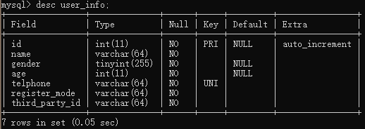
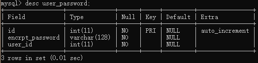
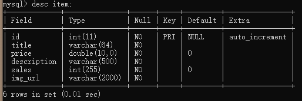
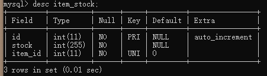
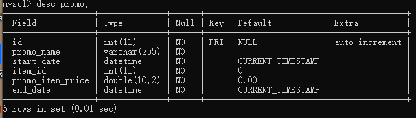
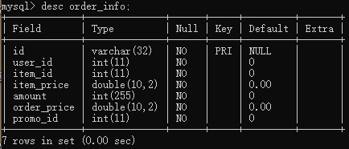

# 项目中的 MySQL 表

## 用户登录模块

### user_info 表

自增 id 为主键，在 telphone 字段建立唯一索引。

### user_password 表

密码经加密后存储到数据库中，与用户其他非隐私字段分离。

## 商品模块

### item 表

物品表存储每个物品的**名称**、**价格**、**描述**、**销量**、**图片URL**。

### item_stock 表

物品的库存，设置 item_id 的外键是 item 表的 id。

## 促销模块

### promo 表

促销表，设置 item_id 的外键是 item 表的 id。

## 订单模块

### order_info 表

订单表，设置 item_id 的外键是 item 表的 id。