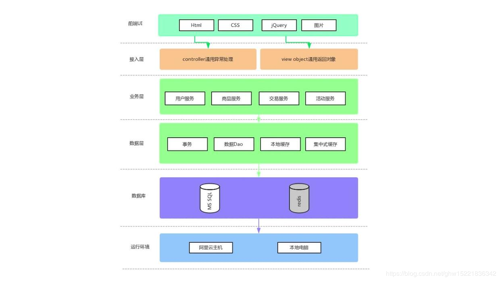

# Java 电商秒杀系统性能优化（一）

## 项目简介

通过 SpringBoot 快速搭建的前后端分离的电商基础秒杀项目。项目通过应用领域驱动型的分层模型设计方式去完成：用户otp（**one-time password**）注册、登陆、查看、商品列表、进入商品详情以及倒计时秒杀开始后下单购买的基本流程；

使用阿里巴巴的 **druid** 连接池。

## 项目要点

1. 在mybatis-generator.xml配置文件中在对应生成表类名配置中加入；
2. 前端 ajax 调用接口获取验证码 html/getotp.html，出现跨域请求问题 解决方法：@CrossOrigin(origins = {"*"}, allowCredentials = “true”) allowedHeaders 允许前端将 token 放入 header 做 session 共享的跨域请求。 allowCredentials 授信后，需前端也设置 xhfFields 授信才能实现跨域 session 共享。 xhrFields: {withCredentials: true}；
3. 统一前端返回格式**CommonReturnType {status: xx ,object:xx} dataobject -> 与数据库对应的映射对象 model -> 用于业务逻辑service的领域模型对象 viewobject -**> 用于前端交互的模型对象；
4. 使用 **hibernate-validator** 通过注解来完成模型参数校验；
5. insertSelective 中设置 keyProperty=“id” useGeneratedKeys=“true” 使得插入完后的 DO 生成自增 id 。 insertSelective与insert区别： insertSelective对应的sql语句加入了NULL校验，即只会插入数据不为null的字段值（null的字段依赖于数据库字段默认值）insert则会插入所有字段，会插入null。
6. 数据库设计规范，设计时字段要设置为**not null**，并设置默认值，避免唯一索引在null情况下失效等类似场景；
7. 解决如果事务**createorder**下单如果回滚，该下单方法中获得流水号id回滚，使等到的id号可能再一次被使用 在**generatorOrderNo**方法前加注解： **@Transactional(propagation = Propagation.REQUIRES_NEW)**
8. 使用**聚合模型**在itemModel加入**PromoModel promoModel**，若不为空表示其有未结束的秒杀活动；在orderModel中加入promoId，若不为空，则以秒杀方式下单；

