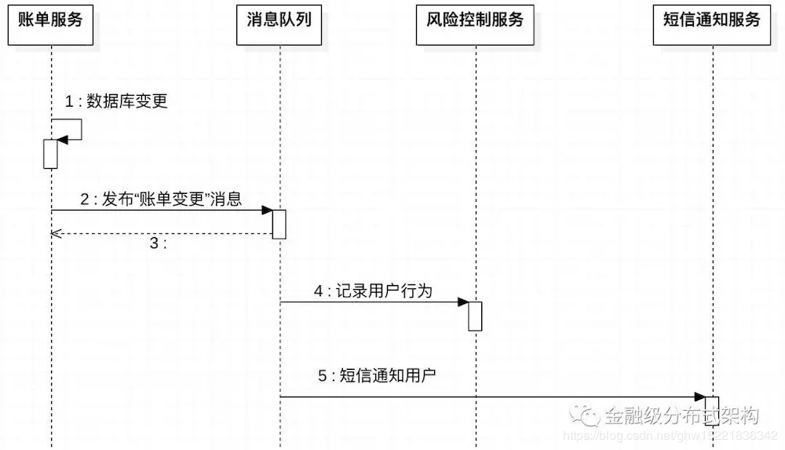

# Java电商秒杀系统性能优化(七)——交易优化技术之事务型消息-保证最终一致性

## 概述

本章延续之前缓存库存所引入的事务不一致的问题，使用了异步化的事务型消息解决了最终一致性的问题，同时引入库存售罄这样的方案解决过载击穿的问题。

学习目标：

* **掌握异步化事务型消息模型；**
* **掌握库存售罄模型；**

## 一、事务型消息原理

## 1.1 消息队列简介

在分布式系统架构中，消息队列的核心职责是为不同的应用系统提供异步通信服务，通常涉及以下三个重要角色：

* **消息发布者**，发送消息的应用系统，负责创建消息对象并通过网络发布到消息 Broker，发布的过程一般是同步的；
* **消息 Broker**，异步消息的“代理人”，负责接收并持久化消息，保证将消息投递到指定的消息订阅者应用系统；
* **消息订阅者**，订阅消息的应用系统，负责消费消息 Broker 投递过来的消息。

在分布式系统架构中，引入消息队列带来的三大核心优势如下：

* 1、提高核心链路吞吐量；
* 2、降低应用系统之间的耦合度
* 3、增强整体服务的高可用能力

### 1.2 消息队列应用实例

分析和设计一个典型的支付应用业务逻辑，以 “账单查询 Case” 为例，基本业务逻辑如下:

* 检索数据库，获取指定账户的账单记录；
* 记录用户的检索行为，为风险控制提供数据积累；
* 发送短信到用户手机，通知用户其账单被查询事件；

依赖 “同步 RPC” 的设计方案 A 如下所示：


依赖 “异步消息队列” 的设计方案 B 如下所示：


对比以上 A, B 两个设计方案，引入消息队列的设计方案 B 具有如下优势：

* “账单服务” 处理 “账单查询 Case” 的耗时由 60 ms 缩减至 13 ms， 提高了服务的吞吐量；
* “账单服务” 和 “风险控制服务”、“短信通知服务” 完全解耦，如果在业务演进过程中，增加了新的下游服务，“账单服务” 完全无需变更；
* 当 “风险控制服务” 和 “短信通知服务” 不可用时，不会导致 “账单服务” 不可用；

通过以上 “账单查询 Case” 的设计方案，可以阐明引入消息队列给分布式应用架构带来的三大核心优势；

下面继续分析和设计 “账单变更 Case”，基本业务逻辑如下：

* 写入数据库，变更指定账户的账单记录；
* 记录用户检索行为，为风险控制提供数据积累；
* 发送短信到用户手机，通知用户其账户变更金额。

与 “账单查询 Case” 的区别在于数据库操作是写入，而不再是检索。二者的区别是**数据库的检索**不涉及数据库事务，**数据库写入**一定会涉及到数据库事务，按照之前的引入消息队列设计思路，“账单变更 Case” 的设计方案 C 如下：



但是这种设计方案存在一个严重的问题就是，如果 **“发布账单变更消息” 发送失败**（例如**网络异常或者消息队列服务不可用**），则会**导致 “记录用户行为” 和 “短信通知用户” 后续动作失败**，**无法完成风险控制数据积累**，用户也无法及时获取到账户变更信息。

为了解决以上设计方案 C 的严重问题，初步考虑先发布 “账单变更” 消息，再做数据库变更的设计方案，但还是无法解决 “消息发布” 和 “数据库事务” 可能不一致性的严重问题，如果消息已发布成功过了，数据库变更事务回滚了，就会导致用户的账单没有变更，但用户却收到了账户变更短信，存在一致性漏洞的 “账单变更 Case” 消息队列设计方案 D 如下所示：


可以梳理一下完美解决 “账单变更 Case” 需要解决的关键点：

* 必须满足“一致性”要求，即**账单服务数据库变更事务提交成功**，**风险控制服务和短信通知服务收到“账单变更”消息**；
* **账单服务数据库变更事务回滚**，风险控制服务和短信通知服务不会收到“账单变更”消息；
* “账单变更”消息发布失败，尽量避免导致数据库变更事务的回滚；

### 1.3 事务型消息设计方案

为了解决以上描述的两个需求，消息队列需要提供一种特殊类型的消息**：消息队列收到消息后不会立刻投递消息到消息订阅者，而是根据消息发布者应用的数据库事务状态决定消息是否投递。如果数据库事务提交，则消息投递到订阅者；反之则不投递。此类消息被命名为 “事务型消息”**。具体设计方案如下：


事务型消息设计方案 E按照 “事务型消息设计方案 E” 的时序图，消息发布者和消息队列之间增加了一个 “二阶段” 消息，用来标明对应事务型消息的 “事务状态”，消息队列根据 “二阶段” 消息决定是否投递消息到下游消息订阅者。应用 “事务型消息”，“账单变更 Case” 的可行解决方案如下所示：


按照 “账单变更 Case” 消息队列-事务型消息设计方案 F，可以满足“账单服务数据库变更”与“异步消息是否投递到订阅者应用”的事务一致性需求。

消息队列 “事务型消息” 的设计方案和实现原理基本阐明清楚了，还遗留两个可以深究的关键点：

* **为什么消息发布方法需要在本地数据库事务方法之前？**
* **如果消息队列收不到事务型消息的二阶段“提交 or 回滚” 消息，如何处理？**

针对第一个关键点，假定方法执行时序是先执行本地数据库事务方法，之后发布 “事务型” 消息，那么消息发布失败会导致消息发布者本地事务回滚，这明显是不符合预期的，因为数据库事务回滚的成本比较消息发布失败是高昂的；

针对第二个关键点，在分布式网络架构中是可能出现的，比如网络异常、消息队列服务短时间不可用等。这也是消息队列提供严谨的 “事务型消息” 特性必须要解决的问题，如果消息队列没有收到 “提交 or 回滚” 回滚消息，则无法决定是否投递消息到消息订阅者，因此，严谨的 “事务型消息” 设计方案需要有一个异常场景，命名为 “事务型消息状态回查”，具体设计方案如下：


需要明确的是，“事务型消息状态回查” 只在 “提交 or 回滚消息” 失败的场景下被触发，属于异常路径。

### 1.4 事务型消息总结

在分布式系统架构中，尤其是金融级业务应用的解决方案设计中，消息队列提供 “事务型消息” 特性是必不可少的，“数据一致性”  是金融级分布式架构的基本要求，本节通过实例逐步说明消息队列产品支持 “事务型消息”  的必要性、设计方案和原理，定义了明确的消息队列事务型消息的核心原理：

* **消息队列事务型消息基于 “二阶段” 消息实现；**
* **事务型消息是否投递与消息发布者本地事务状态保持一致；**
* **事务型消息状态回查是保证了 “事务型消息” 的严谨性。**

## 二、操作流水

**问题本质：**
 没有库存操作流水：

**对于操作型数据**：**log data**,意义是库存扣减的操作记录下来，便于追踪库存操作流水具体的状态；根据这个状态去做对应的回滚，或者查询对应的状态，使很多异步型的操作可以在操作型数据上，例如编译人员在后台创建的一些配置。

**主业务数据：master data**，ItemModel就是主业务数据，记录了对应商品的主数据；ItemStock对应的库存也是主业务数据；

### 2.1 库存数据库最终一致性保证

方案：

* 引入库存操作流水，能够做到redis和数据库之间最终的一致性；
* 引入事务性消息机制；

带来的问题是：

* redis不可用时如何处理；
* 扣减流水错误如何处理；

### 2.2 业务场景决定高可用技术实现

**设计原则**
 宁可少卖，不可超卖；

**方案**

- redis可以比实际数据库中少；
- 超时释放；

### 2.3 库存售罄

- 库存售罄标识；
- 售罄后不去操作后续流程；
- 售罄后通知各系统售罄；
- 回补上新

### 2.4 后置流程

- 销量逻辑异步化；
- 交易单逻辑异步化；

### 2.5 交易单逻辑异步化

- 生成交易单sequence后直接异步返回；
- 前端轮询异步单状态；

我们必须有交易单才能够进行支付，因此对于交易单的时候必须要生成交易单sequence,还需要在前端进行轮询去查询订单状态，生成之后才可以进行支付操作。

## 三、异步更新库存

```java
ItemService.java
新建一个方法
//异步更新库存
boolean asyncDecreaseStock(Integer itemId,Integer amount);
//库存回补
boolean increaseStock(Integer itemId,Integer amount)throws BusinessException;

ItemServiceImpl.java
@Override
public boolean asyncDecreaseStock(Integer itemId, Integer amount) {
    boolean mqResult = mqProducer.asyncReduceStock(itemId,amount);
    return mqResult;
}

@Override
public boolean increaseStock(Integer itemId, Integer amount) throws BusinessException {
    redisTemplate.opsForValue().increment("promo_item_stock_"+itemId,amount.intValue());
    return true;
}
```

**等到前面所有的事务更新完毕，最后再发异步操作.我们异步更新了库存的操作，并且根据对应的mqResult的状态去回补库存**。

## 四、事务型消息应用

什么叫事务性呢？就是保证数据库的事务提交，只要事务提交了就一定会保证消息发送成功。数据库内事务回滚了，消息必定不发送，事务提交未知，消息也处于一个等待的状态；

```java
MqProducer.java
@PostConstruct
    public void init() throws MQClientException {
        //做mq producer的初始化
        producer = new DefaultMQProducer("producer_group");
        producer.setNamesrvAddr(nameAddr);
        producer.start();

        transactionMQProducer = new TransactionMQProducer("transaction_producer_group");
        transactionMQProducer.setNamesrvAddr(nameAddr);
        transactionMQProducer.start();

        transactionMQProducer.setTransactionListener(new TransactionListener() {
            @Override
            public LocalTransactionState executeLocalTransaction(Message msg, Object arg) {
                //真正要做的事  创建订单
                Integer itemId = (Integer) ((Map)arg).get("itemId");
                Integer promoId = (Integer) ((Map)arg).get("promoId");
                Integer userId = (Integer) ((Map)arg).get("userId");
                Integer amount = (Integer) ((Map)arg).get("amount");
                String stockLogId = (String) ((Map)arg).get("stockLogId");
                try {
                    orderService.createOrder(userId,itemId,promoId,amount,stockLogId);
                } catch (BusinessException e) {
                    e.printStackTrace();
                    //设置对应的stockLog为回滚状态
                    StockLogDO stockLogDO = stockLogDOMapper.selectByPrimaryKey(stockLogId);
                    stockLogDO.setStatus(3);
                    stockLogDOMapper.updateByPrimaryKeySelective(stockLogDO);
                    return LocalTransactionState.ROLLBACK_MESSAGE;
                }
                return LocalTransactionState.COMMIT_MESSAGE;
            }

            @Override
            public LocalTransactionState checkLocalTransaction(MessageExt msg) {
                //根据是否扣减库存成功，来判断要返回COMMIT,ROLLBACK还是继续UNKNOWN
                String jsonString  = new String(msg.getBody());
                Map<String,Object>map = JSON.parseObject(jsonString, Map.class);
                Integer itemId = (Integer) map.get("itemId");
                Integer amount = (Integer) map.get("amount");
                String stockLogId = (String) map.get("stockLogId");
                StockLogDO stockLogDO = stockLogDOMapper.selectByPrimaryKey(stockLogId);
                if(stockLogDO == null){
                    return LocalTransactionState.UNKNOW;
                }
                if(stockLogDO.getStatus().intValue() == 2){
                    return LocalTransactionState.COMMIT_MESSAGE;
                }else if(stockLogDO.getStatus().intValue() == 1){
                    return LocalTransactionState.UNKNOW;
                }
                return LocalTransactionState.ROLLBACK_MESSAGE;
            }
        });
    }
    
//事务型同步库存扣减消息
public boolean transactionAsyncReduceStock(Integer userId,Integer itemId,Integer promoId,Integer amount,String stockLogId){
    Map<String,Object> bodyMap = new HashMap<>();
    bodyMap.put("itemId",itemId);
    bodyMap.put("amount",amount);
    bodyMap.put("stockLogId",stockLogId);

    Map<String,Object> argsMap = new HashMap<>();//传递对应的消息参数
    argsMap.put("itemId",itemId);
    argsMap.put("amount",amount);
    argsMap.put("userId",userId);
    argsMap.put("promoId",promoId);
    argsMap.put("stockLogId",stockLogId);

    Message message = new Message(topicName,"increase",
            JSON.toJSON(bodyMap).toString().getBytes(Charset.forName("UTF-8")));
    TransactionSendResult sendResult = null;
    try {
        sendResult = transactionMQProducer.sendMessageInTransaction(message,argsMap);
    } catch (MQClientException e) {
        e.printStackTrace();
        return false;
    }
    if(sendResult.getLocalTransactionState() == LocalTransactionState.ROLLBACK_MESSAGE){
        return false;
    }else if(sendResult.getLocalTransactionState() == LocalTransactionState.COMMIT_MESSAGE){
        return true;
    }else{
        return false;
    }

}

//判断库存是否扣减成功，到resi内判断是否扣减成功
@Override
        public LocalTransactionState checkLocalTransaction(MessageExt msg) {
            //根据是否扣减库存成功，来判断要返回COMMIT,ROLLBACK还是继续UNKNOWN
            String jsonString  = new String(msg.getBody());
            Map<String,Object>map = JSON.parseObject(jsonString, Map.class);
            Integer itemId = (Integer) map.get("itemId");
            Integer amount = (Integer) map.get("amount");
            String stockLogId = (String) map.get("stockLogId");
            StockLogDO stockLogDO = stockLogDOMapper.selectByPrimaryKey(stockLogId);
            if(stockLogDO == null){
                return LocalTransactionState.UNKNOW;
            }
            if(stockLogDO.getStatus().intValue() == 2){
                return LocalTransactionState.COMMIT_MESSAGE;
            }else if(stockLogDO.getStatus().intValue() == 1){
                return LocalTransactionState.UNKNOW;
            }
            return LocalTransactionState.ROLLBACK_MESSAGE;
        }
    });
}
******
orderController.java也要进行相应的操作
//再去完成对应的下单事务型消息机制
        if(!mqProducer.transactionAsyncReduceStock(userModel.getId(),itemId,promoId,amount,stockLogId)){
            throw new BusinessException(EmBusinessError.UNKNOWN_ERROR,"下单失败");
        }
        return CommonReturnType.create(null);

//ItemServiceImpl.java
 //初始化对应的库存流水
    @Override
    @Transactional
    public String initStockLog(Integer itemId, Integer amount) {
        StockLogDO stockLogDO = new StockLogDO();
        stockLogDO.setItemId(itemId);
        stockLogDO.setAmount(amount);
        stockLogDO.setStockLogId(UUID.randomUUID().toString().replace("-",""));
        stockLogDO.setStatus(1);//初始化状态，1表示初始化状态；2、表示下单扣减库存成功；3、表示下单回滚

        stockLogDOMapper.insertSelective(stockLogDO);

        return stockLogDO.getStockLogId();

    }
```

