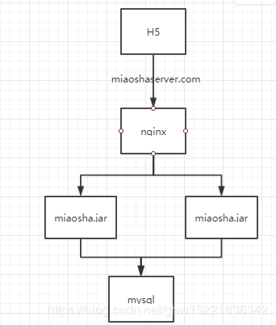
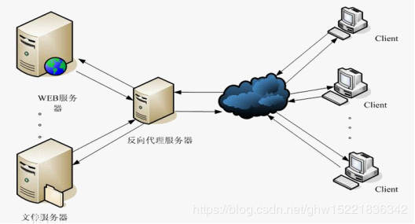
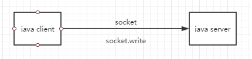
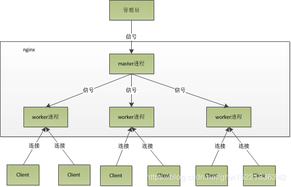
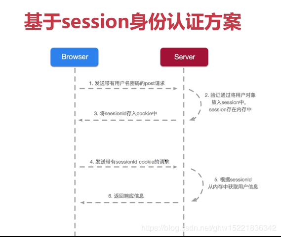
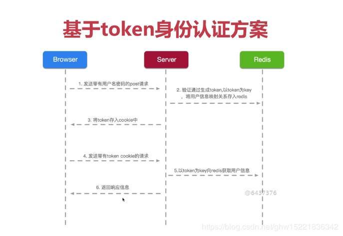

# Java 电商秒杀系统性能优化（三）——分布式扩展

在本篇博客中，在此基础上进行反向代理负载均衡的优化，深入讲解 **nginx 高性能**的原因，并且使用 nginx 作为**动静分离的**服务器部署，同时在项目中引入**分布式会话管理**的机制来解决登录一致态的问题。

## 一、单机容量问题

### 1.1 单机容量问题，水平扩展方案

在采用 Jmeter 进行性能压测,采用 `top -H` 命令可以查看CPU的使用率，memory占用增加,CPU中用户空间和系统调用的cpu使用情况，需要引入水平扩展方案；

### 水平扩展方案

将对应的服务端做一个对等的水平部署

* mysql数据库开放远程连接；
* 服务端水平部署；
* 验证访问；

流程图如下：



### 1.2 Nginx 反向代理

**正向代理**：
 通常的代理服务器，客户端必须指定代理服务器，并且将直接要发送到web服务器上的http请求发送到代理服务器中，并且由代理服务器向Internet上的web服务器发送请求，最终达到客户机的目的；

**反向代理(Reverse Proxy)**
 反向代理是指以代理服务器来接收Internet上的连接请求，然后将请求转发到内部网络上的服务器中，并将从服务器上返回的结果，返回给Internet请求连接的客户端，此时代理服务器对外表现为一个反向代理服务器；

Nginx只做请求的转发，后台有多个http服务器提供服务，nginx的功能就是把请求转发到后面的服务器，决定把请求发给谁；简单的来说，**Nginx可以管理后端的一个tomcat集群，然后以一个统一的域名供用户去访问**；



### 1.3 负载均衡

负载均衡(Load Balance)通过负载均衡调度服务器，将来自浏览器的访问请求分发到应用服务器集群中的任何一台服务器上，如果有更多的用户，就在集群中加入更多的应用服务器，使应用服务器的负载压力不再成为整个网站的瓶颈；

Nginx作为反向代理服务器，可以对后台的多台Tomcat服务器负载均衡；

**Nginx 负载均衡策略**

通过vim conf/nginx.conf，命令进行负载均衡的配置；

1. **轮询(默认)**
    每个web请求按照时间顺序逐一分配到不同的后端服务器，如果后端服务器over了，就自动剔除；

   ```
       upstream nginxDemo {
           server 127.0.0.1:8081;
           server 127.0.0.1:8082;
       }
   ```

2. **最少连接**

   web请求会被转发到**连接数最少**的服务器上；

   ```
       upstream nginxDemo {
           least_conn;
           server 127.0.0.1:8081;
           server 127.0.0.1:8082;
       }
   ```

3. **weight权重**

   指定轮询几率，weight和访问比率成正比，用于后端服务器性能不均的情况，weight默认是1；

   ```
       #服务器A和服务器B的访问比例为：2-1;比如有3个请求，前两个会访问A，三个访问B，其它规则和轮询一样。
       upstream nginxDemo {
           server 127.0.0.1:8081 weight=2; #服务器A
           server 127.0.0.1:8082; #服务器B
       }
   ```

4. **ip_hash**

   每个请求按访问 ip 的hash值分配，这样同一客户端连续的Web请求都会被分发到同一服务器进行处理，可以解决session的问题。当后台服务器宕机时，会自动跳转到其它服务器；

   ```
      upstream nginxDemo {
           ip_hash;
           server 127.0.0.1:8081 weight=2; #服务器A
           server 127.0.0.1:8082; #服务器B
       }
   ```

   基于weight的负载均衡和基于ip_hash的负载均衡可以组合在一起使用；

## 二、部署Nginx

### 2.3 前端资源部署

* 打包上传前端资源文件；
* 配置前端资源路由；

#### 2.4 配置 Nginx 反向代理

**nginx动静分离服务器**

* location节点path特定resources:静态资源路径；
* location节点其它路径：动态资源用；

**如何使用动态资源？**
 nginx做反向代理服务器

* 设置upstream server；
* 设置动态请求location为proxy pass路径；
* 开启tomcat access log(访问日志)验证

### 2.5 分布扩展后的性能压测

开启Jmeter压测
 **单机压测**：

* 线程数1000，Ramp-Up时间10秒，循环次数30；
* 平均响应耗时**460ms**,**tps1500**,**cpu占用80%**；

## 三、Nginx 高性能原因

Nginx高性能主要分为以下三点：

* **epoll多路复用完成非阻塞式的IO操作**；
* **master worker进程模型，允许其进行平滑重启和配置，不会断开和客户端连接**；
* **协程机制，完成单进程单线程模型，并支持并发编程调用接口**；

### 3.1 epoll 多路复用（解决IO阻塞回调通知问题）

I/O 多路利用就是通过一种机制，可以监视多个描述符，一旦某个IO能够读写，通知程序进行相应的读写操作。

**I/O多路复用的场合**

1. 当客户处理多个描述字时（通常是交互式输入和网络套接字），必须使用I/O复用;
2. 如果一个TCP服务器既要处理监听套接字，又要处理已连接套接字，一般也要用到I/O复用;
3. 如果一个服务器即要处理TCP，又要处理UDP，一般要使用I/O复用;

**Java BIO模型**



client和server之间通过tpc/ip建立联系，javaclient只有等到所有字节流socket.write到字节流的缓冲之后，对应的java client才会返回；若网络很慢，缓冲区填满之后，client就必须等待信息传输过去之后，使得缓冲区可以给上游去写时，才可达到直接返回的效果；


**Linux select模型**

Linux select模型，变更触发轮训查询，文件描述符有1024数量上限；一旦java server被唤醒，并且对应的socket连接打上有变化的标识之后，就代表已经有数据可以让你读写；

**弊端：**
 轮询效率低，有1024数量限制；


**epoll模型**

epoll是为了解决select和poll的轮询方式效率低问题；

**假设一个场景：**
 有100万个客户端同时与一个服务器进程保持着TCP连接。而每一时刻，通常只有几百上千个TCP连接是活跃的(事实上大部分场景都是这种情况)。如何实现这样的高并发？

在select/poll时代，服务器进程每次都把这100万个连接告诉操作系统(从用户态复制句柄数据结构到内核态)，让操作系统内核去查询这些套接字上是否有事件发生，轮询完后，再将句柄数据复制到用户态，服务器应用程序轮询处理已发生的网络事件，这一过程资源消耗较大。因此，select/poll一般只能处理几千的并发连接。


**epoll的设计和实现与select完全不同**：
 epoll通过在Linux内核中申请一个简单的文件系统(文件系统一般由B+树实现)
 把原先的select/poll调用分成了3个部分：

1. 调用epoll_create()建立一个epoll对象(在epoll文件系统中为这个句柄对象分配资源);
2. 调用epoll_ctl向epoll对象中添加这100万个连接的套接字;
3. 调用epoll_wait收集发生的事件的连接;

实现上面说是的场景，只需要在进程启动时建立一个epoll对象，然后在需要的时候向这个epoll对象中添加或者删除连接。同时，epoll_wait的效率也非常高，因为调用epoll_wait时，并没有一股脑的向操作系统复制这100万个连接的句柄数据，内核也不需要去遍历全部的连接。

### 3.2 master-worker 进程模型

Nginx 多进程模型：



管理员理解为root操作用户，用于启动管理nginx进程；
 Master进程的主要功能：

* 接收来自外界的信号；
* 向各个worker进程发送信号；
* 监控worker进程的运行状态；
* 当worker进程在异常情况下退出后，会自动重启新的worker进程；

nginx 会启动一个master进程，然后根据配置文件内的 worker 进程的数量去启动相应的数量的 worker 进程，master 进程和 worker 进程是一个父子关系；master 进程用来管理 worker 进程，worker进程才是用来管理客户端连接的。

Master进程会先创建好对应的socke去监听对应的端口，然后再fork出多个worker进程，master会启动一个epoll的多路复用模型；当client想要在socket端口建立经典的TCP三次握手建立连接的时候，对应的epoll多路复用会产生一个回调，通知所有的可以accept的worker进程，但只有一个worker进程会成功，其它的都会失败。


Nginx提供了一把**共享锁accept_mutex**来保证同一时刻只有一个work进程在accept连接，从而解决集群问题；当一个worker进程accept这个连接后，就开始读取请求，解析请求，处理请求，产生数据后，再返回给客户端，最后才断开连接；

### 3.3 协程机制

一个线程可以有多个协程，协程是线程的内存模型

* 依附于线程的内存模型，切换开销小；
* 遇阻塞及归还执行权，代码同步，调用新的不阻塞的协程；
* 无需加锁；

## 四、分布式会话

### 4.1 会话管理

#### 4.1.1 基于 cookie 传输 sessionid



客户端用cookie保存了sessionID，当我们请求服务器的时候，会把这个sessionID一起发给服务器，服务器会到内存中搜索对应的sessionID，如果找到了对应的 sessionID，说明我们处于登录状态，有相应的权限；如果没有找到对应的sessionID，这说明：要么是我们把浏览器关掉了（后面会说明为什么），要么session超时了（没有请求服务器超过20分钟），session被服务器清除了，则服务器会给你分配一个新的sessionID。你得重新登录并把这个新的sessionID保存在cookie中。

#### 4.1.2 基于token传输类似sessionid



### 4.2 分布式会话

redis 是分布式会话的不二之选；

#### 4.2.1 redis 配置

* 在spring boot项目中，引入对redis的依赖，在pom.xml中添加依赖；
* 在application.properties中配置redis，配置springboot对redis的依赖，设置jedis连接池；
* 服务器内搭建redis并且配置ip地址；

#### 4.2.2 基于 token 的分布式会话实现

token本质上相当于一个令牌的概念，登录操作时，服务端类似于下发sessionid植入到cookie中，下发一个令牌传给前端，前端可以将令牌存储起来，使得在下一次存储中对应的请求需要登录，则将对应的令牌和请求协同在一个固定的参数上，传给服务器，服务器再通过对应的token实现对应的会话凭证概念，完成对应的会话管理。
