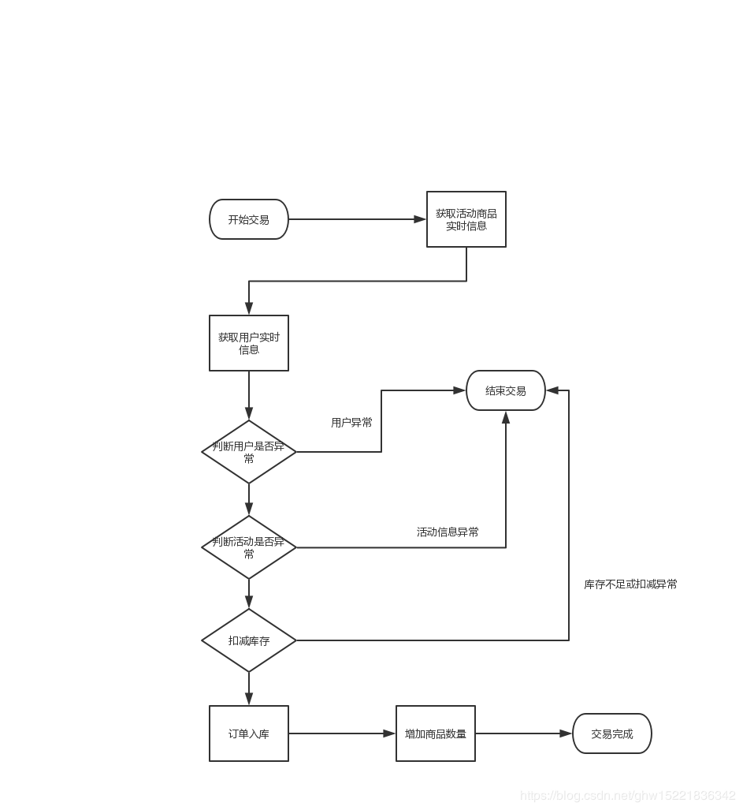
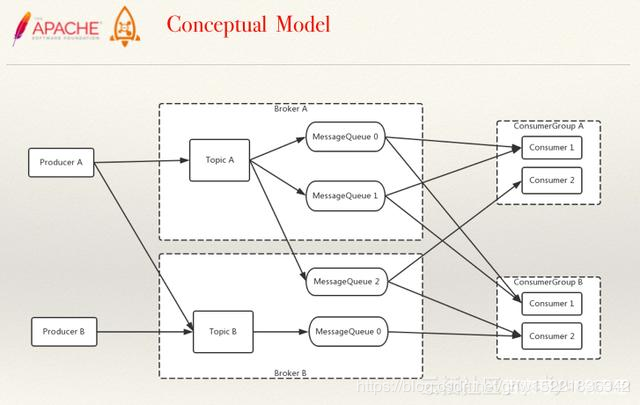
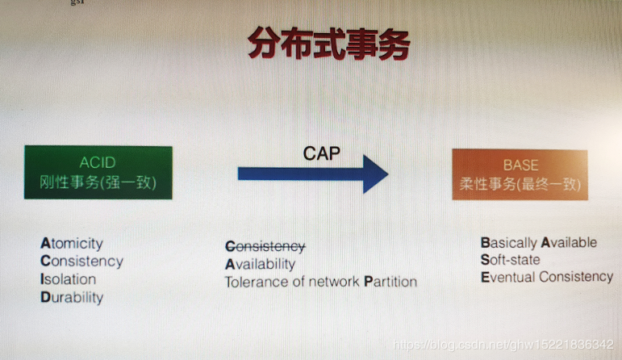

# Java电商秒杀系统性能优化(六)——交易性能优化技术之缓存库存

## 概述

本篇博客介绍了下单交易的性能优化技术，通过交易验证缓存的优化，库存缓存模型优化解决了交易流程中繁琐耗性能的验证缓存，并解决数据库库存行锁的问题，同时也引入了缓存与数据库分布式提交过程中不一致的风险。

本章学习目标：

* **掌握高效交易验证方式**
* **掌握缓存库存模型**

## 一、高效交易验证

### 1.1 交易性能瓶颈

* 采用jmeter压测进行性能压测，请求改为POST请求，加入消息体中，average 500ms  tps200/s cpu% 75%；
   交易验证完全依赖数据库,通过SQL语句的方式发送给数据库，完成读操作；
* **库存行锁**（使用 Redis 作为缓存层前，交易性能瓶颈在数据库的行锁操作）
* 后置处理逻辑



### 1.2 交易验证优化

* **获取用户信息，用户风控策略优化:\**策略缓存模型化，将对应的风控内容做到redis缓存里面，例如\**是否异地登录**、**账号异常**，将风控的策略**通过异步的方式写入对应缓存中**，在实时查询过程中做一个风控策略的实时拦截；

* **活动校验策略优化**：引入活动发布流程，模型缓存化，紧急下线能力；

  运营发现活动有异常，在后台将对应的活动进行修改，比如将活动提前结束。若线上在redis的缓存没有正常过期，即便修改了活动时间，但是用户还是可以以活动秒杀价格交易，因此需要一个紧急下线能力。所以运营人员至少要在活动开始前半个小时将活动发布上去，半个小时内足够进行缓存的预热。在后设计一个紧急下线的接口，用代码实现可以清除redis内的缓存。当redis内无法查询状态，就会去数据库内查询活动状态，从而达到紧急下架的能力；
  

**验收效果**
 jmeter验收验证优化效果
 Average time = 600ms   tps=1200/s

## 二、缓存库存模型

### 2.1 库存行锁优化

itemId 需要创建唯一索引

```mysql
alter table item_stock add unique index
item_id_index(item_id)
```

#### 2.1.1 扣减库存缓存化

**方案：**

* 活动发布同步库存进缓存；
* 下单交易减缓存库存；

问题：

数据库记录不一致，缓存中修改了但是数据库中的数据没有进行修改；

#### 2.1.2 异步同步数据库

**方案：**

* 活动发布同步库存进缓存；
* 下单交易减缓存库存；
* 异步消息扣减数据库内库存；（多加了一步异步消息队列）

可以让C端用户完成购买商品的高效体验，又能保证数据库最终的一致性；

## 2.2 异步消息队列 rocketMQ

**rocketmq**：

* 高性能，高并发，分布式消息中间件；
* 典型应用场景：分布式事务，异步解耦；



**Producer解决消息生产的问题,Consumer消息的消费端**

**Broker**

相当于一个中间人，由**topic和MessageQueue**组成，任何一条rocketmq的消息都是隶属于某一个topic,一个topic可以被一个messagebroker管理，也可以被多个messagebroker管理；

### 2.2.1 部署模型

Broker向Nameserver发送注册请求，broker的ip和负责的topic,queue；
 每一个broker至少有一个queue,producer从Nameserver上发现broker1；

采用**负载轮询**的方式第一次请求到queue1中，生成一个message1,第二次请求到queue2,生成一个message2,同时consumer会向这两个queue分别建立**长连接**。

当producer做对应投递时，consumer会被唤醒，拉取对应的message,这种方式被称为**长轮询**；

**Consumer group的作用**：以queue为单位作为一个消息的管理，当consumer消费完一个message的时候会回复一个消息给对应的queue,并且将对应的message2变为已经消费成功要被干掉的状态；

若对应的**一个queue被多个consumer消费**的情况下，势必会造成一个同步的问题，存在一个**锁竞争**的机制，rocketmq采用的是以queue为单位平均的分配给consumer,所以设计一个好的中间件就是为了保证**queue和consumer**的数量相等；

当有多个consumer group,**一个订单系统**就属于一个group,另外一个consumer group就属于**商品系统**；生产者端并不知道生成的消息对应的消费端是哪个系统，只会无脑的投消息，关注这个消息的人指出来即可。**topicA**还是以consumer_group为管理的基础单元，一个queue1可以被一个consumer group中的一个consumer所消费，也可以被另一个consumer group中的consumer所消费，**以consumer_group去做对应消息的消费和管理**。

### 2.2.2 主从复制机制

如果对应的 broker1产生了任何异常，producer知道broker掉线了，没办法投递对应的消息；

**broker2作为broker1的slave**,平时不对外进行服务，只做消息的从库，一旦对应的message1被消费；一旦broker1发生异常，nameserver感知到会将broker2变为主库，并且**通知producer和consumer端**，让其通过**broker2去接管对应的消费**，slave和master之间的数据可以是同步，也可以是异步。

同步的话，producer生成在broker1中生产message1成功，也要broker2中备份message1也能够成功，性能偏低；

主broker1作为生产成功\消费成功即可,roker2做异步复制即可。只要网络的延迟小，对应的cpu处理速度快，是不会发生消息丢失的情况。但是**在分布式的环境下，没有办法同时保证强一致性和可用性**。如果选择强可用性肯定会降低强一致性，当发生主备切换的时候可能会发生消息的丢失。

### 2.2.3 分布式事务



之前所有的操作都是在单库上面去执行的，依赖于spring的transactional标签，借助于MySQL数据库的**ACID(原子性、一致性、隔离性、持久性**)对应的刚性事务强一致的方式保证了数据库事务的一致性问题。

**分布式设计CAP三方面，一致性、可用性、分区容忍性**

分区容忍性是必要的，要么选择**强一致性**，**等待所有的数据都一致的时候才可用**；要么就是**牺牲强一致性变得可用**。所以牺牲强一致性来实现CAP中的A和P(可用性和分区容忍性)。强一致性是重要的，但是不追求瞬时状态的强一致性，追求的是**最终的一致性**，达到基础可用、最终一致性、软状态；

**软状态**：在应用当中会瞬时的存在有数据不一致性的情况，比如一部分数据已经成功，另外一部分数据还在处理当中。那我们的业务认为这些是可以容忍的；

在我们的缓存库存中，redis中存储的状态都是正确的，但是由于异步消息队列的consumer没有被触发，在那一瞬时数据库的状态是错误的。但只要分布式事务的消息投递成功，数据库的状态就会被正确更新，这个设计就是用来处理库存最终一致性的方案。只要消息中间件有99%以上的高可用的方式，就有99%以上的概率是可以保证数据库的状态可以跟redis中的状态是一致的。

