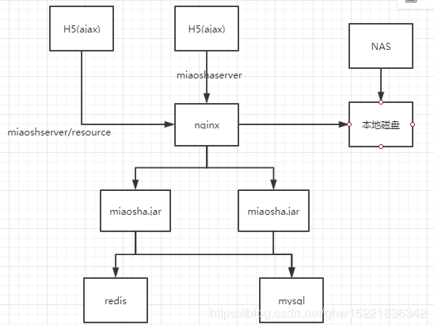
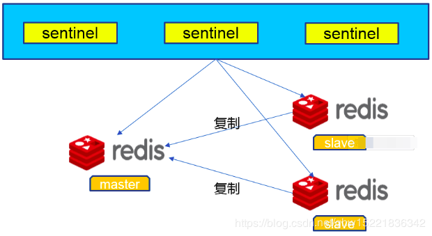
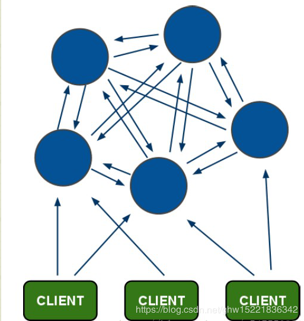
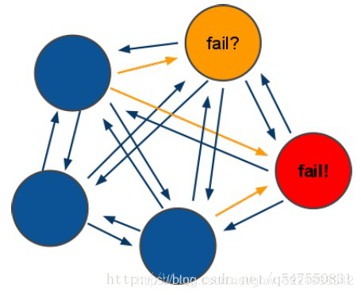

# Java电商秒杀系统性能优化(四)——查询优化缓存之多级优化-接触高性能缓存方案

## 概览

本章的核心目标是优化商品详情页对应的动态请求的性能。通过多级缓存：**redis**、**guava cache**、**nginx lua缓存**实现了一套削峰的**多级缓存方案**，优雅的依靠不同的热点分类使用不同类型的多级缓存并设置不同的失效策略，解决动态请求的性能问题。

## 1. 缓存设计原则 

* 能够使用快速存取的设备，一般采用内存作为缓存设计的基本设备(内存具备快速存取，速度是磁盘的几千倍，弊端：断电即丢失)；
* 采用分布式就能扩展对应的节点，缓存离用户越近，用户访问数据走的链路就越少，查询效率就越高；
* 脏缓存清理，缓存具有丢失性。如果缓存不更新到磁盘上，不能算是更新成功，因此关键的数据一定要存储在不能丢失的设备上，一旦数据库中的数据发生了变更，那么缓存中的数据都变成了脏数据，例如一个商品的变价；
  

## 2. 多级缓存方案

* redis缓存，有集中式管理缓存的特点；
* 热点内存本地缓存（guava cache）
* nginx proxy cache缓存
* nginx lua缓存

## 一、Redis 集中式缓存

redis是缓存的数据库中间件，对应的是一个**NoSQL数据库**，仅仅支持**key-value**的方式来进行不同的数据结构之间的访问操作。redis可以配置将数据刷新到磁盘地一些策略。架构图如下图所示：



### 1.1 Redis sentinal 哨兵模式（保证高可用）

主从切换技术的方法是：当主服务器宕机后，需要手动把一台从服务器切换为主服务器，这就需要人工干预，费事费力，还会造成一段时间内服务不可用。这种方式不可取，因此需要采用**sentinal哨兵模式**；

Sentinel(哨兵)是用于监控redis集群中Master状态的工具，是Redis 的高可用性解决方案，sentinel哨兵模式已经被集成在redis2.4之后的版本中。sentinel是redis高可用的解决方案，sentinel系统可以监视一个或者多个redis master服务，以及这些master服务的所有从服务；当某个master服务下线时，自动将该master下的某个从服务升级为master服务替代已下线的master服务继续处理请求。

sentinel可以让redis实现**主从复制**，当一个集群中的master失效之后，sentinel可以选举出一个新的master用于自动接替master的工作，集群中的其他redis服务器自动指向新的master同步数据。一般建议sentinel采取奇数台，防止某一台sentinel无法连接到master导致误切换。结构图如下所示：



**Sentinel作用：**
1）Master状态检测
2）如果Master异常，则会进行Master-Slave切换，将其中一个Slave作为Master，将之前的Master作为Slave。
3）Master-Slave切换后，master_redis.conf、slave_redis.conf和sentinel.conf的内容都会发生改变，即master_redis.conf中会多一行slaveof的配置，sentinel.conf的监控目标会随之调换。

**Redis Sentinel的主从切换方案：**
Redis 2.8版开始正式提供名为Sentinel的主从切换方案，通俗的来讲，Sentinel可以用来管理多个Redis服务器实例，可以实现一个功能上实现HA的集群，Sentinel主要负责三个方面的任务：
1）**监控（Monitoring）**： Sentinel 会不断地检查你的主服务器和从服务器是否运作正常。
2）**提醒（Notification）**： 当被监控的某个 Redis 服务器出现问题时， Sentinel 可以通过 API 向管理员或者其他应用程序发送通知。
3）**自动故障迁移（Automatic failover）**： 当一个主服务器不能正常工作时， Sentinel 会开始一次自动故障迁移操作， 它会将失效主服务器的其中一个从服务器升级为新的主服务器， 并让失效主服务器的其他从服务器改为复制新的主服务器； 当客户端试图连接失效的主服务器时， 集群也会向客户端返回新主服务器的地址， 使得集群可以使用新主服务器代替失效服务器。

### 1.2 Redis cluster 模式（保证高性能）

一般情况下，使用主从模式加Sentinal监控就可以满足基本需求了，但是当数据量过大一个主机放不下的时候，就需要对数据进行分区，将key按照一定的规则进行计算，并将key对应的value分配到指定的Redis实例上，这样的模式简称Redis集群。

Redis集群提供了以下两个好处：

* 将数据自动切分split到多个节点的能力。
* 当集群中的一部分节点失效或者无法进行通讯时， 仍然可以继续处理命令请求的能力。



* 所有的redis节点彼此互联(**PING-PONG机制**),内部使用二进制协议优化传输速度和带宽；
* 节点的fail是通过集群中超过半数的节点检测失效时才生效；
* 客户端与redis节点直连,不需要中间proxy层.客户端不需要连接集群所有节点,连接集群中任何一个可用节点即可；
* redis-cluster把所有的物理节点映射到[0-16383]slot上,cluster 负责维护**node<->slot<->value；**

Redis集群中内置了 16384 个哈希槽，当需要在 Redis 集群中放置一个 key-value 时，redis 先对key 使用 crc16 算法算出一个结果，然后把结果对 16384 求余数，这样每个 key 都会对应一个编号在 0-16383 之间的哈希槽，redis 会根据节点数量大致均等的将哈希槽映射到不同的节点。


投票过程是集群中所有master参与,如果半数以上master节点与当前master节点通信超时**(cluster-node-timeout)**,认为当前master节点挂掉。

什么时候整个**集群不可用(cluster_state:fail)**?

1、如果集群任意master挂掉,且当前master没有slave.集群进入fail状态,也可以理解成集群的slot映射[0-16383]不完整时进入fail状态.。

2、如果集群超过半数以上master挂掉，无论是否有slave，集群进入fail状态

### 1.3 Redis 集中式缓存商品详情页接入

```java
// 打开ItemController

@Autowired
private RedisTemplate redistemplate;//封装了所有对于redis的key-value操作；

//商品详情页浏览
@RequestMapping(value = "/get",method = {RequestMethod.GET})
@ResponseBody
public CommonReturnType getItem(@RequestParam(name = "id")Integer id){
    //根据商品的id到redis内获取
    ItemModel itemModel = (ItemModel)redisTemplate.opsForValue().get("item_"+id);

    //若redis内不存在对应的itemModel,则访问下游service;
    if(itemModel == null){
        ItemModel itemModel = itemService.getItemById(id);
        //设置itemModel到redis内
        redisTemplate.opsForValue().set("item_"+id,itemModel);
        //设置十分钟的失效时间
        redisTemplate.expire("item_"+id,10, TimeUnit.MINUTES);
        }
    
    ItemVO itemVO = convertVOFromModel(itemModel);

    return CommonReturnType.create(itemVO);
}
```

### 1.4 Redis 集中式缓存压测效果验证

```java
连接到和redis server于数据库 server共享的server上面
top -H
ifconfig
./redis-cli -h 172.31.49.157
select 10
get item_6
采用Jmeter压测工具发现，Average耗时为250多ms,Tps 2000/s
采用top -H查看发现redisserver占用的cpu只有2%,没有到达瓶颈
```

## 二、本地热点缓存

Redis缓存的优势是一个集中式的**key-value**缓存的数据库，并且支持数据库的**一致性持久化操作**。但正是由于其一致性管理的特性，导致我们所有对于Redis的存取都需要通过IO达到对应的**RedisServer**上,并且根据Redis的协议去更新Redis的状态，因此相比于本地缓存，Redis不能达到更高的性能要求。

为了减少访问redis的网络开销和redis的广播消息，本地热点缓存的生命周期不会特别长；本地热点缓存是为了一些热点数据瞬时访问的容量来做服务的，对应的生命周期要比rediskey的生命周期要短很多；这样才能做到被动失效的时候对于脏读失效的控制是非常小的；


### 2.1 Guava cache

Guava 作为Google开源Java 库中的精品成员，在性能、功能上都十分出色;
 简单来说，Guava cache本质上是一个Hash Map

* 可以控制key和value的大小，以及key的超时时间
* 可配置的LRU策略，最近最少访问的key，当内存不足的时候优先被淘汰；
* 线程安全；

### 2.2 实现 Guava cache

先添加依赖，然后再创建缓存实现的service,并且进行参数的设置，最后添加商品详情页的浏览，先在本地浏览，若没有再去redis缓存中查询；

```java
在pom.xml中添加依赖
<dependency>
  <groupId>com.google.guava</groupId>
  <artifactId>guava</artifactId>
  <version>18.0</version>
</dependency>

在service层中创建一个CacheService
//封装本地缓存操作类
public interface CacheService {
    //存方法
    void setCommonCache(String key,Object value);
    //取方法
    Object getFromCommonCache(String key);
}
在service.impl中创建一个CacheServiceImpl
  @PostConstruct
    public void init(){
        commonCache = CacheBuilder.newBuilder()
                //设置缓存容器的初始容量为10
                .initialCapacity(10)
                //设置缓存中最大可以存储100个KEY,超过100个之后会按照LRU的策略移除缓存项
                .maximumSize(100)
                //设置写缓存后多少秒过期
                .expireAfterWrite(60, TimeUnit.SECONDS).build();
    }
//在ItemController中引入对应的cache;
@Autowired
private CacheService cacheService;

//商品详情页浏览
//先取本地缓存
    itemModel = (ItemModel) cacheService.getFromCommonCache("item_"+id);
    if(itemModel == null){
        //根据商品的id到redis内获取
        itemModel = (ItemModel) redisTemplate.opsForValue().get("item_"+id);
        //若redis内不存在对应的itemModel,则访问下游service
        if(itemModel == null){
            itemModel = itemService.getItemById(id);
            //设置itemModel到redis内
            redisTemplate.opsForValue().set("item_"+id,itemModel);
            redisTemplate.expire("item_"+id,10, TimeUnit.MINUTES);
        }
        //填充本地缓存
        cacheService.setCommonCache("item_"+id,itemModel);
    }    
```

### 2.3  本地数据热点缓存压测结果验证

线程数1000，ramp-up时间：5s,循环次数：60
Average time 150ms,对应的**Tps:3500/s**,对应的redis几乎没有任何压力，
缓存机制从redis缓存加载到了jvm缓存之后，减少了多段的网络开销，并且完成了对应的内存访问输出结果，性能提升明显，但是数据更新之后缓存失效，还有JVM容量大小的限制；

## 三、 nginx proxy cache 缓存

* **nginx proxy cache**的启用必须是nginx必须可以是反向代理前置；
* **依靠文件系统存索引级的文件**，本质上是将一个请求当作一个文件存储在本地使得下一次用户的请求过来直接看本地有没有一个对应的文件来决定proxy cache是否启用；
* 依靠内存缓存文件地址，缓存的内容存储在磁盘中，但是缓存的key是在内存当中，并且缓存的key在内存当中的内容就是缓存的内容文件在文件系统中的地址；

### 3.1 缓存实现

```java
nginx proxy cache缓存配置
//首先先连接到nginx反向代理的服务器中
cd conf
vim nginx.conf
#声明一个cache缓存节点的内容
//做一个二级目录，先将对应的url做一次hash,取最后一位做一个文件目录的索引；
//在取一位做第二级目录的索引来完成对应的操作，文件内容分散到多个目录，减少寻址的消耗；
//在nginx内存当中，开了100m大小的空间用来存储keys_zone中的所有的key
//文件存取7天,文件系统组多存取10个G
proxy_cache_path /usr/local/openresty/nginx/tmp_cache levels=1:2 keys_zone=tmp_cache:100m inactive = 7d max_size=10g;
//在location中多指定一个结点
location / {
    proxy_cache tmp_cache;
    proxy_cache_key $uri;
    proxy_cache_valid 200 206 304 302 7d;//只有后端返回的状态码是这些，对应的cache操作才会生效，缓存周期10天
}
//重启
sbin/nginx -s reload
//验证有效性，打开秒杀服务器的tomcat容器
```

### 3.2 性能压测

虽然直接在nginx上做缓存返回，但其实这个缓存读取的还是本地的文件，并没有将对应的文件内容缓存在nginx的内存当中，所以对应的性能消耗，反而不如nginx直接反向代理过来的数据直接返回内存中的内容更高效，所以我们需要将对应的配置回滚掉，不需要这个配置了。

